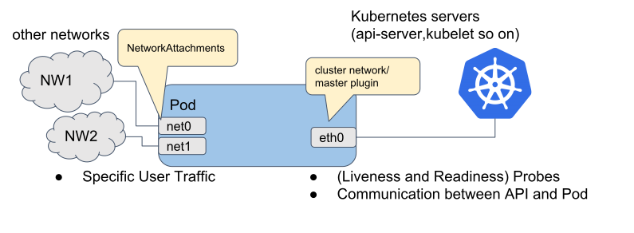

# 实现容器间的 RDMA 高速网络

## 实现多网卡

Multus CNI 简单来说是一种符合 CNI 规范的插件，它的存在就是帮助 Pod 建立多个网络接口。

Multus CNI 本身并不提供网络配置功能，它是通过其他满足 CNI 规范的插件进行容器网络配置。

如下图所示，原本 Pod 内只有一个由主 CNI 插件创建的 eth0 接口，当集群环境存在 Multus 插件，并添加了额外的配置之后，你将发现 Pod 内部不再仅有 eth0 ，还有 net0、net1 这些额外的接口。

GPU 的通信接口通过 verbs （相当于 socket ，RDMA 的用户层接口称 verbs）实现高速通信。

:::center
   
  图 基于 Multus CNI 的 Pod 内网卡结构
:::

