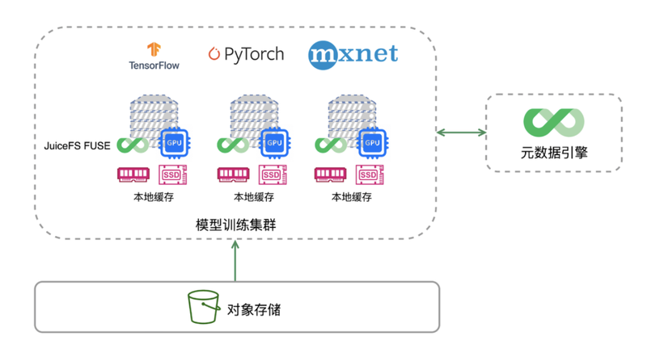
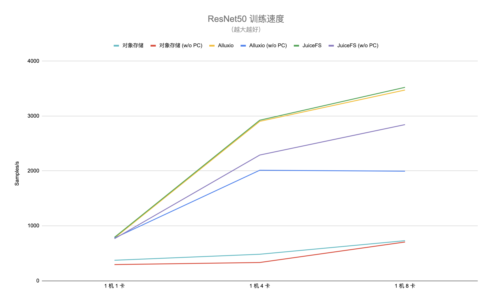

# 实现高性能分布式存储

## 

在 AI/ML 领域，POSIX 是数据访问最普遍的接口，也就是几乎所有编程语言都支持的 open, read, write 和 close 等 API

所以如何将大量的样本数据，就近缓存，就是AI+K8s系统需要重点考虑的问题。分布式缓存加速系统，就是其中一条路线。

JuiceFS 采用「数据」与「元数据」分离存储的架构，从而实现文件系统的分布式设计。文件数据本身会被切分保存在对象存储（例如 Amazon S3），而元数据则可以保存在 Redis、MySQL、TiKV、SQLite 等多种数据库中，你可以根据场景与性能要求进行选择。

:::center
   
  图  RDMA 
:::

上图是架构图，分为三个部分：

- 第一部分：元数据引擎，根据个人选择，可以使用任何数据库，例如 Redis、MySQL 等等，作为元数据引擎。
- 第二部分：底层数据存储，在云上或私有云中，使用对象存储服务来对接 JuiceFS。
- 第三部分：JuiceFS 客户端，用户在使用时需要在每个 GPU 和计算节点上挂载 JuiceFS，这样就可以像访问本地硬盘一样访问 JuiceFS 的文件系统。

当通过 JuiceFS 客户端读取数据时，这些数据将会智能地缓存到应用配置的本地缓存路径（可能是内存，也可能是磁盘），同时元数据也会缓存到客户端节点本地内存中。对于 AI 模型训练场景来说，第一个 epoch 完成之后后续的计算都可以直接从缓存中获取训练数据，极大地提升了训练效率。

## 测试数据

选取常见的 ResNet50 模型以及 ImageNet 数据集，训练任务使用了 DLPerf 项目提供的脚本，对应的深度学习框架是 PyTorch。训练节点配置了 8 块 NVIDIA A100 显卡。

作为对比，我们将公有云上的对象存储作为基准线（通过类 S3FS 的方式进行访问），同时和开源项目 Alluxio 进行比较，分别测试了 1 机 1 卡、1 机 4 卡、1 机 8 卡不同配置下的训练效率（即每秒处理的样本数）。

如果进行单机模型训练，在首轮训练时，训练集或数据集通常不会命中缓存。但是从第二轮开始，在缓存资源充足的情况下，几乎不需要访问对象存储，达到加速数据 I/O 的效果。

:::center
   
  图  RDMA [图片来源](https://juicefs.com/zh-cn/blog/solutions/how-to-use-juicefs-to-speed-up-ai-model-training-by-7-times)
:::

得益于元数据缓存和数据缓存，可以看到不管是在哪种场景下，JuiceFS 相比对象存储平均都能达到 4 倍以上的性能提升，最多能有接近 7 倍的性能差距。