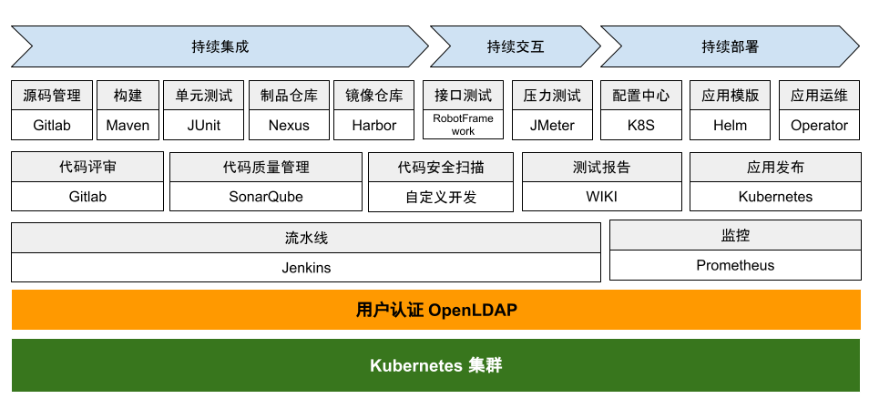

# CI/CD 典型工具链

在 CI/CD 工程实施中，Jenkins 和 Gitlab 已成为流程中的核心工具，其中 Jenkins 提供了数以百计的插件来支持各种项目的自动化构建、部署，贯穿于 CI/CD  整个过程，并将各个阶段串联起来。现如今的 CI/CD 中，集合容器技术、镜像仓库、容器编排系统等各类工具链，已成为企业、各类组织效率提升必不可少的基础支撑。

	
	
图：CI/CD 典型工具链

目前，CI/CD 典型的工具链包括持续集成、持续交付、持续部署与基础工具类。

## 基础工具

