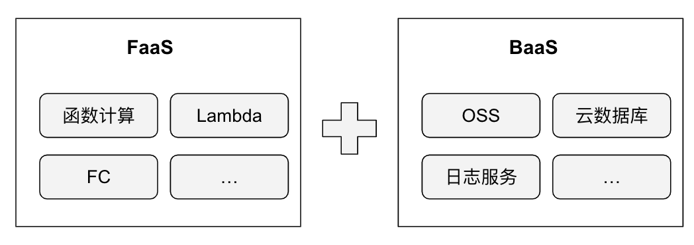

# Serverless

Serverless的全称是 Serverless computing 无服务器运算。

> 从当前的发展来看，提供无需关注底层基础设施的服务，就可以称为Serverless服务

无服务器是一种架构理念，并不代表某种技术。其核心思想是以平台即服务（PaaS）为基础，将提供服务资源的基础设施抽象成各种服务，其服务端逻辑运行在无状态的计算容器中，以 API 接口的方式提供给用户按需调用，由事件触发，真正做到按需伸缩、按使用收费。

这种架构消除了对传统海量持续在线服务器组件的需求，降低了开发和运维的复杂性，降低运营成本并缩短了业务系统交付周期，是用户能够专注在价值密度更高的业务逻辑的开发上。

目前业内较为公认的无服务器架构主要包含两个方面，即提供计算资源的函数服务平台FaaS，以及提供托管云服务的后端服务 BaaS。

	

## FaaS

FaaS (Functions as a Service) 函数即服务，是无服务器计算的一种形式。

Serverless 相对微服务来说是更加细粒度的服务架构模式，把用户所要执行的每一个 API 操作以函数的形式发布，因此 Serverless 又称为 FaaS。
Serverless 架构本质上是一种事件驱动的由消息触发的服务，FaaS 供应商一般会集成各种同步和异步的事件源，通过订阅这些事件源，可以突发或者定期地触发函数运行。

## BaaS

BaaS (Backend as a Service，BaaS) 则是一些后端云服务，如数据库、对象存储、消息队列等。

只需要调用服务方API即可完成相应的功能，比如常见的身份验证、云端数据/文件存储、消息推送、应用数据分析等。