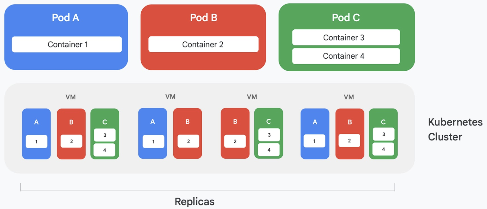

# 云原生架构落地指南

云原生架构包含了 6 个关键架构维度(简写为 SESORA，Service + Elasticity + Serverless + Observability + Resilience + Automation)，因此我们先定义关键维度的成熟度级别

| 指标维度 | ACAN-1（0分） | ACAN-2（1分） | ACAN-3（3分） | ACAN-4（4分）|
| :---: | :---: | :---: |:---: |:---: |
| 服务化能力（Service） | 无  <small>（单体应用）</small>| 部分服务化 & 缺乏治理 <small> (自持技术，初步服务化) </small> | 全部服务化 & 有治理体系  <small> (自持技术，初步服务化) </small> | Mesh 化的服务体系  <small> (云技术、治理最佳实践) </small> |
| 弹性能力（Elasticity） | 全人工扩缩容 <small>（固定容量）</small> | 半闭环 <small>（监控+人工扩缩容）</small> | 非全云方式闭环 <small>（监控+代码伸缩，百节点规模）</small> | 基于云全闭环 <small>（基于流量等多策略，万级节点规模）</small> |
| 无服务器化程度（Serverless） | 未采用 BaaS | 无状态计算委托给云 <small>（计算、网络、大数据）</small> | 有状态存储委托给云 <small>（数据库、文件、对象存储等）</small> | 全无服务器方式运行 <small>（Serverless/FaaS 运行全部业务）</small> |
| 可观测性 （Observability）| 无 | 性能优化 & 错误处理  <small>（日志分析、应用级监控、APM）</small>| 360度 SLA 度量 <small>（链路 Tracing、Metrics度量）</small> | 用户体验持续优化 <small>（用观测大数据提升业务质量）</small> |
| 韧性能力 （Resilience）| 无 | 十分钟切流 <small>（主备HA、集群HA、冷备容灾）</small> | 分钟级切流 <small>（熔断、限流、降级、多活容灾等）</small> | 秒级切流、业务无感  <small>（Serviceless、Service Mesh 等）</small>|
| 自动化能力（Automation） | 无| 基于容器自动化  <small>（基于容器CI/CD）</small>| 具备自描述能力的自动化 <small>（提升软件交付自动化）</small> | 基于 AI 的自动化 <small>（自动化软件交付和运维）</small> |

从自动化能力、无服务化能力、弹性能力、可观测性、韧性能力这五个维度，贯穿说明如何落地云原生架构

## 微服务化

对付复杂性的最好方法之一是将明确定义的功能分成更小的服务，并让每个服务独立迭代。这增加了应用程序的灵活性，允许根据需要更轻松地更改部分应用程序。每个微服务可以由单独的团队进行管理，使用适当的语言编写，并根据需要进行独立扩缩容。

## 将生产服务容器化

容器化云应用的基础是容器管理和编排服务。虽然存在各种各样的服务，但占据统治地位的显然是 Kubernetes，Kubernetes 建立了一个活跃的社区并获得了众多领先商业供应商的支持，已然成为行业中的容器编排标准。

Kubernetes 定义了被称为 Pod 的抽象。每个 Pod 通常只包含一个容器（例如图 4 中的 Pod A 和 B），但也可以包含多个容器（例如 Pod C）。每个 Kubernetes 服务运行一个包含一定数量节点的集群，每个节点通常是一个虚拟机。图 4 仅显示四个虚拟机，但一个真实的集群可能轻易就包含 100 个或更多虚拟机。当 Pod 部署到 Kubernetes 集群上时，服务会确定该 Pod 的容器应该在哪些虚拟机中运行。由于容器指定了其所需的资源，因此 Kubernetes 可以智能地选择为每个虚拟机分配哪些 Pod。

Pod 的部署信息会指明应该运行的 Pod 实例（副本）数量。Kubernetes 服务随后会创建该数量的 Pod 容器实例并分配给虚拟机。例如，在图 4 中，Pod A 和 Pod C 的 Deployment 都请求了三个副本。但是，Pod B 的 Deployment 请求了四个副本，因此，此示例集群包含容器 2 的四个运行实例。如图所示，包含多个容器的 Pod（例如 Pod C）的容器将始终被分配给相同节点。

Kubernetes 还提供其他服务，包括：

- 监控正在运行的 Pod，如果容器出现故障，服务将启动新实例。这可确保 Pod 的 Deployment 中请求的所有副本保持可用。
- 负载均衡流量，以智能方式将对每个 pod 发出的请求分散到容器的副本中。
- 自动零停机地发布新容器，新实例将逐步替换现有实例，直到新版本完全部署为止。
- 自动扩缩，集群根据需求自主添加或删除虚拟机。

	

