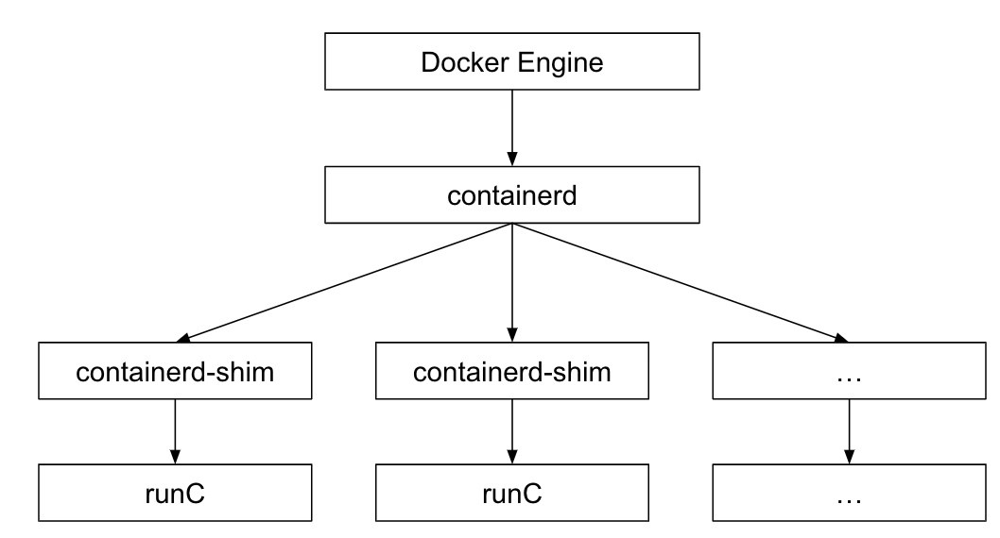

# 理解容器：从 Docker 讲起

容器无疑是近年来云计算中最火热的关键词，随着docker的大热，docker、oci、runc、containerd 等等概念也扑之而来，这么多名词，让我们在云原生的开始阶段，总是云里雾里。


## container

那么，什么是容器？ 容器本质上是受到资源限制，彼此间相互隔离的若干个linux进程的集合。一般来说，容器技术主要指代用于资源限制的cgroup，用于隔离的namespace，以及基础的linux kernel等。

## OCI（Open Container Initiative，开放容器计划）

OCI（Open Container Initiative，开放容器计划），是在 2015 年由 Docker、CoreOS 等公司共同成立的项目，并由 Linux 基金会进行管理，致力于 container runtime 标准的制定和 runc 的开发等工作。

所谓 container runtime，主要负责的是容器的生命周期的管理。OCI 主要分为容器运行时规范(runtime-spec) 和镜像规范(image-spec) 两部分，runtime-spec 标准对容器的创建、删除、查看、状态等操作进行了定义，image-spec 对镜像格式、打包(Bundle)、存储等进行了定义。

<div  align="center">
	
</div>


## runC

runc，是由 Docker 贡献的对于 OCI 标准的一个参考实现，是一个可以用于创建和运行容器的 CLI(command-line interface) 工具。runc 直接与容器所依赖的 Cgroup/OS 等进行交互，负责为容器配置 Cgroup/namespace 等启动容器所需的环境，创建启动容器的相关进程。


为了兼容 OCI 标准，docker 也做了架构调整。将容器运行时相关的程序从docker daemon剥离出来，形成了containerd。Containerd 向 docker 提供运行容器的API，二者通过 grpc 进行交互。containerd 最后会通过runc来实际运行容器。


<div  align="center">
	
</div>

## CRI

CRI（Container Runtime Interface，容器运行时接口）是 K8s 定义的一组与容器运行时进行交互的接口，用于将 K8s 平台与特定的容器实现解耦。在 K8s 早期的版本中，对于容器环境的支持是通过 Dockershim(hard code) 方式直接调用 Docker API 的，后来为了支持更多的容器运行时和更精简的容器运行时，K8s 在遵循 OCI 基础上提出了CRI。

## CRI shim

当前实现了 CRI 的 remote shim 有如下：

- containerd：由 Docker 公司创建，并且在 2017 年捐赠给了 CNCF，2019 年毕业。
- CRI-O：基于 OCI 规范的作为 CRI 和 OCI 之间的一座桥梁。
- Docker Engine：Docker 运行时的支持，由 cri-dockerd 进行实现。
- Mirantis Container Runtime：Docker 企业版(Enterprise Edition) 运行时的支持，由 Mirantis Container Runtime(MCR) 进行实现。

<div  align="center">
	
</div>


## RuntimeClass

RuntimeClass 是 v1.12 引入的新 API 对象，用来支持多个容器运行时，可通过 Pod 字段直接指定。 定义一个 RuntimeClass 如下，对应的 CRI handler 即为目标容器运行时，比如 containerd、crio：

```
apiVersion: node.k8s.io/v1  # RuntimeClass is defined in the node.k8s.io API group
kind: RuntimeClass
metadata:
  name: myclass  # The name the RuntimeClass will be referenced by
  # RuntimeClass is a non-namespaced resource
handler: myconfiguration  # The name of the corresponding CRI configuration

```
