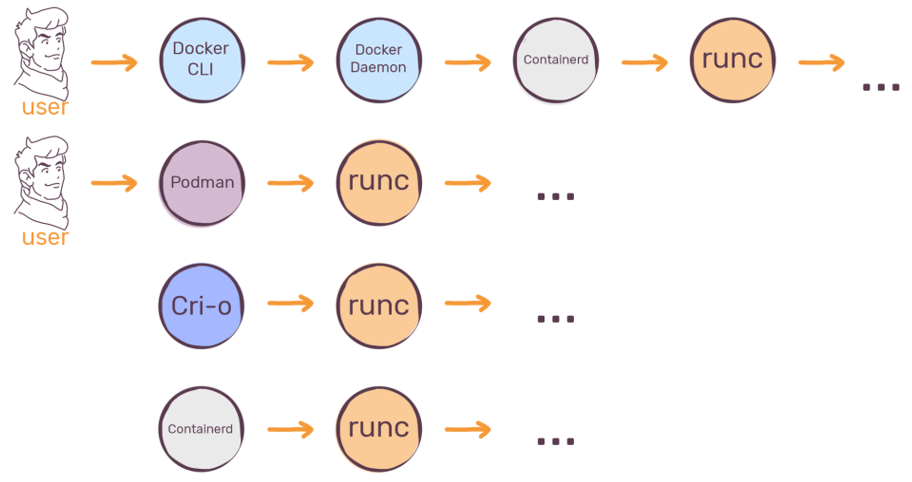
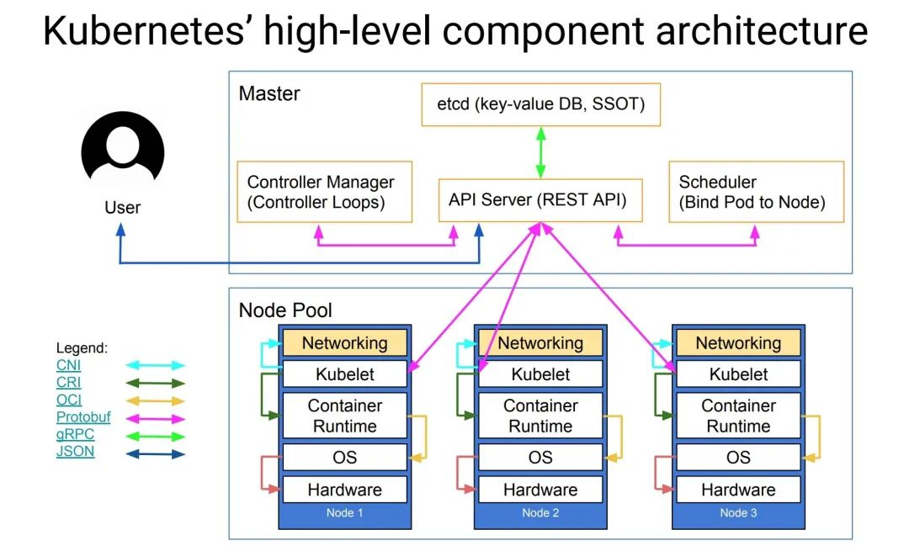
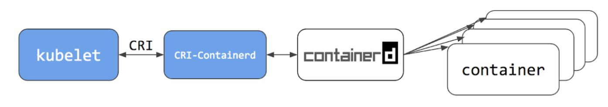

# Kubernetes 与 Docker 与 CRI

Kubernetes v1.20版本 的 release note 里说 deprecated docker。并且在后续版本 v1.24 正式删除了 dockershim 组件，这对我们有什么影响呢？

为了搞明白这件事情，以及理解一系列容器名词 docker, dockershim, containerd, containerd-shim, runc, cri, oci...。我们捋一下 Kubernetes 与 Docker 的发展与关系。

## 从 Docker 说起

从 Docker 1.11 版本开始，Docker 容器运行就不是简单通过 Docker Daemon 来启动了，而是通过集成 containerd、containerd-shim、runC 等多个组件共同完成。

	

其中 containerd 是 CRI（contianer runtime interface： 标准 grpc 接口，容器管理操作标准） 的一种实现，containerd-shim 是 containerd 和 runC 之间的中间层， 而 runC 则是 OCI（开放容器标准）参考实现。

### OCI 标准 （Open Container Initiative）

OCI是由 Docker、CoreOS 等组织对容器格式及运行时建立统一的行业标准。

OCI主要定义两个规范：

- 镜像规范（image-spec）定义了镜像的主要格式及内容
- 运行时规范（runtime-spec） 运行时规范定义镜像文件运行的管理， 而 runC 则是 目前使用最广泛的Low-Level容器运行时（runC 包含libcontainer，包括对namespace和cgroup的调用操作）。

接下去看下目前市面上最主流的3个High-Level容器运行时（High-Level包括镜像传输、镜像管理、镜像解包和 API等高级功能）

- Containerd :CNCF孵化器的开源项目，由 Docker捐献的
- Podman():Redhat孵化的项目，Podman 工具在RHEL8中作为完全支持的功能发布。
- CRI-O : CNCF孵化器的开源项目

我们再继续看一下 容器运行关系：

	

**基于Containerd作为容器运行时的Docker可以定义为"High-High-Level"容器运行时**。

关于 containerd 和 CRI 的关系要注意一些时间点:

- containerd 在 2016年初被拆出来
- CRI 标准在2016 年末出来的 （早于 containerd）
- containerd 在2017年3月进入CNCF之后才添加了CRI支持.

## Kubernetes 与 dockershim

从Kubernetes的架构图中，可以看到 Kubelet 下面还有一层contianer runtime （容器运行时）是作为真正和OS去交互的，这个容器运行时是真正的去管理容器的整个生命周期的以及拉取镜像等操作的。

	

## CRI（Container Runtime Interface）

如上面所说，目前比较主流的High-Level容器运行时有Containerd、CRI-O 以及PodMan等，每个容器运行时都有其自身的特性和优势, 而为了统一标准，更具扩性，Kubernetes 提出了容器管理的标准规范 CRI。主要定义了一组 grpc 接口, 来封装容器操作(create,start,stop,remove…)

## Dockershim

而在 Kubernetes 提出 CRI 操作规范时，Docker刚拆出 containerd，并不支持 CRI 标准。由于当时Docker是容器技术最主流也是最权威的存在，Kuberentes虽然提出了CRI接口规范，但仍然需要去适配CRI与Docker的对接，因此它需要一个中间层或 shim 来对接 Kubelet 和 Docker 的 contianer runtime。

于是 kubelet 中加入了 Dockershim。使用 docker 作为 runtime 的时，实际启动一个容器的过程是：

	

在这个阶段 **Kubelet 的代码和 dockershim 都是放在一个Repo**。

这也就意味着Dockershim是由K8S组织进行开发和维护！由于Docker公司的版本发布K8S组织是无法控制和管理，所以每次Docker发布新的Release，K8S组织都要集中精力去快速的更新维护Dockershim。

同时 Docker Engine 也过于庞大。

## Kubernetes 弃用 Dockershim

Kubernetes1.24版本正式删除和弃用dockershim。这件事情的本质是废弃了内置的 dockershim 功能，直接对接Containerd（后续已经支持 CRI）。这种方式更加标准，调用的链路更加的简洁。

	

综上可见，CRI可以实现kubelet对containerd、CRI-O的统一管理。同时，Kubernetes 1.24将dockershim 组件从 kubelet 中删除后，也建议用户使用更加轻量的容器运行时 containerd 或 CRI-O。

##  小结

虽然 dockershim 组件在 Kubernetes v1.24 发行版本中已被移除。不过来自第三方的替代品 cri-dockerd 可以适配器允许你通过 容器运行时接口（Container Runtime Interface，CRI） 来使用 Docker Engine。

对于Docker生成的镜像，也并不受任何影响，Docker 对镜像的构建是符合  OCI 标准的 (runC 也是 Docker 独立出去的)，镜像适用于所有 CRI 容器运行时。