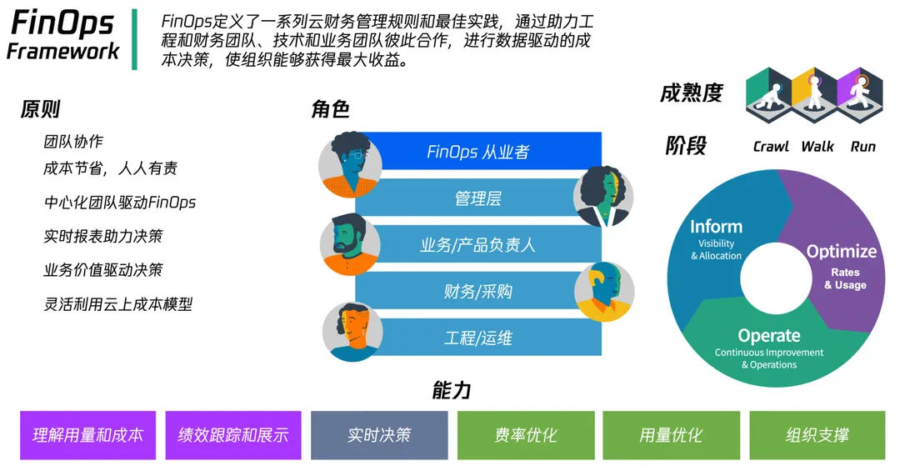

# 13.2 FinOps Framework

FinOps Framework 是由 FinOps 基金会提供的一套指导原则和最佳实践，帮助组织在云环境中实现更好的成本可见性、成本控制和成本优化。FinOps Framework 包含组织角色、实施核心原则、成熟阶段以及实施阶段周期。

	
FinOps Framework 构成

	

## 13.2.1 组织角色

FinOps 是一个持续性且专业性较强的工作，应尽量组建一个专业团队（或虚拟团队），这个团队应有财务/基础设施采购、工程/运维、具体业务负责人、明确能授权的管理层人员。这些角色在 FinOps 实践中密切合作，并在各自领域提供专业知识和支持，共同努力实现云成本可控和优化措施落地，以达到整体的财务效益和资源效率的最大化。

## 13.2.2 FinOps 实施的核心原则

在实践 FinOps 时，遵循以下重要原则可以帮助组织实现成本透明度、预算管理、成本分配和优化等目标。

- **建立对云成本的共识**：企业中各个相关角色应该意识到云成本的重要性，并将成本管理纳入到决策过程中。通过提高成本意识，可以更好地控制和优化云资源的使用。
- **明确云成本管理的责任和角色**：确定负责 FinOps 团队成员，建立相应责任制度。这样确保有专门人员负责云成本的监控、分析和优化，从而提高整体的财务管理效果。
- **提供培训和教育资源**：培训企业成员了解成本管理的基本概念、工具和技术。这有助于增强团队的能力，使他们能够更好地理解和应对云成本挑战。
- **促进不同团队之间的合作**：财务团队、开发团队和运维团队应该紧密合作，共同制定和实施成本管理策略。通过协作，可以更好地理解业务需求、优化资源配置，并确保成本管理策略与业务目标相一致。
- **利用自动化技术提高效率和准确性**：通过采用自动化工具收集、分析和报告云成本数据。自动化还可以帮助实现实时监控和警报，以及自动化资源管理，从而提高成本管理的效率和准确性。

## 13.2.3 FinOps KPI

FinOps 依据明确的 KPI 用于衡量和评估组织在 FinOps 实践中的绩效和成就。FinOps KPI 可大致分为以下几类：

|FinOps KPI 类别 |关键绩效指标/指标|
|:--|:--|
|云可见性 KPI| 成本账单分摊准确率和覆盖度、成本预测准确性、成本优化推荐触达率|
|云优化 KPI| 部门 CPU 利用率、业务/技术单位成本变化率、场景业务指标结合资源变动 |
|云治理和自动化 KPI| 商务折扣、FinOps 文化宣传、成本洞察归因、协助财务/CTO/业务各角色进行数据看清 |

以上是一些常见的 FinOps KPI 示例。但实际上，具体的 KPI 可能会因组织的需求和情况而有所不同。组织可以根据其特定的目标和需求选择适合其环境的 KPI，并据此进行监测和改进。

## 13.2.4 FinOps 成熟度模型

FinOps 的实践本质是迭代的过程，FinOps Framework 定义了关于 FinOps 的`爬`、`走`、`跑` 成熟度特征，用以评估实践结果。

在 FinOps 落地实践时，了解成熟度模型和指标可以帮助团队准确评估其当前水平，发现改进点和推进方向。例如，对于初步实践的团队，最初的重点可能是寻找成本和资源的可视化方法，而更成熟的团队则可能更加关注云开销和预算分析、成本优化和分配、以及团队间的协作和沟通等方面。

|成熟度级别| 成熟度水平特征 | 指标性目标/KPI |
|:--|:--|:--|
| 爬 | 较少的报告以及策略；能评估和理解成熟度的能力提升所带来的收益；为衡量收益设定了基本的 KPI 指标；能力被理解，但无法被阻止内大部分团队遵循 | 预测支出与实际支出准确性差差异为 20%；基于资源的承诺折扣目标覆盖率约 60%；能够至少分配 50% 的云资源支出 |
| 走 | 能力在组织内得到理解和遵循；自动化、流程化覆盖了大部分能力要求；确定大部分困难的边界情况并评估解决他们需要的工作量；为衡量成功设定了中级、高级 KPI 指标| 预测支出与实际支出准确性差差异为 15%； 基于资源的承诺折扣目标覆盖率约 70%；能够至少分配 80% 的云资源支出 |
| 跑 | 组织内所有的团队都理解并遵循能力；为衡量成功设定了非常高的 KPI 指标；完全自动化 | 预测支出与实际支出准确性差差异为 12%；基于资源的承诺折扣目标覆盖率约 80 % ；能够至少分配 90% 的云资源支出 |

成熟度模型的应用，可以帮助企业实现可持续的 FinOps 成果，进而达到支出透明度和控制、优化云资源和实现最大化业务价值的目标。​