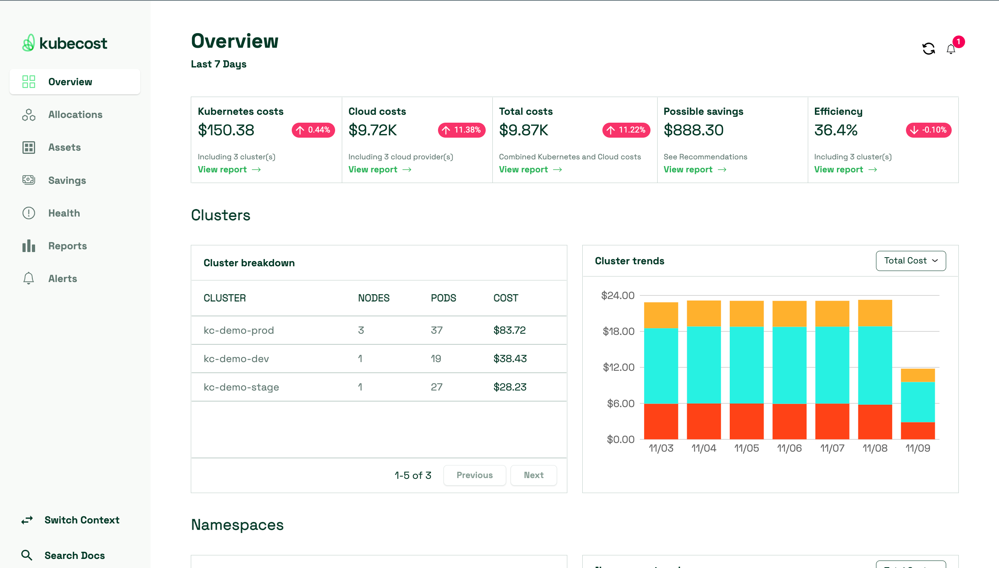

# 13.4 使用 kubecost 分析 Kubernetes 成本

kubecost 是目前较优秀的开源 Kubernetes 成本分析工具，它提供了丰富的功能和仪表板，帮助用户更好地理解和控制其容器化工作负载的成本。

kubecost 目前支持 阿里云、AWS 等云厂商对接，它能够提供集群中命名空间、应用等各类资源成本分配，用户还可以基于这些信息在 Kubecost 中设置预算和警报，帮助运维和财务管理人员进一步实现成本管理。


## 安装 Kubecost

安装 Kubecost 建议使用 Helm 进行安装，使用以下命令：
```plain
helm repo add kubecost https://kubecost.github.io/cost-analyzer/
helm repo update
helm upgrade --install kubecost kubecost/cost-analyzer --namespace kubecost --create-namespace
```

几分钟后，检查以确保 Kubecost 已启动并运行：

```plain
kubectl get pods -n kubecost
# Connect to the Kubecost dashboard UI
kubectl port-forward -n kubecost svc/kubecost-cost-analyzer 9090:9090
```

现在可以打开浏览器并指向 http://127.0.0.1:9090 以打开 Kubecost UI。 在 Kubecost UI 中，选择群集以查看成本分配信息。

<div  align="center">
	
</div>

## kubecost 成本统计原理

### CPU/内存/GPU/存储分析

Kubecost 通过 AWS/GCP 等云服务商 API 动态获取各 region/zone 的上述四项资源的每小时成本，或者通过 json 文件静态配置这几项资源的成本。
kubecost 的成本统计粒度为 container，kubecost 根据每个容器的资源请求 requests 以及资源用量监控进行成本分配，对于未配置 requests 的资源将仅按实际用量监控进行成本分配。

### 网络成本分析

对于提供线上服务的 Kubernetes 集群，网络成本（跨区/跨域传输的流量成本，以及 NAT 网关成本）很可能等于甚至超过计算成本。
kubecost 支持使用 Pod network 监控指标对整个集群的流量成本进行拆分，kubecost 会部署一个绑定 hostNetwork 的 daemonset 来采集需要的网络指标，提供给 prometheus 拉取，再进行进一步的分析。


