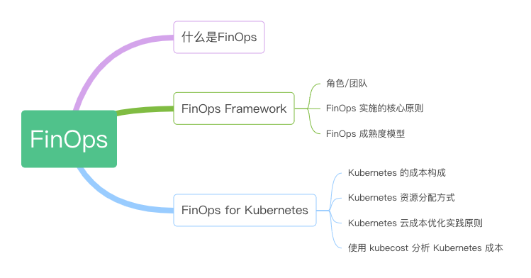

# FinOps 云成本管理

企业组织迁移到云上，并不断利用云的特性来实现关键业务目标，同时也带来了一系列云成本管理挑战。这些挑战包括云成本增长过快、成本归属不清晰、缺乏有效的成本控制手段以及过度依赖云服务提供商等问题。在当前降低成本、提高效率的时代，云成本治理成为企业的重要任务。

随着云计算的快速发展和企业大规模的云上部署，财务管理、云工程和运营发展也逐渐形成了一门专业的学科，即 FinOps。

	
本章内容导读

	

