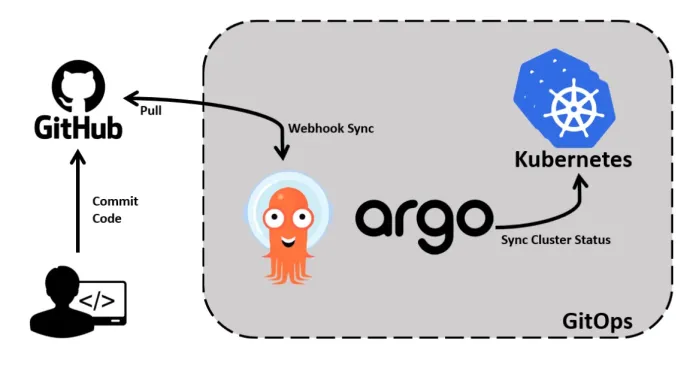

# Argo CD

Argo CD 是以 Kubernetes 作为基础设施，遵循声明式 GitOps 理念的持续交付工具，Argo CD 支持多种配置管理，包括 ksonnet/jsonnet、kustomize 和 Helm 等。它的配置和使用非常简单，并自带一个简单易用的可视化界面。

> Argo CD 是 Intuit 公司开源出来的属于整个 Argo 项目中的其中一个子项目，整个 Argo 项目中还包括 Argo-event、argo-workflow、Argo-Rollout

在介绍 Argo CD 之前，我们先需要清楚为什么使用 Argo CD？ 以及能给我们带来什么好处？

## 传统的 CD 工作流

目前大多数 CI/CD 工具都基于 Push 的部署模式，例如 Jenkins、CircleCI，这种模式一般都会在 CI 流水线完成后执行一个命令将应用程序部署到目标环境中。

这种 CD 模式的缺陷很明显：

- 需要安装配置额外的工具（例如 kubectl）。
- 需要 Kubernetes 进行授权。
- 无法感知部署状态，这也就无法感知期望状态与实际状态产生的偏差，只能接触额外方案来保障一致性。


我们在继续以 Argo CD 为例，来看看遵循声明式的 GitOps 理念的 CD 流程。

## 使用 Argo CD 的 CD 工作流

Argo CD 首先会被部署在 Kubernetes 集群中，使用的是基于 Pull 的部署模式，它会周期性地监控应用的实际状态，也会周期性拉取 Git 仓库中的配置清单，并将实际状态与期望状态进行比较，如果实际状态不符合预期，就会更新应用的实际状态以匹配期望状态。

<div  align="center">
	
</div>

无论是通过 CI 流水线触发更新 Kubernetes 编排文件，还是 运维工程师直接修改 Kubernetes 编排文件，ArgoCD 都会自动拉取最新的配置并应用到 Kubernetes 集群中。


## Argo CD 主要优势有


### Git 作为应用唯一的真实来源

所有 Kubernetes 声明式配置都保存在 Git 中么，并把 Git 作为应用的唯一来源，我们不再需要手动更新应用（例如执行 kubectl apply、helm install ...），只需要通过统一的接口（Git）来更新应用。

此外 Argo CD 不仅监控 Git 仓库中声明的期望状态，还会监控集群中应用状态，并对两种状态进行比较、修正。这就保证了即使有人修改了集群中的应用状态，Argo CD 还是会将其恢复到之前的状态。 这也确保了 Git 仓库编排文件作为集群状态的唯一真实来源。


### 快速回滚

Argo CD 会定期拉取最新配置并应用到集群中，一旦最新的配置导致应用出现故障，我们则可以用过 Git History 将应用状态快速恢复到上一个可用状态。

如果有多个 Kubernetes 集群使用同一个 Git 仓库，这种优势更为明显，出现故障时，不需要分别在不同集群 helm uninstall 等手动方式回滚，只需要将 Git 仓库回滚到上一个可用版本， Argo CD 便会自动同步至所有集群。

### 集群灾备

如果是某个可用区的 Kubernetes 集群整体出现故障，且短期内不可恢复。这个时候我们可以直接创建一个新集群，然后将 Argo CD 连接到 Git 仓库, 新的集群将自动同步仓库内所有应用的配置声明，期间完全不需要人工干预。

### 使用 Git 实现访问控制

通常在生产环境中是不允许所有人访问 Kubernetes 集群，如果直接在 Kubernetes 集群控制访问权限，必须要实现复杂的 RBAC 规则。

而在 git 仓库中控制权限就比较简单了，例如 所有人都可以向仓库中提交 Pull Request，但只有项目 Leader 才可以合并 Pull Request。

这样的好处就是除了集群管理员和少数人员外，其他人不再直接访问  Kubernetes 集群，只需要访问 Git 仓库即可，而且 Argo CD 已经部署在 Kubernetes 集群中，必须的访问权限已经配置妥当，这样就不要给集群外配置额外的证书、权限等，从而给 Kubernetes 集群提供更为安全的保证。

## Argo CD 核心概念

在正式开始使用 Argo CD 之前，需要先了解两个基本概念。

###  Application

Argo CD 中的 Application 定义了 Kubernetes 资源的来源（Source）和目标（Destination）。

来源指的是 Git 仓库中 Kubernetes 资源配置清单所在的位置，而目标是指资源在 Kubernetes 集群中的部署位置。

来源可以是原生的 Kubernetes 配置清单，也可以是 Helm Chart 或者 Kustomize 部署清单。目标指定了 Kubernetes 集群中 API Server 的 URL 和相关的 namespace，这样 Argo CD 就知道将应用部署到哪个集群的哪个 namespace 中。

简而言之，Application 的职责就是将目标 Kubernetes 集群中的 namespace 与 Git 仓库中声明的期望状态连接起来。

Application 的配置清单示例：

```plain
apiVersion: argoproj.io/v1alpha1
kind: Application
metadata:
  name: guestbook
  namespace: argocd
spec:
  project: default
  source:
    repoURL: https://github.com/argoproj/argocd-example-apps.git
    targetRevision: HEAD
    path: guestbook
  destination:
    server: https://kubernetes.default.svc
    namespace: guestbook
```

### Argo CD Project

如果有多个团队，每个团队都要维护大量的应用，就需要用到 Argo CD 的另一个概念：项目（Project）。

Argo CD 中的项目（Project）可以用来对 Application 进行分组，不同的团队使用不同的项目，这样就实现了多租户环境。项目还支持更细粒度的访问权限控制：

- 限制部署内容（受信任的 Git 仓库）；
- 限制目标部署环境（目标集群和 namespace）；
- 限制部署的资源类型（例如 RBAC、CRD、DaemonSets、NetworkPolicy 等）；
- 定义项目角色，为 Application 提供 RBAC（与 OIDC group 或者 JWT 令牌绑定）


## ArgoCD 工作流程

<div  align="center">
	
</div>

### 创建 git 仓库

### 创建 application

### 界面演示代码


Argo CD 默认情况下每 3 分钟会检测 Git 仓库一次，用于判断应用实际状态是否和 Git 中声明的期望状态一致，如果不一致，状态就转换为 OutOfSync。默认情况下并不会触发更新，除非通过 syncPolicy 配置了自动同步。
如果嫌周期性同步太慢了，也可以通过设置 Webhook 来使 Git 仓库更新时立即触发同步。

