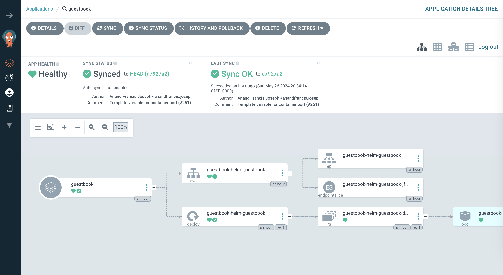

# 10.5 使用 ArgoCD 进行持续交付

:::tip 什么是 ArgoCD

Argo CD 是以 Kubernetes 作为基础设施，遵循声明式 GitOps 理念的持续交付工具，Argo CD 支持多种配置管理，包括 ksonnet/jsonnet、kustomize 和 Helm 等。它的配置和使用非常简单，并自带一个简单易用的可视化界面。
:::

Argo CD 本质上是一个 Kubernetes Operator，它设计了一系列 Kubernetes CRD 描述的自定义资源，并通过 Kubernetes 控制器（ argoCD-application-controller）持续监控应用当前的实际状态是否与 Git 仓库中声明的期望状态相匹配，如不匹配则自动同步修正。

:::center
  <br/>
  图 ArgoCD 如何工作 [图片来源](https://argo-cd.readthedocs.io/en/stable/)
:::

接下来，笔者通过在集群内安装 ArgoCD 以及部署一个应用示例，以便读者了解 ArgoCD 应用概况。

## 安装 ArgoCD

先创建一个命名空间，再通过 kubectl apply 安装 argoCD 提供的 yaml 文件即可。

```
kubectl create namespace argocd
kubectl apply -n argocd -f https://raw.githubusercontent.com/argoproj/argo-cd/stable/manifests/install.yaml
```
安装之后，可以通过自带的 Web UI 进行交互操作，也可以额外安装 CLI ，通过命令行操作或者与 CI 系统整合。

出于演示的目的，我们这里使用自带 WebUI 进行交互。默认情况下，ArgoCD 的 WebUI 服务在集群内部并没有暴露出来，可以通过 LoadBalancer 或者 NodePort 类型的 Service、Ingress、Kubectl 端口转发等方式将 Argo CD 服务发布到 Kubernetes 集群外部。

通过 NodePort 服务的方式暴露 Argo CD 到集群外部。

```
$ kubectl patch svc argocd-server -n argocd -p '{"spec": {"type": "NodePort"}}'
```

查找到 argocd-server 关联的 NodePort 端口，通过浏览器打开：https://localhost:35123/ 控制台。

初次访问需要登录，argoCD 默认账户是 admin，帐号的初始密码是自动生成，并以明文的形式存储在 ArgoCD 安装的命名空间中 argocd-initial-admin-secret 的 Secret 对象下的 password。

通过下面命令获取初始密码。
```
$ kubectl -n argocd get secret argocd-initial-admin-secret -o jsonpath="{.data.password}" | base64 -d
```

## 部署应用

部署应用之前，我们先了解 ArgoCD 定义的 Application 资源，它通过下面两个关键的属性将目标 Kubernetes 集群中的 namespace 与 Git 仓库中声明的期望状态连接起来：

- **Source**：指的是 Git 仓库中 Kubernetes 资源配置清单所在的位置，可以是原生的 Kubernetes 配置清单，也可以是 Helm Chart 或者 Kustomize 部署清单
- **Destination**：通过 Server 指定 Kubernetes 集群以及相关的 namespace，这样 ArgoCD 就知道将应用部署到 Kubernetes 集群中的哪个位置。

除了可以通过 CLI 和 WebUI 可以创建 Application 之外，其实也可以直接通过声明一个 Application 的资源对象来创建一个应用。

```
apiVersion: argoproj.io/v1alpha1
kind: Application
metadata:
  name: guestbook
  namespace: argocd
spec:
  project: default
  source:
    repoURL: https://github.com/argoproj/argocd-example-apps.git
    targetRevision: HEAD
    path: helm-guestbook
  destination:
    server: https://kubernetes.default.svc
    namespace: default
```

除了 Application 资源，ArgoCD 也定义了 Project 资源，对 Application 进行分组，设置更细粒度的访问权限控制，实现多租户环境。

创建 Application 之后，状态为初始 OutOfSync 状态，此时尚未创建任何 Kubernetes 资源，应用程序也尚未部署。要同步（部署）应用程序，在控制台点击 “SYNC” 按钮进行同步，步之后的状态如下图所示。

<div  align="center">
  
  <p>ArgoCD 应用部署示例</p>
</div>

如此，后续无论是通过 CI 流水线触发更新 git 仓库中的编排文件，还是工程师直接修改，ArgoCD 都会自动拉取最新的配置并应用到 Kubernetes 集群中。