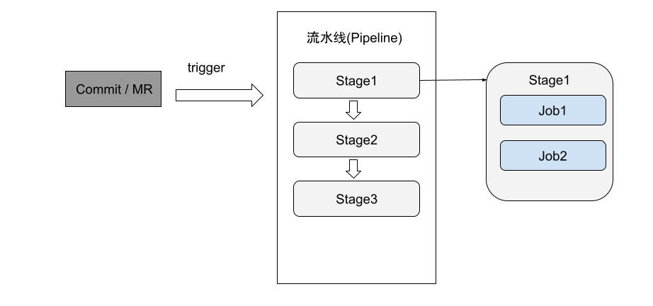

# 持续集成

持续集成是系统持续提供可交付版本软件并且保证软件质量的一种开发方法。

它主张开发人员尽可能早、快地将各自开发的代码集成起来，每次集成都通过自动化的构建（包括静态代码扫描、编译、自动化测试、发布等）来进行质量验证，从而尽可能早地发现集成错误，避免项目延期以及不可预测的质量风险等。

持续集成系统的价值在于完全自动化构建和自动化测试，在微服务持续集成中，包含的关键要素为源代码库、持续集成机系统、自动化测试系统。 

一个典型的持续集成过程为：开发团队基于源代码库（如 Git）建立持续集成系统，当团队成员对源代码就行更新并提交到源码库之后，持续集成系统先从版本控制服务器下载更新后的代码，调用自动化编译脚本进行编译，并运行开发人员预先编写的自动化测试脚本，最后将测试结果生成报告反馈给开发团队，开发团队根据反馈结果进行下一轮的代码迭代更新，并触发新一轮的持续集成过程。


GitLab CI 是为 Gitlab 提供持续集成的一整套系统，

<div  align="center">
  
</div>


## 流水线(Pipeline)

流水线是一个分成不同阶段（Stage）的作业（Job）的集合。一次 Pipeline 其实相当于一次构建任务，里面可以包含多个流程，如安装依赖、运行测试、编译、部署测试服务器、部署生产服务器等流程。任何提交或者 Merge Request 的合并都可以触发 Pipeline。

## Stages

Stages 表示构建阶段，说白了就是上面提到的流程。 我们可以在一次 Pipeline 中定义多个 Stages，这些 Stages 会有以下特点：

- 所有 Stages 会按照顺序运行，即当一个 Stage 完成后，下一个 Stage 才会开始
- 只有当所有 Stages 完成后，该构建任务 (Pipeline) 才会成功
- 如果任何一个 Stage 失败，那么后面的 Stages 不会执行，该构建任务 (Pipeline) 失败

## Jobs

Jobs 表示构建工作，表示某个 Stage 里面执行的工作。 我们可以在 Stages 里面定义多个 Jobs，这些 Jobs 会有以下特点：

- 相同 Stage 中的 Jobs 会并行执行
- 相同 Stage 中的 Jobs 都执行成功时，该 Stage 才会成功
- 如果任何一个 Job 失败，那么该 Stage 失败，即该构建任务 (Pipeline) 失败

## GitLab Runner

理解了上面的基本概念之后，还有一个问题，由谁来执行这些构建任务呢？ 答案就是 GitLab Runner ！

GitLab CI 最大的作用是管理各个项目的构建状态，因此，运行构建任务这种浪费资源的事情就交给 GitLab Runner 来做拉！ 因为 GitLab Runner 可以安装到不同的机器上，所以在构建任务运行期间并不会影响到 GitLab 的性能

## .gitlab-ci.yml

配置好 Runner 之后，我们要做的事情就是在项目根目录中添加 .gitlab-ci.yml 文件。 当我们添加了 .gitlab-ci.yml 文件后，每次提交代码或者合并 MR 都会自动运行构建任务。

```plain
# 定义 stages
stages:
  - build
  - test

# 定义 job
job1:
  stage: test
  script:
    - echo "I am job1"
    - echo "I am in test stage"

# 定义 job
job2:
  stage: build
  script:
    - echo "I am job2"
    - echo "I am in build stage"
```

用 stages 关键字来定义 Pipeline 中的各个构建阶段，然后用一些非关键字来定义 jobs。 每个 job 中可以可以再用 stage 关键字来指定该 job 对应哪个 stage。 job 里面的 script 关键字是最关键的地方了，也是每个 job 中必须要包含的，它表示每个 job 要执行的命令。

```plain
I am job2
I am in build stage
I am job1
I am in test stage
```

