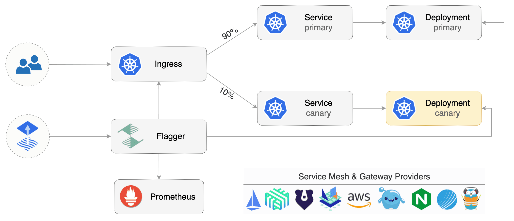

# Flagger

Flagger 是一种渐进式交付工具，也是一个 Kubernetes Operator ，它可以基于多种 ingress 实现金丝雀升级， Flagger 使用 Prometheus 指标对流量进行分析。Flagger 中的 canary 分析器可以通过 webhooks 进行扩展，

Flagger 实现了一个控制环路，该环路逐渐将流量转移到金丝雀，同时测量关键性指标，例如 HTTP 请求成功率、请求延迟、Pod 运行状态等。基于对 KPI 的分享，Flagger  控制金丝雀规模或者终止。

	

