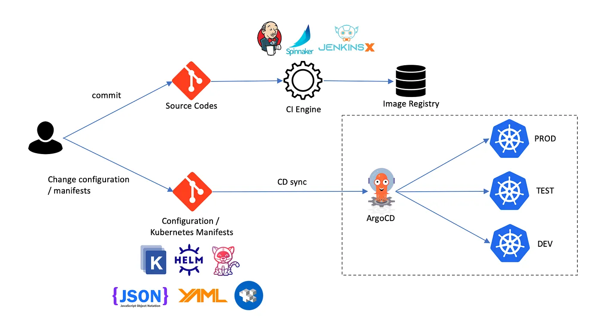

# 什么是 GitOps

GitOps 是 Git 和 Ops 两个概念的缩写，其中 Git 是分布式版本控制软件，而 Ops 来自于 DevOps（开发运维）。这两个概念合在一起就是：基于分布式版本控制软件 Git 的开发运维，GitOps。综合来讲，GitoOps 重新定义了云原生场景下的CI/CD，开发、运维团队以 Git 版本控制，作为中心不可变状态声明，结合 CI/CD 流程中代码审查、自动测试和交付部署 中的各类最佳实践，从而实现应用频繁交付中的效率和质量保障。

## 为什么要使用 GitOps

至目前来讲，贯彻并彻底应用 GitOps 的企业并不算太多，其本质原因还是因为每个企业的运维体系在演进的过程中都带有极大的“个性”，想要对一个企业的运维体系变更，还有更多非技术性的考虑。

不过比较明确的是，GitOps 正在成为新的技术趋势，它重新定义了云原生的场景下 CI/CD 的流程，能很大的提升应用频繁交付的效率和质量保证，从这一点讲，GitOps 是值得投入时间进行研究的。

## GitOps 的设计理念

GitOps 本质上是软件持续交付领域（Continuous Delivery）一种新的理念，而非某项具体的技术或项目，结合如今流行的使用形式，可将 GitOps 简单地理解为以下几大特点：

1. **代码化描述基础设施和应用的部署状态**

任何正在线上运行的基础设施资源或者应用，都可以用代码化的方式来描述其当前状态。描述方式最好采用声明式，这样代码化的部署状态可维护性将会更强。只有将其代码化，我们才能使用代码的方式来管理基础设施和应用的部署。

GitOps 与 IaC（Infrastructure as Code）是密不可分，无法进行 IaC，GitOps 也就无从谈起，IaC 也是后续 GitOps 规模化运维最关键的基础。

2. **使用 Git 的语义来管理代码化后的配置代码**

正如 1 所描述，代码化后的部署配置代码将面临着管理问题，而 GitOps 顾名思义，采用了 Git 的语义来管理代码，主要有：

- 代码存储于 Git 仓库中
- 基于分支模式来管理代码版本 
- 使用 Pull Request 来提交代码变更和 Code Review，对应的变更可方便进行 Revert

3. **具备将配置代码进行自动化部署的能力**

我们已经将基础设施和应用的配置代码化并使用 Git 来进行管理，那么接下来就必须要有相应的能力将配置代码自动化部署于各种真实的线上环境，当 Git 仓库中声明的期望状态发生变化时，可以立刻自动化的应用到系统中，使其当前环境与配置代码所描述的状态一致。

4. **应用状态偏离修正**

应用的状态一旦与 Git 仓库中的期望状态不一致，应该立刻进行自动修复，即使手动修改了集群的编排策略，集群也会被自动恢复到 Git 仓库中清单所描述的状态。

## GitOps 工作流程

鉴于以上 GitOps 的设计哲学，我们看一下 GitOps 的工作流程，如下图所示：

  

- 首先，团队成员都可以 fork 仓库对配置进行更改，然后提交 Pull Request
- 接下来运行 CI 流水线，进行校验配置文件、执行自动化测试、构建 OCI 镜像、推送到镜像仓库等
- CI 流水线执行完成后，拥有合并代码权限的人会将 Pull Request 合并到主分支
- 最后运行 CD 流水线，结合 CD 工具，例如 Argo CD 将变更应用到目标系统中

整个过程中完全自动化且操作透明，通过多人协作和自动化测试来保证了基础设施声明的健壮性。另外由于基础设置配置都存储在Git 仓库中，当应用出现故障时，也可快速地进行版本回退。