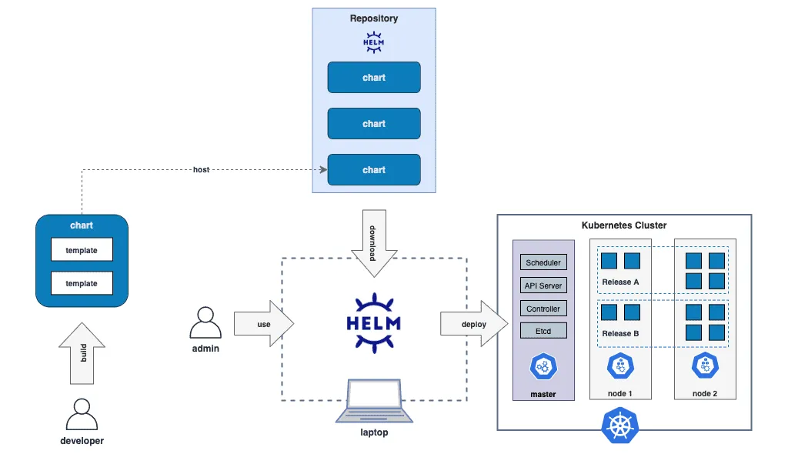

# Helm

Helm 是由 Deis 公司开发的一种系统性管理和封装 Kubernetes 应用的解决方案，它参考了各大 Linux 发行版管理应用的思路，应用格式是 Chart。（相较于 yum 之 Centos， apt-get 之 Ubunut）。Helm 本质就是 Kubernetes 的包管理器，对于使用者而言，使用 Helm 后不用需要了解 Kubernetes 的 yaml 语法并编写应用部署文件，可以通过 Helm 一行命令下载并在 kubernetes 上安装需要的应用。

Helm 一开始的目标就很明确：如果说 Kubernetes 是云原生操作系统的话，那 Helm 就是要成为这个操作系统之上的应用商店和包管理工具。


相信读者朋友们知道 Linux 下的包管理工具和封装格式， 如 Debian 系的 apt-get 命令和 dpkg 格式，RHEL 洗的 yum 命令和 rpm 格式。在 Linux 系统中，有了包管理工具，我们只要知道应用的名称，就可以很方便地从应用仓库中下载、安装、升级、回滚等，而且包管理工具掌握着应用的依赖信息和版本变更情况，具备完整的自管理能力，每个应用依赖哪些前置的第三方库，在安装时都会一并处理好。

Helm 模拟的就是这种做法，它提出了与 Linux 包管理直接对应的 Chart 格式 和 Repoistory 应用仓库，另外针对 Kubernetes 中特有的一个应用要部署多个版本的特点，又提出了 Release 的专有观念。


总结使用 Helm 可以帮我们解决下面这些问题：

- 高度可配置：Helm Charts 提供了高度可配置的选项，可以轻松自定义和修改应用程序的部署配置
- 版本控制 ：Helm 允许管理应用程序的多个版本，从而轻松实现版本控制和回滚
- 模板化：Helm Charts 使用 YAML 模板来定义 Kubernetes 对象的配置，从而简化了配置过程，并提高了可重复性和可扩展性
- 应用程序库：Helm 具有应用程序库的概念，可以轻松地共享和重用 Helm Charts，从而简化了多个应用程序的部署和管理

## Helm 的概念

在使用 Helm 之前，我们先需要理解如下几个核心概念

| 概念|描述|
|:--|:--|
|Chart|Helm 的打包格式，内部包含了一组相关的 kubernetes 资源|
|Repoistory| Helm 的软件仓库，用于存储 Charts |
|Release| 在 kubernetes 上运行的 Chart 实例，例如 一个 Redis Chart 想要运行两个实例，可以将 Redis Chart install 两次，并在每次安装生成自己的 Release 以及 Release 名称 |
|Value| Chart 参数，用于配置 kubernetes 对象|
| Template | 使用 Go 模版语言生成的 kubernetes 对象的定义文件 |

## Helm 的工作流程

如下图所示， Helm 的工作流程总结如下：

- 开发者首先创建并编辑 chart 配置
- 接着打包并发布到 Helm 的仓库
- 当管理员使用 helm 命令安装时， 相关的依赖会从仓库中下载
- 接着 Helm 会根据下载的配置部署资源到 kubernetes 中

<div  align="center">
	
</div>

## Chart 应用示例

```plain
WordPress
.
├── Chart.lock
├── Chart.yaml
├── README.md
├── templates
│   ├── NOTES.txt
│   ├── _helpers.tpl
│   ├── config-secret.yaml
│   ├── deployment.yaml
│   ├── hpa.yaml
│   ├── svc.yaml
│   └── ...
├── values.schema.json
└── values.yaml
```

Chart 包内有几个固定的配置文件： Chart.yaml 给出了 应用自身的详细信息（名称、版本、许可证、自述、说明等）， values.yaml 给出了所有可配置项目的预定义值。

从整体来说， Helm 提供了应用生命周期、版本、依赖项的管理功能，同时 Helm 还支持额外的插件扩展，能加加入 CI/CD 或者其他方面的辅助功能。


## Helm 项目安装

Helm 提供了二进制以及脚本安装，我们这里使用二进制的方式安装。国内 Helm 镜像地址：https://mirrors.huaweicloud.com/helm/


- 下载 需要的版本
- 解压 tar -zxvf helm-v3.0.0-linux-amd64.tar.gz 
- 在解压目录中找到 helm 程序，移动到需要的目录中 mv linux-amd64/helm /usr/local/bin/helm 

添加一个 chart 仓库。

```plain
helm repo add azure https://mirror.azure.cn/kubernetes/charts
```
搜索 chart

```plain
$ helm search repo redis
NAME                           	CHART VERSION	APP VERSION	DESCRIPTION                                       
azure/prometheus-redis-exporter	3.5.1        	1.3.4      	DEPRECATED Prometheus exporter for Redis metrics  
azure/redis                    	10.5.7       	5.0.7      	DEPRECATED Open source, advanced key-value stor...
```

```plain
# 拉取chart包到本地
$ helm pull bitnami/redis-cluster --version 8.1.2
# 安装redis-ha集群，取名redis-ha，需要指定持存储类
$ helm install redis-cluster bitnami/redis-cluster --set global.storageClass=nfs,global.redis.password=xiagao --version 8.1.2
# 卸载
$ helm uninstall redis-cluste
```