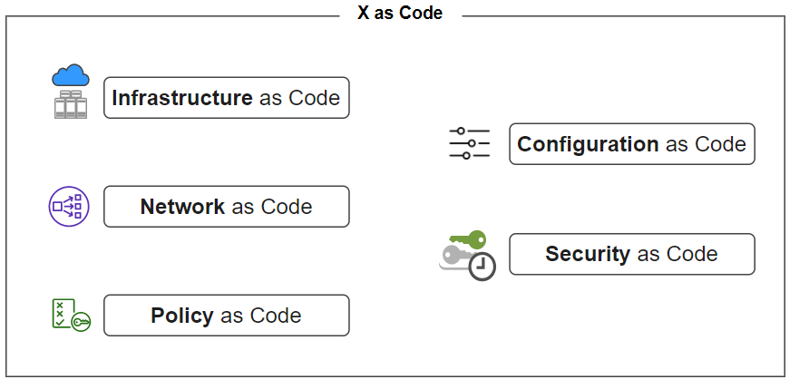

# 基础设施即代码

GitOps 一个最基础的工作是基础设施代码化。

基础设施即代码（Infrastructure as Code, IaC），顾名思义，表示使用代码（而非手动流程）来定义基础设施，研发人员可以像对待应用软件一样对待基础设施，
包括对网络配置、虚拟机、负载平衡、连接拓扑等等都使用高级语言进行编码。

对对应用开发所依靠的环境进行标准化后，DevOps 就能够启动、拆解和扩展基础设施，以响应不断波动的需求，这样的敏捷性能够造就更快、更简单的软件开发、测试和部署。

## IaC 的优势

置备基础架构历来是一个耗时且成本高昂的手动过程，随着云计算的发展，基础架构的管理已逐渐转移到了虚拟化、容器和云计算，在基础架构之上，有数以百计、千计的服务不断地更新迭代，另外基础架构本身也不断地使用、扩展和移除。在这种状态下，如果没有相应的 IaC 管理实践，大规模的基础架构维护也会变得越来越困难。

使用 IaC  可以提高一致性并减少错误和手动配置，它的优势特点如下：

- 可以创建包含基础架构规范的声明式配置文件，从而便于编辑和分发配置。
- 可以确保每次配置的环境都完全相同。
- 可以进行版本控制，所有的变更都会被记录下来，方便溯源。
- 可以将基础设施划分为若干个模块化组件，并通过自动化以不同的方式进行组合。

广义上的 IaC 不仅仅只关于基础设施，还包含了网络、安全、配置等等，所以 IaC 又叫 X as Code。

	

## IaC 工具选型

大部分的公有云已经提供了良好的 API 和相应的 IaC 生态，而对于使用混合云的企业，还是需要一些投入将底层基础设施 IaC 化。

云上资源 IaC 化，比较典型的工具是 Terraform。Terraform 可以说是 IaC 概念最早期的奠基项目，生态最为完善，社区也非常活跃，背后也有非常成熟的商业上市公司 HashiCorp 进行支持。Terraform 抽象了 HCL 这门相对简单易学的 DSL 作为资源描述语言，实践中配合 Terragrunt 这个工具（底层基于 Terraform 进行封装）能更好地写出相对紧凑简洁的代码。

另外一个  Crossplane 。基于 Kubernetes 并通过封装好的形形色色的 CRDs 来操作多云资源。

除以上云资源 IaC 化外，还有应用配置的 IaC，现在大部分企业选择 Kubernetes 作为 PaaS 的基座，行于 Kubernetes 之上的所有资源天然就已经被代码化了，其形式就是资源声明式 YAML 配置，但这种方式，过于简单，局限性过大。 从组织的角度来看，需要有对 yaml 更抽象的部署封装，这就是 Kustomize 和 Helm 。

这两个工具本质上就是客户端 YAML 渲染引擎，用以更好的管理 YAML。从易用性的角度来看 Kustomize 更容易，但从功能性和生态来看 Helm 无疑是现在 Kubernetes 上的事实标准。

Helm 有一定的学习门槛。但是它的功能性非常的完善，基本可以满足绝大多数的 YAML 生成需求。而且，Helm 还有相应的包管理机制 Helm Chart，几乎每一个流行的 Kubernetes 应用都会提供相应的 Helm Chart 供用户安装。