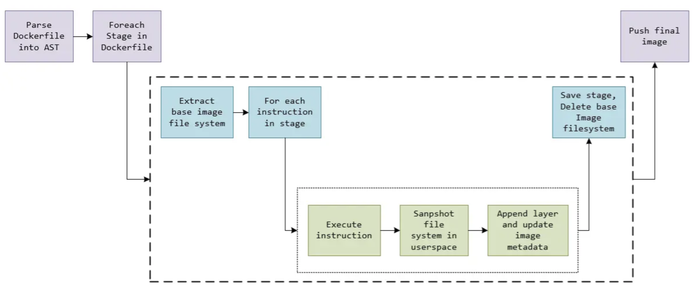

# 10.4.4 使用 Kaniko 构建镜像

我们编译镜像大部分使用 docker build 的方式，而现在大部分的 CI/CD 系统运行在容器内，如果要在容器内编译镜像，你或许会想到将宿主机上的 /var/run/docker.sock 文件通过 hostPath 的方式挂载到 pod 容器内。

但这种方式存在明显的缺陷：**得在宿主机额外安装 Docker 且有安全风险**。那是否有一种能摆脱 Docker，能快速安全的构建容器镜像的方法呢？这就是下面要介绍的 Kaniko。

:::tip Kaniko 是什么

Kaniko 是谷歌开源的一款构建容器镜像的工具。

Kaniko 并不依赖于 Docker 守护进程，完全在用户空间根据 Dockerfile 的内容逐行执行命令来构建镜像，这就使得在一些无法获取 docker 守护 进程的环境下也能够构建镜像。

:::

<div  align="center">
	
	<p>Kaniko 如何工作</p>
</div>

Kaniko 会先提取基础镜像(Dockerfile FROM 之后的镜像)的文件系统，然后根据 Dockerfile 中所描述的，一条条执行命令，每一条命令执行完以后会在用户空间下面创建一个 snapshot，并与存储与内存中的上一个状态进行比对，如果有变化，就将新的修改生成一个镜像层添加在基础镜像上，并且将相关的修改信息写入镜像元数据中。等所有命令执行完，kaniko 会将最终镜像推送到指定的远端镜像仓库。


## 集成 Kaniko 到 Tekton 流水线

有了 kaniko，在 Pod 内构建镜像就变得简单了。如下定义了一个镜像编译的 Task。

```
apiVersion: tekton.dev/v1beta1
kind: Task
metadata:
  name: build-and-push
spec:
  resources:
    inputs:
      - name: repo
        type: git
  steps:
    - name: build-and-push
      image: gcr.io/kaniko-project/executor:v1.3.0
      env:
        - name: DOCKER_CONFIG
          value: /tekton/home/.docker
      command:
        - /kaniko/executor
        - --dockerfile=Dockerfile
        - --context=/workspace/repo/src
        - --destination=arthurk/tekton-test:latest
```

上面的 Task 中，将将 git 作为输入，定义了一个名为 build-and-push 的步骤。

执行的命令就是 /kaniko/executor，通过 --dockerfile 指定 Dockerfile 路径，--context 指定构建上下文，我们这里当然就是项目的根目录了，然后 --destination 参数指定最终我们的镜像名称。


## 2. 镜像构建

熟悉常用的 Dockerfile 指令之后，我们可以开始尝试通过 Dockerfile 构建一个 Nginx 镜像。

```dockerfile
#第1阶段
FROM skillfir/alpine:gcc AS builder01
RUN wget https://nginx.org/download/nginx-1.24.0.tar.gz -O nginx.tar.gz && \
tar -zxf nginx.tar.gz && \
rm -f nginx.tar.gz && \
cd /usr/src/nginx-1.24.0 && \
 ./configure --prefix=/app/nginx --sbin-path=/app/nginx/sbin/nginx && \
  make && make install
  
#第2阶段
FROM skillfir/alpine:glibc
RUN apk update && apk upgrade && apk add pcre openssl-dev pcre-dev zlib-dev 

COPY --from=builder01 /app/nginx /app/nginx
WORKDIR /app/nginx
EXPOSE 80
CMD ["./sbin/nginx","-g","daemon off;"]
```
制作镜像
```bash
docker build -t alpine:nginx .
```
查看镜像产物
```bash
$ docker images 
REPOSITORY                TAG             IMAGE ID       CREATED          SIZE
alpine                    nginx           ca338a969cf7   17 seconds ago   23.4MB
```

测试镜像
```bash
docker run --rm --name nginx -p 80:80 alpine:nginx
```

构建镜像最有挑战性之一的就是使用镜像尽可能小，小的镜像不论在大规模集群部署、故障转移、存储成本方面都有巨大的优势，以下是一些镜像构建的小技巧：
* 选用精简的基础镜像
* 使用多阶段构建
* COPY ADD 和 RUN 命令都会增加镜像层数，所以构建镜像时可以通过合并 RUN 指令减少叠加层，同时 RUN 命令最后可以通过一些工具的清理命令如`yum clean` `conda clean --all`来清理缓存，以此来减小 RUN 层的大小

