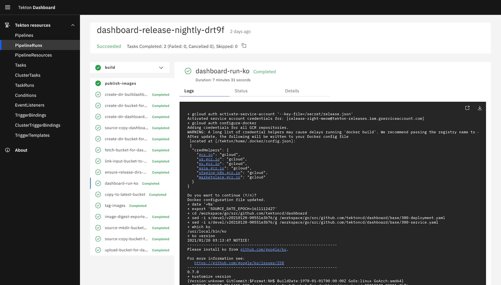

# 10.4.1 安装 Tekton

安装 Tekton 非常简单，通过 tekton 提供的 release.yaml 文件进行安装（注意 Kubernetes 集群版本要求 1.25+）。资源清单文件安装后，会创建一个名为 tekton-pipelines 的命名空间，在该命名空间下面会有大量和 tekton 相关的资源对象。

```
$ kubectl apply --filename https://storage.googleapis.com/tekton-releases/pipeline/latest/release.yaml
```

查看该命名空间中 Pod 状态确认安装是否成功。

```
$ kubectl get pods --namespace tekton-pipelines --watch
NAME                                           READY   STATUS             RESTARTS      AGE
tekton-pipelines-controller-6d5b665f7d-96njd   1/1     Running            0             110s
tekton-pipelines-webhook-9485cfb96-th9pt       1/1     Running            0             110s
```

安装成功后，我们可以选择继续安装 Tekton 提供的 CLI 工具或者 Dashboard 与 Tekton 交互。如下，安装 Dashboard。

```
$ kubectl apply --filename https://storage.googleapis.com/tekton-releases/dashboard/latest/release.yaml
```
临时性通过 kubectl 端口转发将 tekton dashboard 服务暴漏到集群外部（如果是正式使用，可通过 Ingress 绑定 Service 的形式提供外部服务）。
```
$ kubectl --namespace tekton-pipelines port-forward svc/tekton-dashboard 9097:9097
```

打开浏览器访问 http://localhost:9097，可查看 tekton 的各类资源以及流水线运行情况。

:::center
  <br/>
  图 7-1 Tekton Dashboard
:::
