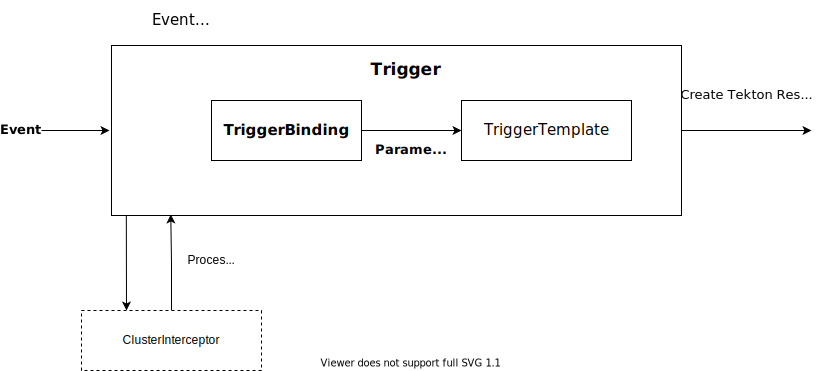
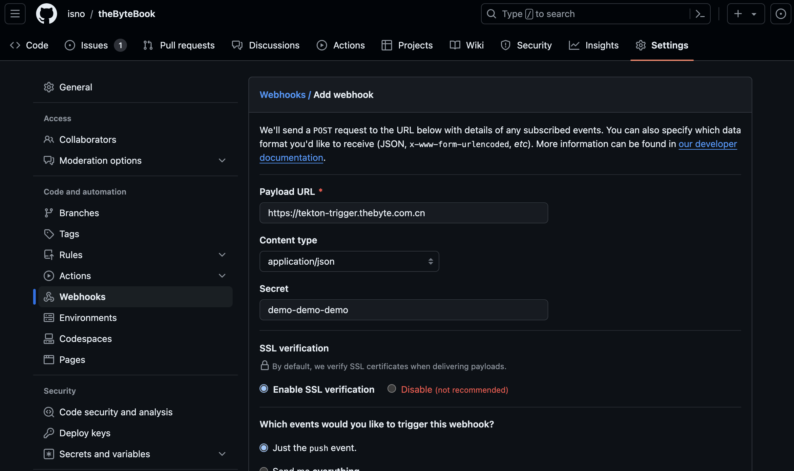

# 10.4.5 自动触发任务

前面我们都是通过手动的方式创建 TaskRun/PipelineRun 触发流水线，本节我们讨论使用 Tekton Trigger 组件**通过外部事件自动触发流水线**。

:::tip 外部事件

gitlab、github 的 Webhook 就是一种最常用的外部事件，通过 Trigger 组件监听这部分事件，而从实现在提交代码后自动运行某些任务。
:::

通过 Trigger 构建自动流水线的流程如图 10-8 所示，它会先启动一个事件监听器 EventListener，然后通过 HTTP 方式暴露服务，接收来自外部事件推送。当接收到外部事件（例如 github push）时：

1. 首先会由 Interceptors 进行有效性验证等处理：
	- 无效的事件直接丢弃；
	- 有效事件交给 TriggerBinding 处理。
2. TriggerBinding 负责从事件内容中提取任务对应的参数，然后将参数传递给 TriggerTemplate。
3. TriggerTemplate 根据预先定义的模版以及收到的参数创建 TaskRun 或者 PipelineRun 对象。

:::center
  <br/>
 图 10-8 Tekton 触发任务工作流程 [图片来源](https://tekton.dev/docs/getting-started/triggers/)
:::

接下来，我们配置一个触发器，接收来自 Github 的 Webhook 事件，关联前面定义的 Pipeline，实现代码测试、构建镜像自动化。

## 1. 创建触发器

使用 Tekton Triggers 之前，先安装对应的组件。

```shell
$ kubectl apply --filename https://storage.googleapis.com/tekton-releases/triggers/latest/release.yaml
```
查看 Triggers 组件安装状态，确定是否为 Running 状态。

```shell
$ kubectl get pods --namespace tekton-pipelines
NAME                                           READY   STATUS    RESTARTS   AGE
tekton-dashboard-69656879d9-7bbkl              1/1     Running   0          2d6h
tekton-pipelines-controller-67f4dc98d8-pgxrq   1/1     Running   0          22d
tekton-pipelines-webhook-59df55445c-jw76v      1/1     Running   0          22d
tekton-triggers-controller-779fc9f557-vj6xs    1/1     Running   0          17m
tekton-triggers-webhook-c77f8dbd6-ctmlm        1/1     Running   0          1
```

创建一个名为 github-listener 的 EventListener 资源对象，文件（github-push-listener.yaml）内容如下所示。

```yaml
apiVersion: triggers.tekton.dev/v1beta1
kind: EventListener
metadata:
  name: github-listener
spec:
  serviceAccountName: tekton-triggers-github-sa
  triggers:
  	interceptors:
        - github:
            secretRef: # 引用 github-secret 的 Secret 对象中的 secretToken 的值
              secretName: github-secret
              secretKey: secretToken
            eventTypes:
              - Push Hook # 只接收 GitLab Push 事件
    - name: github-trigger 
      bindings:
      - ref: github-push-binding
      template:
        ref: github-push-template
```

上面定义的 EventListener 用于监听 GitHub 上的 Push 事件，当有 Push 事件发生时，会触发一个名为 github-trigger 的操作，该操作会执行一个名为 github-push-template 的任务模板。在监听之前，会执行一个名为 github 的拦截器，用于验证 GitHub 事件，并使用提供的密钥进行身份验证。

将定义的 EventListener 资源提交到 Kubernetes 集群。

```
$ kubectl apply -f github-push-listener.yaml
```

## 2. 通过 TriggerBinding 提取事件参数

TriggerBinding 通过 $() 包裹的 JSONPath 表达式提取 Github Webhook 发送过来的数据，至于能够提取哪些参数值，你可以在官网帮助查看 github/gitlab 的 WebHook 的说明[^1]。

```yaml
apiVersion: triggers.tekton.dev/v1beta1
kind: TriggerBinding
metadata:
  name: github-push-binding
spec:
  params:
    - name: git-revision
      value: $(body.checkout_sha)
    - name: git-repository-url
      value: $(body.repository.git_http_url)
```

接下在 TriggerTemplate 对象中通过参数来读取上面 TriggerBinding 中定义的参数值了。

## 3. 接收参数并关联 PipelineRun

定义一个如下所示的 TriggerTemplate 对象，声明一个 TaskRun 的模板。

```yaml
apiVersion: triggers.tekton.dev/v1beta1
kind: TriggerTemplate
metadata:
  name: github-pipeline-template
spec:
  params: # 定义参数，和 TriggerBinding 中的保持一致
    - name: repo
  resourcetemplates:
    - apiVersion: tekton.dev/v1beta1
      kind: PipelineRun # 定义 PipelineRun 模板
      metadata:
        generateName: github-pipeline-run- # PipelineRun 名称前缀
      spec:
        pipelineRef:
          name: github-pipeline
        params:
        - name: repo
          value: $(tt.params.git-repository-url)
```
:::tip 注意
TriggerTemplate 里的 Pipeline 也要使用 generateName，否则名字相同、内容也相同的 PipelineRun 就会被忽略掉。
:::

提交到 Kubernetes 集群。
```
$ kubectl apply -f trigger-binding.yaml
```

## 4. 通过 Ingress 暴露服务

EventListener 创建完成后会生成一个名为 el-gitlab-listener 的 Service 对外暴露用于接收事件响应。我们通过 Ingress 对象绑定 tekton-trigger.thebyte.com.cn 将服务暴露到外网，yaml 文件内容如下（el-gitlab-listener.yaml）。

```yaml
apiVersion: networking.k8s.io/v1
kind: Ingress
metadata:
  name: ingress-wildcard-host
spec:
  rules:
  - host: "tekton-trigger.thebyte.com.cn"
    http:
      paths:
        - path: /
      	pathType: Prefix
        backend:
          service:
            name: el-gitlab-listener
            port:
              number: 8080
```

提交到 Kubernetes 集群。

```
$ kubectl apply -f el-gitlab-listener.yaml
```

## 5. 设置 Github Webhook

上面我们已经设置完 EventListener，下面我们在 github 中为仓库设置 Webhook，如图 10-9 所示，填写 Playload Url、Secret 等信息。

:::center
  <br/>
  图 10-9 设置 Github Webhook
:::

配置完之后，推送代码，Github 将产生一个 Webhook 事件，请求 tekton-trigger.thebyte.com.cn，然后触发我们定义的流水线。

[^1]: 参见 https://docs.gitlab.com/ee/user/project/integrations/webhook_events.html#push-events