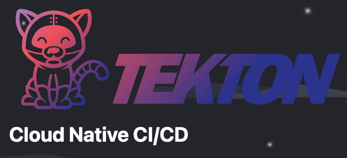
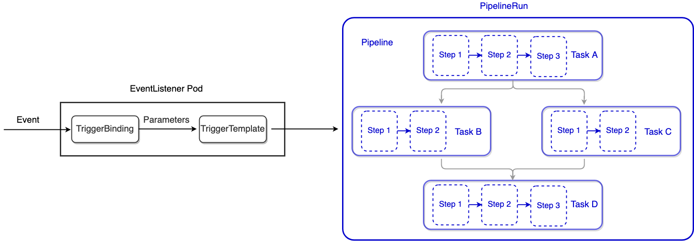

# 10.4 使用 Tekton 进行持续集成

本文选择 Tekton 构建 CI 流程。

:::tip Tekton 是什么

Tekton 的前身是 Knative 项目的 build-pipeline 项目，这个项目是为了给 build 模块增加 pipeline 的功能，但是随着不同的功能加入到 Knative build 模块中，build 模块越来越变得像一个通用的 CI/CD 系统，于是，索性将 build-pipeline 剥离出 Knative，就变成了现在的 Tekton，而 Tekton 也从此致力于提供全功能、标准化的云原生 CI/CD 解决方案。

:::

构建 CI（持续集成）可选型的方案众多，例如 Gitlab CI、Jenkins、Travis CI、Circle CI 等，那为什么选择 Tekton 呢？

最主要的原因还是 Tekton 是一款基于 Kubernetes 实现的 CI/CD 框架，可以充分利用 Kubernetes 的生态与其他服务整合，例如监控、告警、日志等，形成基于 Kubernetes 的完整 DevOps 技术栈。

如下图所示，Tekton 简介：Cloud Native CI/CD（符合云原生理念的 CI/CD 系统）。

	

Tekton 整体分为两部分：EventListener 和 Pipeline。Event Handler 主要是接受 SCM（Software Configuration Management，软件配置管理系统） 系统的事件消息（如代码变更），然后做一些处理，获取必要的信息（代码提交者、提交内容等），然后把这些内容当作输入（Input）传递到 Pipeline Handler 部分。Pipeline Handler 会根据用于自定义的流程（如完成源码到镜像的转换）来完成整个 CI/CD 构建。

Pipeline Handler 有几个概念需要了解：

- Step：Step 是 Tekton 最基本的操作单元，每一个 Step 就是用特定的构建工具来用特定的输入（Input）生成特定输出（Output）的过程，上一个 Step 的输出可以作为下一个 Step 的输入。Step 是在由用户提供的容器镜像拉起的容器里面完成工作的；
- Task：Task 是一系列 Step 的有序集合。Task 是在 Kubernetes pod 里面完成工作的；而 Step 是 pod 的单个容器中完成工作的；
- TaskRun：TaskRun 是 Task 的具体执行。每次创建一个 TaskRun 就会有一个指定的 Task 开始运行。TaskRun 可以单独运行，也可以被嵌入到 PipelineRun 中；
- Pipeline：Pipeline 是一系列 Task 的有序集合。Tekton 会收集所有的 tasks，将它们链接成一个有向无环图（directed acyclic graph，即 DAG），然后按顺序执行。Pipeline 的执行会生成一系列 pod。
- PipelineRun：PipelineRun 是 Pipeline 的具体执行。每次创建一个 PipelineRun 就会有一个指定的 Pipeline 开始运行。
- PipelineResource：PipelineResource，主要用来定义 Step 需要的输入（Input）以及相应的输出（Output）。

	

