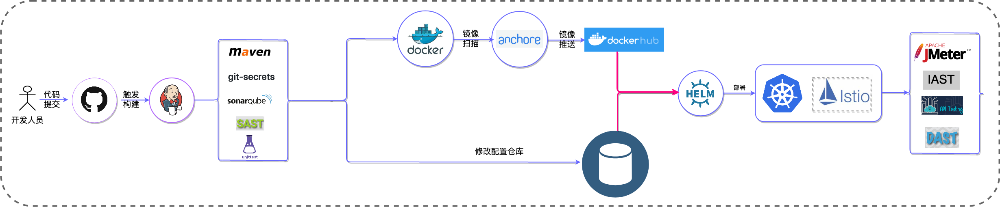
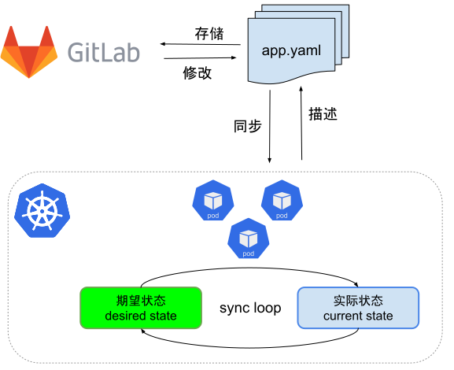

# 10.1 GitOps 出现的背景

先来看一个传统的云原生应用如何进行持续交付。

图 10-1 展示了一个典型的 Push 交付模型，包含了从开发人员提交代码到代码构建检测再到镜像构建最后进行数据以及后续测试的流程。

:::center
   
  图 10-1 Push 交付模型
:::

当做好自动化以后，实施持续集成、持续部署/交付，看起来也没什么问题。

## 10.1.1 Push 交付模型的问题

但认真思考，会发现 Push 模型**流程都是从左往右推进**。如果是云原生应用（用 yaml 文件进行描述，并存储在配置仓库中的应用），随着时间的推移：

- 很难保证配置描述和云原生底座（如 kubernetes 集群）上的实际状态真正相符，容易发生“配置漂移”情况（配置仓库和集群运行状态不相符）；
- 随着集群数量和应用程序的增多，工程师们将疲于应对**线上和配置状态不一致**问题，还产生各类**安全合规**问题（人工操作 kubectl，无法追溯、不可回源等）。

## 10.1.2 解决问题的核心：声明式设计

你是否还能想起本书第一章关于声明式的介绍。

:::tip 声明式设计要点
我们向一个工具描述我们想要让一个事物达到的目标状态，由这个工具自己内部去解决如何令这个事物达到目标状态。
:::

云原生应用的部署底座是 Kubernetes，Kubernetes 是一种声明式系统，把应用状态用 yaml 文件进行描述状态（例如 kustomize、Helm 定义应用）。把描述应用状态的 yaml 文件存储在 Git 仓库中，再有一个连接 git 配置和集群状态自动同步的机制，如图 10-2 所示，以声明式系统为基座、以 Git 为单一可信源的一种新型交付模型出现了。

:::center
   
  图 10-2 GitOps 中的应用同步模型
:::

