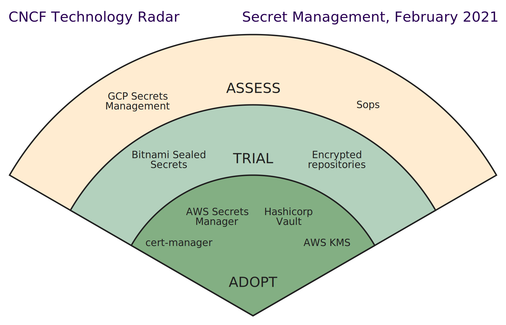

# 10.3 解决 IaC 后的隐私安全问题

GitOps 的核心原则之一是**一切皆代码**，随后用 GitHub/GitLab 等对代码进行版本控制。

此处，引出第一个问题：**代码中的敏感信息怎么处理**？你肯定不希望你的公司出现在新闻或者社区讨论中：xx 公司的工程师居然把密钥/密码推送到了 github 中! 这样的案例可不少见。

避免此类问题**最有效的方式是对敏感信息进行加密再推送至仓库，只要保证解密所用密钥的安全，那就能保证敏感信息不会被泄漏**。

关于加密所用的手段，可以查看 CNCF 发布的 “安全管理技术雷达图”。

:::center
   
  图 10-4 安全管理技术雷达图 [图片来源](https://radar.cncf.io/)
:::

从技术雷达看，开源的 Vault、Sealed Secrets、Sops 等产品，也有厂商提供的 AWS KMS、GCP Secrets Management 等产品。但不管采用哪种工具，背后的原理大都采用**非对称加密**[^1]的方式：
- 加密是通过公钥将敏感信息进行加密。
- 解密通过私钥将加密信息解密，并生成 kubernetes 能识别的 secret 资源，最终被应用程序所使用。

只要保证私钥的安全，那么敏感信息就能保证不会被泄露。

[^1]: 非对称加密原理可以回顾本书 2.5.1节《理解 HTTPS 流程》内容
