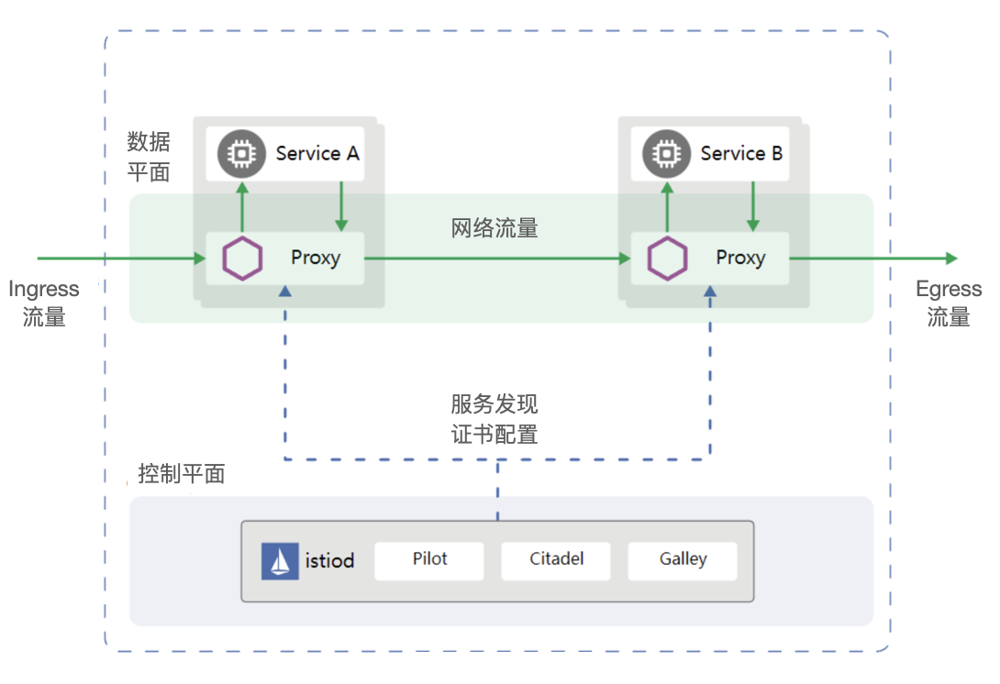

# ServiceMesh 技术实现

## Istio

Istio 是由 Google、IBM 和 Lyft 发起的开源 Service Mesh 框架。Istio 是 Service Mesh 目前的实现的典型代表，Istio 使用 Envoy 作为 Sidecar。

Istio 为微服务应用提供了一个完整的解决方案，可以以统一的方式去检测和管理微服务。同时，它还提供了管理流量、实施访问策略、收集数据等功能，而所有这些功能都对业务代码透明，即不需要修改业务代码就能实现。有了 Istio，就几乎可以不需要其他的微服务框架，也不需要自己去实现服务治理等功能，只要把网络层委托给 Istio，它就能帮助完成这一系列的功能。

由于 Istio 构建于 Kubernetes 之上，因此它自然可以运行于提供  Kubernetes 容器服务的云平台环境中， 也因此成为大部分云平台 ServiceMesh 实现方案。

## Linkerd2

Linkerd 是 Buoyant 公司 2016 年率先开源的高性能网络代理，是业界的第一款 Service Mesh 框架。

其主要用于解决分布式环境中服务之间通信面临的一些问题，如网络不可靠、不安全、延迟丢包等问题。Linkerd 最初使用 Scala 语言编写，其版本 Linkerd2 使用 Go 与 Rust 重构。

## Conduit

Conduit 于 2017 年 12 月发布，作为由 Buoyant 继 Linkerd 后赞助的另外一个开源项目，作为 Linkerd 面向 Kubernetes 的独立版本。Conduit 旨在彻底简化用户在 Kubernetes 使用服务网格的复杂度，提高用户体验，而不是像 Linkerd 一样针对各种平台进行优化。Conduit 的主要目标是轻量级、高性能、安全并且非常容易理解和使用。同 Linkerd 和 Istio，Conduit 也包含数据平面和控制平面，其中数据平面由 Rust 语言开发，使得 Conduit 使用极少的内存资源，而控制平面由 Go 语言开发。

	

## 小结

Kubernetes 的出现已经解决了运维中容器部署，高可用，多副本，容器迁移，弹性扩容，滚动更新，镜像版本管理，服务探活，计算资源分配，计算节点监控等的大部分问题，拥有着优秀的自动运维机制。

但 K8S 在应用层 Service 容器上的监控与流量的管理，容器之间的相互调用，监控，注册，配置，浏览治理等功能并未提供。

为了补充此功能模块则出现了 Server-Mesh 体系的技术，来扩展 K8S 在这方面的能力。使得微服务不再关注具体配置，环境细节，侧重关心业务功能实现，并且摆脱语言环境的限制。
