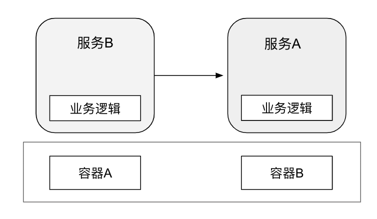
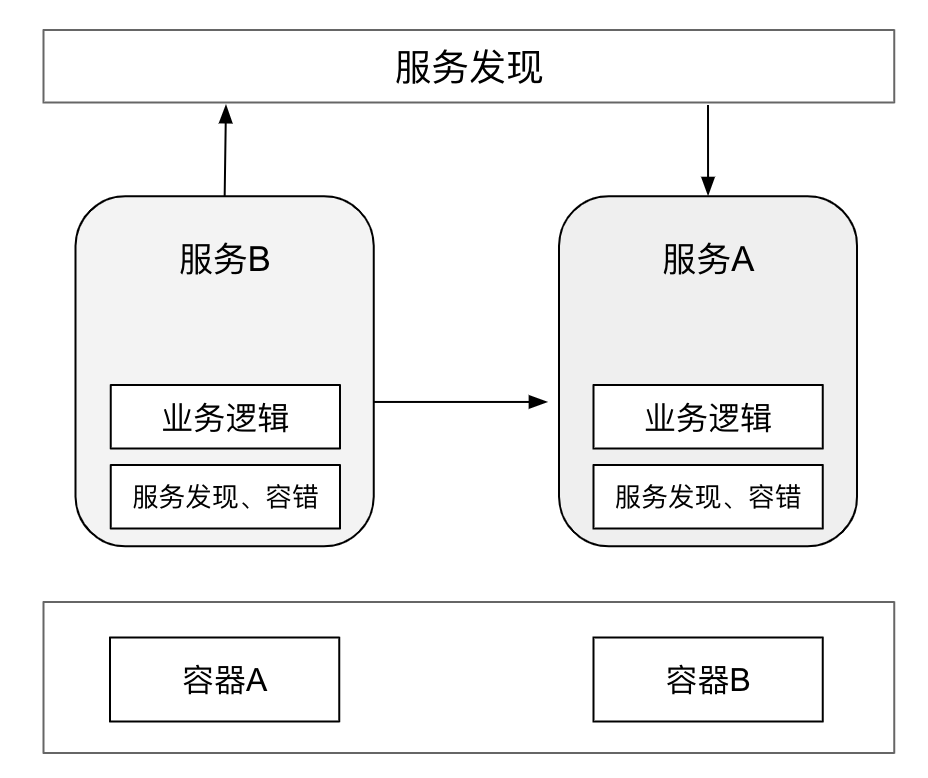
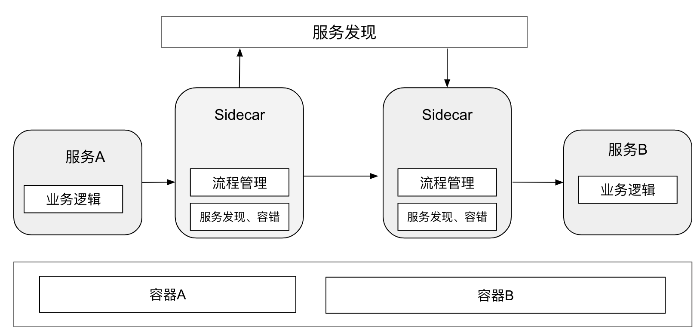
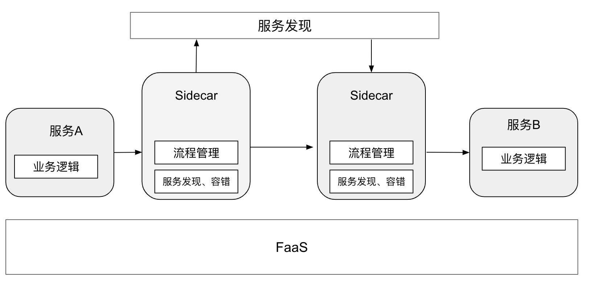

# 微服务架构演进

自 2011 年微服务架构理念提出以来，10 余年间一批又一批技术框架和理念不断涌现出来，按照笔者的理解，这期间典型的架构模式已经迭代了四代。

在第一代微服务架构中，以 RPC 通信为代表，首要解决的是微服务之间的通信问题。技术框架代表如阿里 Dubbo，跨语言平台的框架 Thrift、gRPC...
这个阶段，特别是早期版本的 RPC 框架，应用除了要实现业务逻辑之外，还需要自行解决上下游寻址、通信以及容错等问题。随着服务规模的扩大，服务寻址逻辑也愈加变的复杂，哪怕是同一种开发语言的另外一个应用，上述的微服务基础能力也要再重新实现一遍。

	

在第二代微服务架构中，服务治理逻辑 SDK 化。旁路服务注册中心作为协调者完成服务的自动注册和发现，服务之间的通信以及容错机制开始模块化，并形成独立的服务框架。

这个阶段比较有代表性的框架如 Dubbo、Spring Cloud，只需要少量代码和注解，即可集成各种所需的服务治理能力。

但随着服务框架内功能日益繁多，复用不同开发语言的基础功能就会十分苦难，这也意味着微服务的开发人员被迫绑定在某种特定语言之下，从而违背了微服务敏捷迭代的原则。

	

第三代微服务架构就是云原生时代的微服务架构，出现了服务网格的概念。原来被模块化到服务框架的微服务基础能力，从一个 SDK 演进成为一个独立的进程 - Sidecar（边车）。这个变化使得第二代架构中多语言支持问题得到了彻底解决，微服务基础能力演进和业务迭代解耦。边车进程开始接管微服务应用之间的流量，承载第二代微服务架构中服务框架的功能，包括如服务发现、调用容错以及服务治理能力，具体如权重路由、灰度路由、流量重放等。

这个阶段比较有代表性的框架如 Linkerd、Istio 等

	

第四代微服务架构是目前业界提出的多运行时微服务架构，利用最近的 FaaS 和 AWS 的 Lambda 等无服务器技术来进一步简化微服务的开发和交付。

在第四代微服架构中，微服务由一个应用进一步简化为微逻辑(Micrologic)，变成短暂的功能的集合。 

这中新型的架构也对边车模式提出了更高的要求，更多可复用的分布式能力从应用中剥离，并下沉到边车中，例如状态管理、资源绑定、链路追踪、事务管理等。同时，开发侧开始提倡面向 localhost 编程的理念，并提供标准 API 屏蔽底层资源、服务、基础设施之间的差异，以进一步降低微服务的开发难度。

目前比较有代表性的框架如 Dapr。

	

