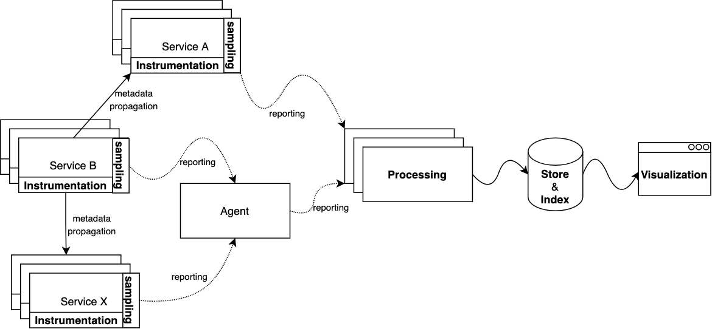

# 链路追踪系统

分布式微服务之间的调用关系很复杂，在业务规模不断增大，服务不断增多且频繁变更的情况下，故常传播及互相影响就成了主要的故障原因之一。

复杂的调用调来一些列问题：在故障时，如何快速分析时哪些服务出现问题？如何梳理服务依赖的关系以及容错性。传统方式是逐个排查服务的指标、日志等，但因为数量太大，很难在短时间内定位问题。

于是调链路追踪系统应运而生，它要解决的问题就是：解决请求全链路的追踪，查看请求调用关系、每个环节的失败耗时信息。

## 调用链追踪系统

链路追踪系统开源的软件有 Jaeger、SkyWalking、Pinpoint、Zipkin、Spring Cloud Sleuth 等。它们在微服务层实现链路追踪功能，总体思想是从请求发起端到后端数据库存储层，所有层都通过一个 TraceId 串起来，期间每经过的一个节点叫作 Span，调用的耗时、错误等信息均附属在节点上，总而实现对一个全链路的追踪、观测。

## 调用链系统基本架构

尽管市面上存在各式各样的调用链追踪系统，但它们的基本架构相对一致, 核心逻辑包括：埋点、采样、上报、处理、存储/索引、可视化、过载控制等。

	

## 小结

调用链不局限于模块、微服务之间的调用关系，也涉及内部逻辑与函数的调用关系，Linux 系统中 Profiling、Strace、tcpdump，Java 中的 Stace 等都是追踪领域相关的技术。