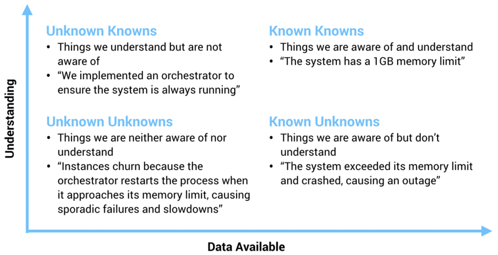

# 9.2 可观测性与传统监控

认识可观测性之后，引来第一个问题：“可观测性与传统监控区别是什么?”。

业内专家 Baron Schwartz 曾用非常简洁的话总结了两者的关系，先看看他的解释。
:::tip 可观测与监控的关系
监控告诉我们系统哪些部分是工作的，可观测性告诉我们那里为什么不工作了。

:::right
——by《高性能 MySQL》作者 Baron Schwartz 
:::

如图 9-1，我们把系统的理解程度和可收集信息之间的关系象限化分析，进一步理解可观测性与传统监控的区别。

:::center
   
  图 9-1 可观测性帮助工程师解决未知的未知（Unknown Unknowns）
:::

X 轴的右侧（Known Knows 和 Known Unknowns）表示确定性的已知和未知，图中给出了相应的例子。这类信息通常是系统上线前就能预见，并能够监控的基础性、普适性事实（如 CPU Load、内存、TPS、QPS 等指标）。过去的大多数运维监控都是围绕这些确定的因素展开的。

然而，很多情况下，这些基础信息很难全面描述和衡量系统的状态。例如，坐标的左上角：Unknown Knowns（未知的已知，通俗理解为假设）。举个例子，为保证服务可用性，通常会引入限流或熔断等容错手段。假设请求量突然异常暴增，容错机制生效，保障服务最大程度上的可用性。但注意，这里的“假设”（请求量突然暴增）并未实际发生。因此，日常情况下的基础监控看不出任何异常。

但当系统接受真正的考验时，那些未经过验证的“假设”（如限流逻辑写错了）会导致我们碰见最不愿见到的情况 —— Unknown Unknowns（未知的未知，毫无征兆且难以理解）。

经验丰富（翻了无数次车）的工程师根据以往经验，逐步缩小 Unknown Unknowns 的排查范围，从而缩短故障修复时间。但更合理的做法是，根据系统的细微输出（如 metrics、logs、traces，也就是遥测数据），以低门槛且直观的方式（如监控大盘、链路追踪拓扑等）描绘出系统的全面状态。如此，当发生 Unknown Unkowns 情况时，才能具象化的一步步定位到问题的根因。

[^1]: 参见 https://blog.sciencenet.cn/blog-829-1271882.html
