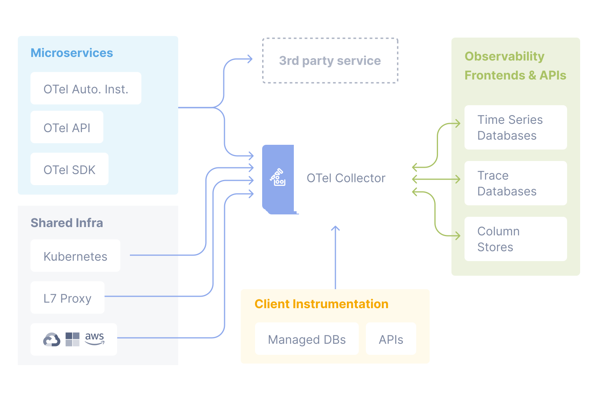

# 9.4 可观测标准项目的演进

对可观测性能力建设而言，最关键的核心问题是：解决数据统一和关联，让数据产生“”血缘关系。但
不同观测数据的处理方案各异，且使用着不同的协议和数据格式，彼此难以兼容或互通。

最开始，Dapper 发布后，市场出现了大量的追踪系统，如 Jaeger、Pinpoint、Zipkin 等。这些系统以 Dapper 论文为原型实现，功能上没有本质差别，但由于它们实现方式和技术栈各不相同，有着自己的采集标准以及 SDK，各类的追踪系统很难直接兼容或一起使用。

为了解决追踪系统各自为政的乱象，一些老牌 APM（Application Performance Monitoring，应用程序性能监控）系统代表的厂商（如 Uber、LightStep、Redhat）定义了一套厂商无关、语言无关的分布式追踪的标准协议 —— OpenTracing。

OpenTracing 作为一个抽象标准，试图通过定义通用的 API 来解决追踪系统标准化的问题。OpenTracing 为开发者提供了一套一致的接口，可以在不同编程语言中使用。只要是符合 OpenTracing 规范的追踪系统，开发者可以灵活地替换或组合探针、存储和界面等组件。2016 年，CNCF 正式接纳 OpenTracing 成为其第三个项目，前两个项目分别是鼎鼎大名的 Kubernetes 和 Prometheus。这标志着 OpenTracing 作为分布式系统可观测性领域的标准之一，得到了业界的广泛认可。

OpenTracing 推出不久之后，Google 和微软联合推出了 OpenCensus 项目。OpenCensus 最初是 Google 内部监控工具的开源版本，目标并不是抢 OpenTracing 的饭碗，而是希望为分布式系统提供一个统一的、跨语言的、开箱即用的可观测性框架，既能够追踪分布式系统中跨服务的请求路径，又能够收集应用程序的性能指标。

虽说 OpenTracing 和 OpenCensus 推动了可观测性系统的发展，但它们作为不同的协议标准，彼此之间的竞争和分裂不可避免地消耗了社区资源。对用户而言，一边是老牌 APM 厂商，另一边是拥有强大影响力的 Google 和微软。选择困难症发作时，一个新的设想开始被不断讨论：“能否有一个统一的标准，能够同时支持指标、追踪和日志等各类可观测性数据？”。

2019 年，OpenTracing 和 OpenCensus 的维护者决定将两个项目整合在一起，希望将链路追踪、指标和日志融合在一起，形成一个统一的解决方案。OpenTracing 和 OpenCensus 合并之后形成了 OpenTelemetry 项目。

OpenTelemetry 覆盖了各类可观测数据类型的规范定义、API 定义、规范实现以及数据的获取与传输。目标是解决的是可观测性数据统一的第一步：通过 API 和 SDK 来标准化可观测数据的采集和传输，之后，观测数据如何使用、存储、展示和告警，OpenTelemetry 本身并不涉及。这使得 OpenTelemetry 既不会因动了“数据的蛋糕”，引起生态抵制，也极大保存了精力，得以专注于实现兼容“所有的语言、所有的系统”的数据采集器（OpenTelemetry Collector）。

如下图所示，应用只需要一种 SDK 就可以实现所有类型数据的统一产生；集群只需要部署一个 OpenTelemetry Collector 便可以实现所有类型数据的采集。而且 Metrics、Tracing、Logging 的具有相同的 Meta 信息（描述和标识数据的附加信息，如标签、时间戳、上下文信息等），可以做无缝关联。之后，你可以使用 Prometheus + Grafana 做指标的存储和展示，使用 Jaeger 做分布式跟踪的存储和展示。

:::center
   
  图 9-23 集成 OpenTelemetry 的可观测架构 [图片来源](https://opentelemetry.io/docs/)
:::

自 2019 年发布，OpenTelemetry 便得到了广泛的社区支持。现如今，许多云服务提供商和容器平台，如 AWS、Google Cloud、Azure、阿里云等均已开始支持和推广 OpenTelemetry。在复杂的微服务架构和云原生环境中，OpenTelemetry 已成为可观测领域遥测数据生成和收集的事实标准。