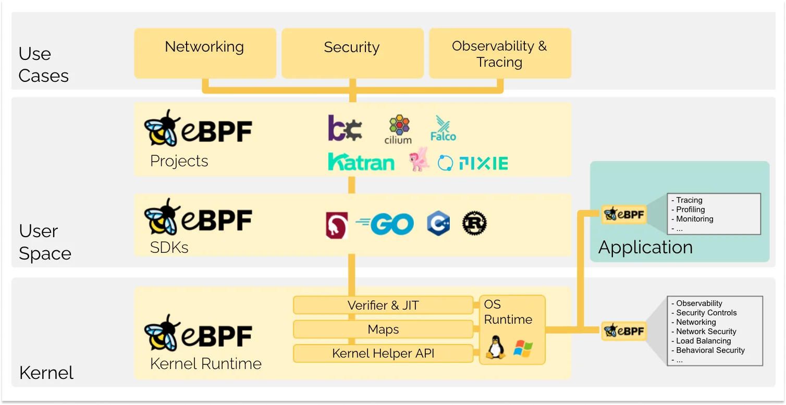

# 9.6 eBPF

传统的APM方案多以嵌入代码的方式实现应用程序的可观测性。市面上APM对非JAVA技术栈都以提供三方包的形式实现，这主要会有两个方面的问题：
1、Agent维护困难
对于不同开发语言有不同的Agent包，Agent太多导致覆盖面不全
2、代码冲突
在业务代码里嵌入了APM客户端相关的代码，如果遇到依赖冲突，问题非常难定位。并且这个代码是不可插拔的。

我们去接触过很多做商用的APM公司，提供的demo案例全是以JAVA为主，其他的开发语言如Python、Golang等则大部分处于开发中状态，非常不利于方案的落地。基于这两个问题，我们把目光投向了一个新的可观测性领域：**eBPF**。

>eBPF 是一项革命性的技术，起源于 Linux 内核，它可以在特权上下文中（如操作系统内核）运行沙盒程序。它用于安全有效地扩展内核的功能，而无需通过更改内核源代码或加载内核模块的方式来实现。  

	

更多的技术细节可以去 ebpf.io 查看。

当前基于eBPF技术实现的可观测性开源产品是DeepFlow的社区版，基于领先的 AutoMetrics 机制，利用 eBPF 技术零侵扰绘制生产环境的服务全景图，包括任意语言开发的服务、未知代码的第三方服务、所有的云原生基础设施服务。