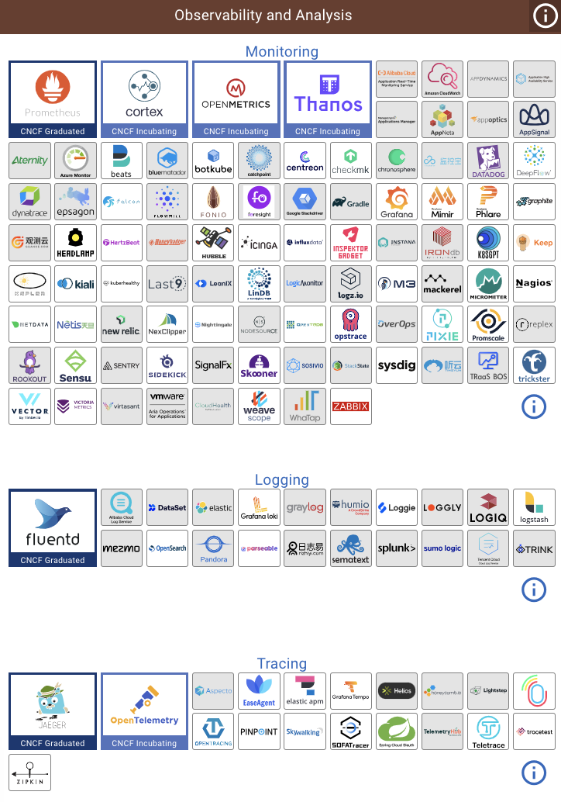

# 9.1 什么是可观测性

分布式系统的可观测性跟控制论里面的可观测性是一致的，这种在其他领域借用的舶来概念并不稀奇，比如常见的“架构”、“设计模式” 等词汇与都是来自于建筑学的概念。

那么，什么是可观测性？可观测性观测什么？Google Cloud 在 OpenTelemetry 的介绍中提到了这么一个概念[^1]：

:::tip telemetry data（遥测数据）

The information that you will use to determine whether an application is healthy and performing as designed is called telemetry data. 

遥测数据是指采样和汇总有关软件系统性能和行为的数据，这些数据（响应时间、错误率、资源消耗等）用于监控和了解系统的当前状态。
:::

遥测数据你不一定陌生，你或许看过中央电视台火箭发射的直播，发射指挥大厅内有条不紊的回响起一系列口令：“USB、雷达 跟踪正常，遥测信号正常”。遥测信号正常说明火箭运行的参数在理想的范围内。软件领域的可测性和系统遥测数据本质和火箭一样，主要就是通过收集系统内部各类的遥测数据来了解系统内部正在发生的事情，以此找到问题的根本原因并提⾼系统可用性，所以，本质上它就是一门数据收集和分析的科学。

总结来说，软件领域的可测性能够帮助大家在 DevOps 中遇到的故障定位难、容量评估、链路梳理、性能分析等问题，提供一种所谓洞见的能力。所以从实际效果看，分布式系统的可观测性可以认为是生物学的显微镜、天文学的望远镜，我想这也是很多开源项目 Logo 中带有各种镜子的原因。

## 可观测性与传统监控

:::tip 可观测与监控
监控告诉我们系统哪些部分是工作的，可观测性告诉我们那里为什么不工作了

-- 《高性能 MySQL》作者 by Baron Schwartz 
:::

在过去，一个物理机器的状态确实可以通过几个监控指标描述，但是随着我们的系统越来越复杂，观测对象正渐渐的从 Infrastructure 转到 应用，观察行为本身从 Monitoring（监控）到 Observability（观测）。虽然看上去这两者只是文字上的差别，也确实容易引起误解，但是请仔细思考背后的含义。

如下图所示，套用 Donald Rumsfeld 关于 Known、Unknowns 的名言[^3]，把系统的理解程度和可收集信息之间的关系进行象限化分析。

	

X 轴的右侧称为 Known Knows（已知且理解）和 Known Unknowns（已知但不理解），这些信息通常是最基础的普适的事实，也就是在系统上线之前我们一定就能想到，一定能够监控起来的（CPU Load、内存、TPS、QPS 之类的指标）。我们过去已有的大多数运维监控都是围绕观察 Known Knows、处理 Known Unknowns 这些确定的东西。

但是还是有很多情况是这些基础信息很难描述和衡量的，例如这个坐标的左上角：Unknown Knowns（未知的已知，通俗解释可称假设）。举个例子：有经验的架构师为保证系统的可用性时，通常会增加限流、熔断的机制，假设在有突发压力的情况下，这些机制生效尽力保证可用性。注意在这个例子中，`假设`的事情（请求突然增大）并没有发生，如果日常压力不大，从已有的基础监控中，可能也很难看出任何问题。但是到出事的时候，这个未曾验证的发生的失误就会变了我们最不愿意看到的 Unknown Unkowns（没有任何线索、也不理解的意外）。

有经验的架构师能通过种种的蛛丝马迹证实自己的推测，也从无数次翻车的事故分析总结中将 Unknown Unknowns 的查询范围变小。但是更合理的做法是透过系统输出的蛛丝马迹，以一个低门槛且形象的方式描绘系统更全面的状态，当发生 Unknown Unkowns 的情况时候，具象化的一步步找到根因。

在云原生和微服务的世界里，最近几年一个行业的大趋势是将系统的可观测性放在一个更高的位置，监控只是可观测性的一个子集，如下所示。

	

## 可观测性数据分类

工业界和学术界一般会将可观测性的遥测数据分解为三个更具体方向进行研究，它们分别是**事件日志（Logging）、链路追踪（Tracing）和聚合度量（Metrics）**。

- Metrics，一般用来计算 Events 发生数量的数据集，这些数据通常具有原子性、且可以聚合。从操作系统到应用程序，任何事物都会产生 Metrics 数据，这些数据可以用来度量操作系统或者应用是否健康。
- Logging，描述一系列离散的事件，在缺乏有力的监控系统时，Logging 数据通常是工程师在定位问题时最直接的手段。如果说 Metrics 告诉你应用程序出现问题，那么 Logging 就告诉你为什么出现问题。
- Tracing，微服务下，多个服务之间或多或少存在依赖，Tracing 通过有向无环图的方式记录分布式系统依赖中发生 Events 之间的因果关系。

2017 年的分布式追踪峰会结束后，Peter Bourgon 撰写了总结文章《Metrics, Tracing, and Logging》[^2]系统地阐述了这三者的定义、特征以及它们之间的关系与差异，受到了业界的广泛认可。

	

来自于 Cindy Sridharan 的《Distributed Systems Observability》著作中进一步将这三个类型的数据称为可观测性的三大支柱（three pillars），不过将它们成为支柱容易让人产生误解，支柱就像一个房子的均匀受力支撑点，缺一不可。而事实上这三者都可以独立存在，系统中也往往只存在 Logging、Tracing。

所以，在最新 CNCF 发布的可观测性白皮书中，将这些可观测的数据统一称为信号（Signals），主要的信号除了 Metrics、logs、traces 之外又额外增加了  Profiles 和 Dumps。

## 可观测性生态

在 CNCF Landscape 中，有个专门的可观测方案分类：Observability and Analysis，下面还有三个子分类：Montioring、Logging、Tracing，其中的产品加起来上百个，可见其纷繁庞大。关键的这并不是全部，不在 CNCF 范围内的商业产品更是不计其数。

	

[^1]: 参见 https://medium.com/lightstephq/observability-will-never-replace-monitoring-because-it-shouldnt-eeea92c4c5c9

[^1]: 参见 https://cloud.google.com/learn/what-is-opentelemetry
[^2]: 参见 https://peter.bourgon.org/blog/2017/02/21/metrics-tracing-and-logging.html
[^3]: 参见 https://blog.sciencenet.cn/blog-829-1271882.html