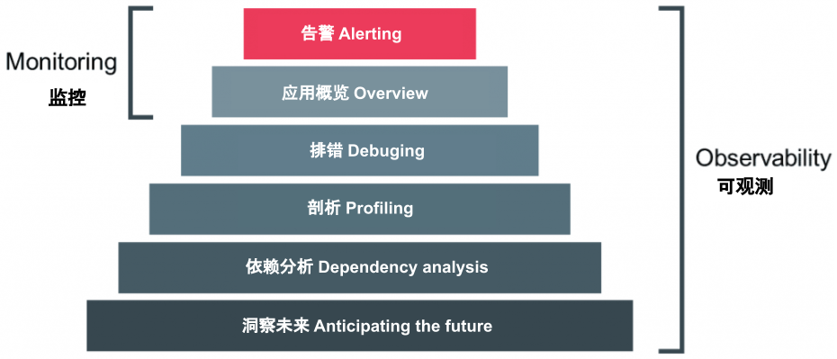

# 9.1 什么是可观测性

分布式系统的可观测性跟控制论里面的可观测性是一致的，这种在其他领域借用的舶来概念并不稀奇，比如常见的“架构”、“设计模式” 等词汇与都是来自于建筑学的概念。

那么，什么是可观测性？观测的是什么？Google Cloud 在 OpenTelemetry 的介绍中提到了这么一个概念[^1]：

:::tip telemetry data（遥测数据）

The information that you will use to determine whether an application is healthy and performing as designed is called telemetry data. 

遥测数据是指采样和汇总有关软件系统性能和行为的数据，这些数据（响应时间、错误率、资源消耗等）用于监控和了解系统的当前状态。
:::

如果你在生活中观察仔细，观看火箭发射的直播时，能注意到发射指挥大厅内回响起一系列有条不紊的口令：“东风光学USB雷达跟踪正常，遥测信号正常”，软件领域的可测性和系统遥测数据本质和火箭一样，就是通过收集系统内部各类的遥测数据来了解系统内部正在发生的事情。

所以，可观测性本质上一门数据收集和分析的科学，帮助大家在 DevOps 中遇到的故障定位难、容量评估、链路梳理、性能分析等问题。

## 可观测性与传统监控

:::tip 可观测与监控
监控告诉我们系统哪些部分是工作的，可观测性告诉我们那里为什么不工作了

-- 《高性能 MySQL》作者 by Baron Schwartz 
:::

在过去，一个物理机器的状态确实可以通过几个监控指标描述，但是随着我们的系统越来越复杂，观测对象正渐渐的从 Infrastructure 转到 应用，观察行为本身从 Monitoring（监控）到 Observability（观测）。虽然看上去这两者只是文字上的差别，也确实容易引起误解，但是请仔细思考背后的含义。

如下图所示，套用 Donald Rumsfeld 关于 Known、Unknowns 的名言[^2]，把系统的理解程度和可收集信息之间的关系进行象限化分析。

	

X 轴的右侧称为 Known Knows（已知且理解）和 Known Unknowns（已知但不理解），这些信息通常是最基础的普适的事实，也就是在系统上线之前我们一定就能想到，一定能够监控起来的（CPU Load、内存、TPS、QPS 之类的指标）。我们过去已有的大多数运维监控都是围绕观察 Known Knows、处理 Known Unknowns 这些确定的东西。

但还是有很多情况是这些基础信息很难描述和衡量的，例如这个坐标的左上角：Unknown Knowns（未知的已知，通俗解释可称假设）。举个例子：有经验的架构师为保证系统的可用性时，通常会增加限流、熔断的机制，假设在有突发压力的情况下，这些机制生效尽力保证可用性。注意在这个例子中，`假设`的事情（请求突然增大）并没有发生，如果日常压力不大，从已有的基础监控中，可能也很难看出任何问题。但是到出事的时候，这个未曾验证的发生的失误就会变了我们最不愿意看到的 Unknown Unkowns（没有任何线索、也不理解的意外）。

有经验的架构师能通过种种的蛛丝马迹证实自己的推测，也从无数次翻车的事故分析总结中将 Unknown Unknowns 的查询范围变小。但是更合理的做法是透过系统输出的蛛丝马迹，以一个低门槛且形象的方式描绘系统更全面的状态，当发生 Unknown Unkowns 的情况时候，具象化的一步步找到根因。你是否已经理解？这就是各种可观测系统所做的事情。

在云原生和微服务的世界里，最近几年一个行业的大趋势是将系统的可观测性放在一个更高的位置，监控只是可观测性的一个子集，如下所示。

	

[^1]: 参见 https://cloud.google.com/learn/what-is-opentelemetry
[^2]: 参见 https://blog.sciencenet.cn/blog-829-1271882.html