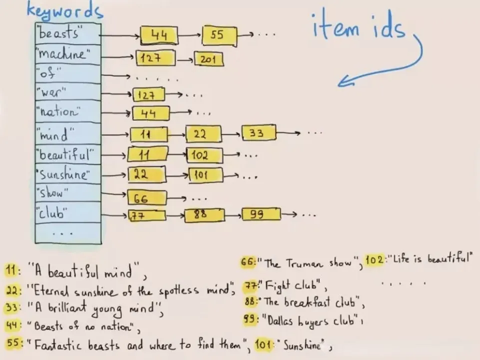

# 9.2.2 事件日志

对于日志的生产和处理，相信程序员们绝对不会陌生，绝大多数程序员生涯的第一行代码是打印 “hello world” 并从控制台输出开始。现在稍微复杂点的系统，对日志的完整处理除了打印，还包含着采集、传输、清洗、存储、分析与检索、告警与智能化响应一系列过程。

日志的处理和分析是典型的大数据分析场景之一：高吞吐写入，还要求实时文本检索及低成本海量存储。业内通常以 ELK（倒排索引架构，消耗巨大的资源建立索引，巨大的存储成本）和 Grafana Loki（轻量索引，检索性能慢）为代表的两类权衡架构。

## 传统解决方案 ELK

讨论实现一套完整的日志系统，工程师们或多或少都应该听说过这几个名词：ELK、ELKB 或者 Elastic Stack。这些其实是实现日志处理方案一套开源组件。

:::tip 什么是 ELKB

ELK 是三个开源项目的首字母缩写，这三个项目分别是：Elasticsearch、Logstash 和 Kibana。Elasticsearch 是一个搜索和分析引擎。Logstash 是服务器端数据处理管道，能够同时从多个来源采集数据，转换数据，然后将数据发送到诸如 Elasticsearch 等“存储库”中。Kibana 则可以让用户在 Elasticsearch 中使用图形和图表对数据进行可视化。Beats 作为轻量级的数据搬运工，集合了多种单一用途数据采集器，将数据发送给 Logstash 或 ElasticSearch，其可扩展的框架及丰富的预置采集器将使工作事半功倍。
:::

总结起来，ELKB 是一组开源组件套件，组件之间作用不用，各司其事，可以像网络协议一样按分层来理解和归类，形成一个类似 TCP/IP Stack 类似的 ELK Stack，如下图所示。但明确的是 ELK 中的 Stack 肯定不是协议栈，且和协议没有任何关系。为统一明确，本文把上面的所有名词简称为 Elastic。

	
	
ELKB 套件

我们来看一个典型的 Elastic Stack 使用场景，大致系统架构如下（整合了消息队列和 Nginx 的架构）。

	
	
Elastic Stack 日志系统

这个系统中，Beats 部署到日志所在地，用来收集原始数据，然后使用 MQ 做缓冲换取更好的吞吐，接着发给 logstash 做数据清洗，最后落地到 es 集群并进行索引，使用时通过 Kibana 来检索和分析，如果有必要挂上 Nginx 做各类访问控制。

Elastic 中最核心的是 Elasticsearch，它是一个提供一种准实时搜索服务（生产环境中可以做到上报 10 秒后可搜，不惜成本万亿级日志秒级响应）的分布式搜索分析引擎。

:::tip 额外知识

与 Elasticsearch 类似的产品还有商业公司 Splunk 和 Apache 开源的 Solr。事实上，Elasticsearch 和 Solr 都使用了著名的 Java 信息检索工具包 Lucene，Lucene 的作者就是大名鼎鼎的 Doug Cutting，如果你不知道谁是 Doug Cutting，那你一定听过他儿子玩具的名字 -- Hadoop。

:::

Elasticsearch 在日志场景中的优势在于全文检索能力，能快速从海量的数据中检索出关键词匹配的日志，其底层核心技术是转置索引（Inverted index）。正常的索引是按 ID 查询详情，类似字典通过页码查询内容。转置索引反过来，将每一行文本进行分词，变成一个个词（Term），然后构建词（Term） -> 行号列表（Posting List） 的映射关系，将映射关系按照词进行排序存储。当需要查询某个词在哪些行出现的时候，先在 词 -> 行号列表 的有序映射关系中查找词对应的行号列表，然后用行号列表中的行号去取出对应行的内容。这样的查询方式，可以避免遍历对每一行数据进行扫描和匹配，只需要访问包含查找词的行，在海量数据下性能有数量级的提升。

	
	
inverted index

转置索引为 ES 带来 快速检索能力的同时，也付出了写入吞出率低和存储占用高的代价。由于数据写入转置索引时需要进行分词、词典排序、构建排序表等 CPU 和内存密集型操作，导致写入吞出率大幅下降。而从存储的成本角度考虑，ES 会存储原始数据和转置索引，为了加速分析可能还需要存储一份列存数据。3份的冗余数据导致更高的存储空间占用。

采用全文检索对日志进行索引，优点是功能丰富，允许各类的复杂的操作。但是，如上的方案也明显透漏出架构复杂、维护困难、资源占用高。日志的大多数查询只关注一定时间范围和一些简单的参数（例如 host、service 等），很多功能往往用不上，ELK 方案像是杀鸡用牛刀。

如果只是需求只是把日志集中起来，操作多是近期范围内的查询，最多用来告警或者排查问题，那就没必要做成全文索引。那么我们可以把目光转向 Loki。

## 日志处理新贵 Loki 

Loki 是 Grafana Labs 公司推出的类似于 Prometheus 的日志系统（官方的项目介绍是 like Prometheus，but for logs）。

Loki 一个明显的特点是非常经济，Loki 不再根据日志的原始内容建立大量的全文索引，而是借鉴了 Prometheus 核心的思想，使用标签去对日志进行特征标记，然后归集统计。Loki 只索引与日志相关的元数据标签，而日志内容则以压缩方式存储于对象存储中，不做任何索引，这样的话，能避免大量的内存资源占用，转向廉价的硬盘存储。相较于 ES 这种全文索引的系统，数据可在十倍量级上降低，加上使用对象存储，最终存储成本可降低数十倍甚至更低。

	
	
Loki 架构：与 Prometheus、Grafana 密切集成

Loki 对 Kubernetes 友好，Promtail（日志收集代理）以 DaemonSet 方式运行在每个节点中，负责收集日志并将其发送给 Loki。日志数据使用和 Prometheus 一样的标签来作为索引，也正是因为这个原因，通过这些标签，既可以查询日志的内容，也可以查询到监控的内容，还能对接到 alertmanager。这两种查询被很好的兼容，节省了分别存储相关日志和监控数据的成本，也减少了查询的切换成本（避免 kibana 和 grafana 来回切换）。

作为 Grafana Labs 的自家产品，自然与 Grafana 密切集成，

	
	
Loki Grafana 

总体而言，Loki 和 ELK 都是优秀的日志解决方案，具体如何选择取决于具体场景。 Loki 相对轻量，具有较高的可扩展性和简化的存储架构，若是数据的处理不那么复杂，且有时序属性，如应用程序日志和基础设施指标，并且应用使用 kubernetes Pod 形式部署，则选择 Loki 比较合适。ELK 则相对重量，需要复杂的存储架构和较高的硬件要求，部署和管理也比较复杂，适合更大的数据集和更复杂的数据处理需求。

## 日志展示

在仪表可视化领域，如果 Grafana 称第二，应该没有敢称第一。在 Grafana Labs 公司成立之前，Grafana Dashboard 就已经在各个开源社区有不小的名气和用户积累。依靠社区的用户基础，Grafana Labs 也快速地将产品渗透至各个企业，如果你观察仔细，还能在各类大场面时不时会见到 Grafana 的身影：2016年，在猎鹰9号火箭首次发射期间，Grafana 出现在 SpaceX 控制中心的屏幕上；几周后，微软发布一段宣传视频，展示了他们的水下数据中心，同样出现了 Grafana 的身影[^3]。

Grafana slogan 中的 “Dashboard anything. Observe everything.” 这个anything 和 everything 可不是说说，使用 Grafana 可以非常轻松的将任何数据[^1]转成任何你想要的图表[^2]的展现形式来做到数据监控以及数据统计。

	

[^1]: 参见 https://grafana.com/grafana/plugins/data-source-plugins/
[^2]: 参见 https://grafana.com/grafana/dashboards/
[^3]: 参见 https://grafana.com/blog/2023/09/26/celebrating-grafana-10-top-10-oh-my-grafana-dashboard-moments-of-the-decade/