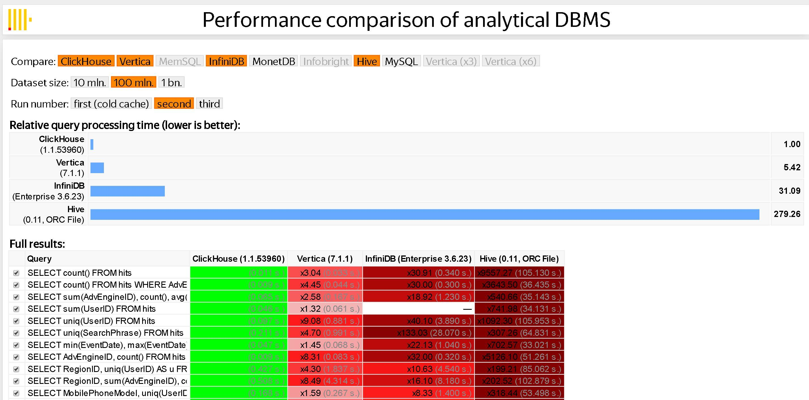

# 9.3.2 日志的索引与存储

处理日志本来是件稀松平常的事情，但随着数据规模的增长，量变引发质变，高吞吐写入（GB/s）、低成本海量存储（PB 级别）以及亿级数据的实时检索（1 秒内），已成为软件工程领域最具挑战性的难题之一。

本节将从日志索引和存储的角度出发，介绍三种业内应对海量数据挑战的方案。

## 1. 全文索引 Elastic Stack

在讨论如何构建完整的日志系统时，ELK、ELKB 或 Elastic Stack 是工程师们非常熟悉的术语。它们实际上指的是同一套由 Elastic 公司[^1]开发的开源工具，旨在处理海量数据的收集、搜索、分析和可视化。

图 9-6 展示了一套基于 Elastic Stack 的日志处理方案：

- **数据收集**：Beats 组件部署在业务所在节点，负责收集原始的日志数据；
- **数据缓冲**：使用 RabbitMQ 消息队列缓冲数据，提高数据吞吐量；
- **数据清洗**：数据通过 Logstash 进行清洗。
- **数据存储**：清洗后的数据存储在 Elasticsearch 集群中，它负责索引日志数据、查询聚合等核心功能；
- **数据可视化**：Kibana 负责数据检索、分析与可视化，必要时可部署 Nginx 实现访问控制。

:::center
  <br/>
  图 9-6 整合了消息队列、Nginx 的 Elastic Stack 日志系统
:::

Elastic Stack 中最核心的组件是 Elasticsearch —— 基于 Apache Lucene 构建的开源的搜索与分析引擎。值得一提的是，Lucene 的作者就是大名鼎鼎的 Doug Cutting，如果你不知道他是谁是？那你一定听过他儿子玩具的名字 —— Hadoop。

Elasticsearch 能够在海量数据中迅速检索关键词，其关键技术之一就是 Lucene 提供的“反向索引”（Inverted Index）。与反向索引相对的是正向索引，二者的区别如下：

- **正向索引**（Forward Index）：传统的索引方法，将文档集合中的每个单词作为键，值为包含该单词的文档列表。正向索引适用于快速检索特定标识符的文档，常见于数据库中的主键索引。
- **反向索引**（Inverted Index）：反向索引通过将文本分割成词条并构建“<词条->文档编号>”的映射，快速定位某个词出现在什么文档中。值得注意的是，反向索引常被译为“倒排索引”，但“倒排”容易让人误以为与排序有关，实际上它与排序无关。

举一个具体的例子，以下是三个待索引的英文句子：

- T~0~ = "it is what it is"
- T~1~ = "what is it"
- T~2~ = "it is a banana"

通过反向索引，得到下面的匹配关系：

```
"a":      {2}
"banana": {2}
"is":     {0, 1, 2}
"it":     {0, 1, 2}
"what":   {0, 1}
```
在检索时，条件“what”、“is” 和 “it” 将对应集合：$\{0, 1\}\cap\{0,1,2\}\cap\{0,1,2\} = \{0,1\}$。可以看出，**反向索引能够快速定位包含特定关键词的文档，而无需逐个扫描所有文档**。

Elasticsearch 的另一项关键技术是“分片”（sharding）。每个分片相当于一个独立的 Lucene 实例，类似于一个完整的数据库。在文档（Elasticsearch 数据的基本单位）写入时，Elasticsearch 会根据哈希函数（通常基于文档 ID）计算出文档所属的分片，从而将文档均匀分配到不同的分片；查询时，多个分片并行计算，Elasticsearch 将结果聚合后再返回给客户端。

为了追求极致的查询性能，Elasticsearch 也付出了以下代价：
- **写入吞吐量下降**：文档写入需要进行分词、构建排序表等操作，这些都是 CPU 和内存密集型的，会导致写入性能下降；
- **存储空间占用高**：Elasticsearch 不仅存储原始数据和反向索引，为了加速分析能力，可能还额外存储一份列式数据（Column-oriented Data）；其次，为了避免单点故障，Elasticsearch 会为每个分片创建一个或多个副本副本（Replica），这导致 Elasticsearch 会占用极大的存储空间。


## 2. 轻量化 Loki 

Grafana Loki 是由 Grafana Labs 开发的一款日志聚合系统，其设计灵感来源于 Prometheus，目标是成为“日志领域的 Prometheus”。与 Elastic Stack 相比，Loki 具有轻量、低成本和与 Kubernetes 高度集成等特点。

Loki 的架构如图 9-7 所示，其组件以及作用如下：
- **日志代理**（Promtail）：负责从多种来源（如文件系统、云日志服务）收集日志，并将其格式化后发送至 Loki 系统；
- **分发器**（Distributor）：接收 Promtail 或其他来源发送的日志，验证日志的完整性，并根据分片规则将日志分发到合适的 Ingester 节点；
- **写入器**（Ingester）：负责日志的临时存储和索引，将日志数据分段存储，并定期将数据持久化到长久存储（如对象存储）；
- **查询器**（Querier）：执行用户的日志查询请求，从存储中提取所需数据并返回结果；
- **查询前端**（Query Frontend）：用于优化查询性能，负责分解复杂查询、管理缓存以及合并查询结果，提高查询效率和用户体验；
- **规则处理器**（Ruler）：处理监控和告警规则，对日志数据执行周期性评估，并根据预定义规则触发告警或生成报告。

:::center
  <br/>
  图 9-7 Loki 架构
:::

Loki 的主要特点是，只对日志的元数据（如标签、时间戳）建立索引，而不对原始日志数据进行索引。在 Loki 的存储模型中，数据有以下两种类型：

- **索引**（Indexes）：Loki 的索引仅包含日志标签（如日志的来源、应用名、主机名等）和时间戳。索引与相应的块关联；
- **块**（Chunks）：用来存储原始日志数据的基本单元。原始日志数据会被压缩成“块”，存储在持久化存储介质中，如对象存储（例如 Amazon S3、GCP、MinIO）或本地文件系统。

不难看出，Loki 通过仅索引元数据、以及索引和块的分离存储设计，让其在处理大规模日志数据时具有明显的成本优势。

## 3. 列式存储 ClickHouse

ClickHouse 是由俄罗斯 Yandex 公司[^2]于 2008 年开发的开源列式数据库管理系统。它支持高并发查询，能够高效处理数百亿到数万亿条记录的数据，且具备极快的查询速度，广泛应用于实时数据分析、日志处理、指标监控等领域。

在大规模数据处理过程中，提升查询速度的最有效方法是减少数据扫描范围，这其中的关键在于数据的组织和存储方式。

我们先来看传统的行式数据库是如何存储数据的，以 MySQL 或 PostgreSQL 数据库为例，它们的数据组织如表 9-2 所示，是按行存储的。

<center >表 9-2 行式数据库存储结构</center>

|Row | ProductId |sales  |Title| GoodEvent |CreateTime|
|:--|:--|:--|:--|:--|:--|
| #0 | 89354350662 |120 |Investor Relations|  1 |2016-05-18 05:19:20|
| #1 |  90329509958 | 10|  Contact us |  1 | 2016-05-18 08:10:20| 
| #2 |  89953706054 | 78 | Mission|  1 | 2016-05-18 07:38:00| | 
| #N |  ...|  ...|  ...|  ... | ...

在行式数据库中，一行数据会在物理存储介质中紧密相邻。

如果要执行下面的 SQL 来统计某个产品的销售额，行式数据库需要加载整个表的所有行到内存，进行扫描和过滤（检查是否符合 WHERE 条件）。过滤出目标行后，若有聚合函数（如 SUM、MAX、MIN），还需要进行相应的计算和排序，最后才会过滤掉不必要的列，整个过程可能非常耗时。

```SQL 
// 统计销售额
SELECT sum(sales) AS count FROM 表 WHERE  ProductId=90329509958
```

接下来，我们来看列式数据库，ClickHouse 的数据组织如表 9-3 所示，数据按列而非按行存储，一列数据在物理存储介质中紧密相邻。我们继续以上面的统计销售额的 SQL 为例，列式数据库只读取与查询相关的列（如 sales 列），不会读取不相关列，从而减少不必要的磁盘 I/O 操作。

<center >表 9-3 列式数据库存储结构</center>

|Row:| #0 | #1 | #2 | #N|
|:--|:--|:--|:--|:--|
|ProductId:| 89354350662 |90329509958 |89953706054 |...|
|sales: |120 |22| 12 |...|
|Title: | Investor  Relations | Contact us | Mission |...|
|GoodEvent: | 1| 1| 1| ...|
|CreateTime: | 2016-05-18 05:19:20 |2016-05-18 08:10:20 |2016-05-18 07:38:00 |...|

此外，列式存储通常与数据压缩伴生。数据压缩的本质是通过一定步长对数据进行匹配扫描，发现重复部分后进行编码转换。面向列式的存储，同一列的数据类型和语义相同，重复项的可能性更高，因此自然有着更高的压缩率。

ClickHouse 更进一步的允许用户根据每列数据的特性选择最适合的压缩算法。如下 SQL 示例，创建 MergeTree 类型 example 表，其中：

- id 列使用的 LZ4 算法，主要用于需要快速压缩和解压缩的场景；
- name 列使用的 ZSTD 算法，主要用于日志、文本、二进制数据数据，该算法在压缩效率、速度和压缩比之间有良好的平衡；
- createTime 列使用的 Double-Delta 算法，主要用于压缩具有递增或相邻值差异较小的数据，特别适用于时间戳或计数类数据。

```SQL
CREATE TABLE example (
    id UInt64 CODEC(ZSTD), -- 为整数列设置 LZ4 压缩
    name String CODEC(LZ4), -- 为字符串列设置 ZSTD 压缩
    age UInt8 CODEC(NONE),  -- 不压缩
    score Float32 CODEC(Gorilla) -- 为浮点数设置 Gorilla 压缩
    createTime DateTime CODEC(Delta, ZSTD), --  为时间戳设置 Delta 编码加 ZSTD 压缩
) ENGINE = MergeTree()
ORDER BY id;
```

作为一款分布式数据系统，ClickHouse 自然支持“分片”（Sharding）技术。

ClickHouse 将数据切分成多个部分，并分布到不同的物理节点。也就是说，只要有足够多的硬件资源，ClickHouse 就能处理数万亿条记录、PB 级别规模的数据量。根据 Yandex 公布的测试结果来看（图 9-9），ClickHouse 性能表现遥遥领先对手，比 Vertica（一款商业 OLAP 软件）快约 5 倍、比 Hive 快 279 倍、比 InfiniDB 快 31 倍。

:::center
  <br/>
  图 9-9 ClickHouse 性能测试 [图片来源](http://clickhouse.yandex/benchmark.html)
:::

正如 ClickHouse 的宣传所言，其他的开源系统太慢，商用的又太贵。只有 ClickHouse 在存储成本与查询性能之间做到了良好平衡，不仅快且还开源。

[^1]: Elastic 公司的发展始于创始人 Shay Banon 的个人兴趣，从开源、聚人、成立公司，到走向纽交所，再到股价一路狂飙（2024 年 7 月 11 日，最新市值 $107 亿），几乎是最理想的工程师创业故事。
[^2]: Yandex 是一家总部位于俄罗斯的跨国科技公司，被称为“俄罗斯的谷歌”，以其搜索引擎、互联网服务和技术创新而闻名。