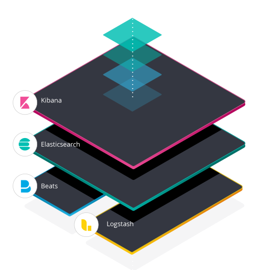
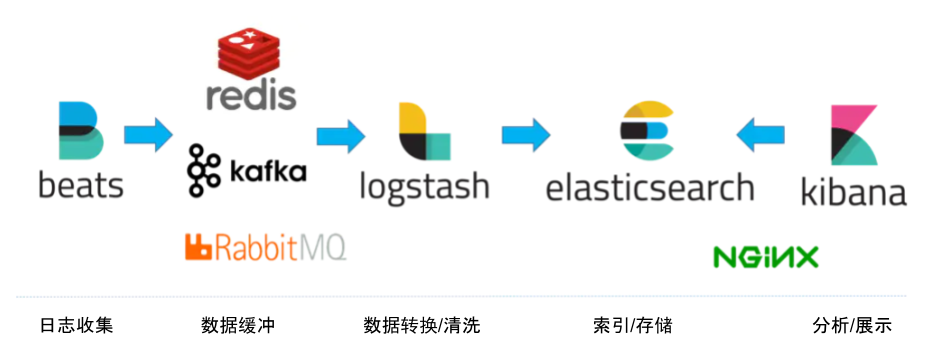
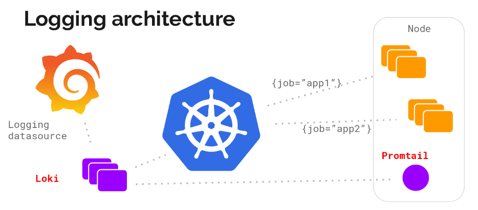
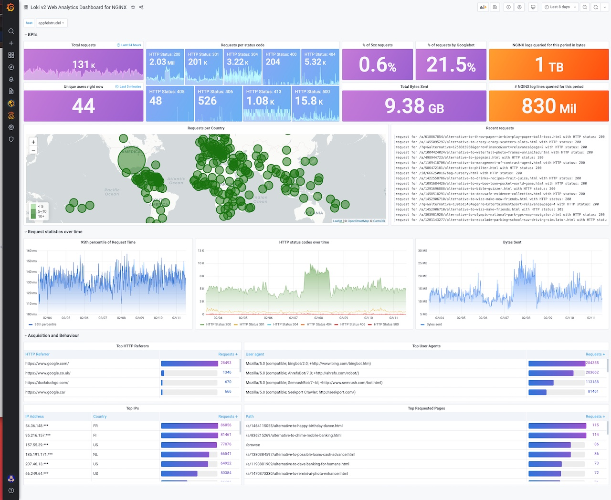
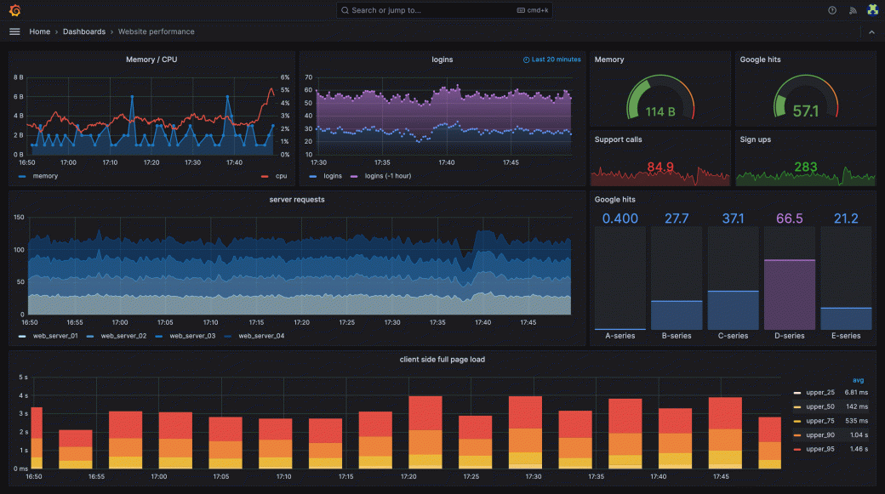

# 9.2.2 事件日志

日志我们绝对不会陌生（绝大多数程序员生涯的第一行代码都是从打印 “hello world” 开始）。整个日志系统中最成熟的部分就是打印日志。尤其是本地日志打印，各式各样层出不穷的 logging Library，同步的异步的、有锁的无锁的、有上下文的无上下文的、高性能的低性能的，花活最多轮子也造的最多。

作为最古老而又最具体的 Signal，日志记录的是系统运行期间发生的离散的事件，特别是非预期的行为、异常情况。大部分的时候都是基于可读性较好的文本。

今天只要稍微复杂点的系统，已经很难只依靠 tail、grep、awk 来从日志中挖掘信息，对于日志的完整处理，除了打印，还包含着日志采集、日志传输、日志清洗、日志存储、分析与检索、告警与智能化响应一系列步骤。

## ELK

谈论实现一套完整的日志系统，相信用户或多或少都应该听说过这几个名词：Elasticsearch、ELK 或者 Elastic Stack。

:::tip ELKB

ELK 是三个开源项目的首字母缩写，这三个项目分别是：Elasticsearch、Logstash 和 Kibana。 Elasticsearch 是一个搜索和分析引擎。 Logstash 是服务器端数据处理管道，能够同时从多个来源采集数据，转换数据，然后将数据发送到诸如 Elasticsearch 等“存储库”中。Kibana 则可以让用户在 Elasticsearch 中使用图形和图表对数据进行可视化。Beats 作为轻量级的数据搬运工，集合了多种单一用途数据采集器，将数据发送给 Logstash 或 ElasticSearch，其可扩展的框架及丰富的预置采集器将使工作事半功倍。
:::

	
	
Loki 架构：与 Prometheus、Grafana 密切集成

ELK 中最核心的是 Elasticsearch，它是一个分布式搜索分析引擎，提供一种准实时搜索服务（生产环境中可以做到上报 10 秒后可搜，不惜成本万亿级日志秒级响应）。与 Elasticsearch 类似的产品还有商业公司 Splunk 和 Apache 开源的 Solr。事实上，Elasticsearch 和 Solr 都使用了著名的 Java 信息检索工具包 Lucene，Lucene 的作者就是大名鼎鼎的 Doug Cutting，如果你不知道谁是 Doug Cutting，那你一定听过他儿子玩具的名字 -- Hadoop。

Elastic Stack 之所以流行的一个原因之一，可能是它的无侵入性。对于遗留系统的日志，它可以做到悄无声息地把处了上面打印日志之外的所有事情，全都给做了。

我们来看一个典型的 Elastic Stack 使用场景，大致系统架构如下（整合了消息队列和 Nginx 的架构）。

	
	
Elastic Stack 日志系统

这个系统中，Beats 部署到日志所在地，用来收集原始数据，然后使用 MQ 做缓冲换取更好的吞吐，接着发给 logstash 做数据清洗，最后落地到 es 集群并进行索引，使用时通过 Kibana 来检索和分析，如果有必要挂上 Nginx 做各类访问控制。

采用全文检索对日志进行索引，优点是功能丰富，允许各类的复杂的操作。但是，如上的方案也明显透漏出架构复杂、维护困难、资源占用高。日志的大多数查询只关注一定时间范围和一些简单的参数（例如 host、service 等），很多功能往往用不上，ELK 方案像是杀鸡用牛刀。

如果只是需求只是把日志集中起来，最多用来告警或者排查问题，那么我们可以把目光转向 Loki。

## Loki 

Loki 是 Grafana Labs 公司推出的类似于 Prometheus 的日志系统（官方的项目介绍是 like Prometheus，but for logs）。

Loki 一个明显的特点是非常经济，Loki 不再根据日志的原始内容建立大量的全文索引，而是借鉴了 Prometheus 核心的思想，使用标签去对日志进行特征标记，然后归集统计。Loki 只索引与日志相关的元数据标签，而日志内容则以压缩方式存储于对象存储中，不做任何索引，这样的话，能避免大量的内存资源占用，转向廉价的硬盘存储。相较于 ES 这种全文索引的系统，数据可在十倍量级上降低，加上使用对象存储，最终存储成本可降低数十倍甚至更低。

	
	
Loki 架构：与 Prometheus、Grafana 密切集成

Loki 对 Kubernetes 友好，Promtail（日志收集代理）以 DaemonSet 方式运行在每个节点中，负责收集日志并将其发送给 Loki。日志数据使用和 Prometheus 一样的标签来作为索引，也正是因为这个原因，通过这些标签，既可以查询日志的内容，也可以查询到监控的内容，还能对接到 alertmanager。这两种查询被很好的兼容，节省了分别存储相关日志和监控数据的成本，也减少了查询的切换成本（避免 kibana 和 grafana 来回切换）。

作为 Grafana Labs 的自家产品，自然与 Grafana 密切集成，

	
	
Loki Grafana 

总体而言，Loki 和 ELK 都是优秀的日志解决方案，具体如何选择取决于具体场景。 Loki 相对轻量，具有较高的可扩展性和简化的存储架构，若是数据的处理不那么复杂，且有时序属性，如应用程序日志和基础设施指标，并且应用使用 kubernetes Pod 形式部署，则选择 Loki 比较合适。ELK 则相对重量，需要复杂的存储架构和较高的硬件要求，部署和管理也比较复杂，适合更大的数据集和更复杂的数据处理需求。

## 日志展示

在仪表可视化领域，如果 Grafana 称第二，应该没有敢称第一。在 Grafana Labs 公司成立之前，Grafana Dashboard 就已经在各个开源社区有不小的名气和用户积累。依靠社区的用户基础，Grafana Labs 也快速地将产品渗透至各个企业，如果你观察仔细，还能在各类大场面时不时会见到 Grafana 的身影：2016年，在猎鹰9号火箭首次发射期间，Grafana 出现在 SpaceX 控制中心的屏幕上；几周后，微软发布一段宣传视频，展示了他们的水下数据中心，同样出现了 Grafana 的身影[^3]。

Grafana slogan 中的 “Dashboard anything. Observe everything.” 这个anything 和 everything 可不是说说，使用 Grafana 可以非常轻松的将任何数据[^1]转成任何你想要的图表[^2]的展现形式来做到数据监控以及数据统计。

	

[^1]: 参见 https://grafana.com/grafana/plugins/data-source-plugins/
[^2]: 参见 https://grafana.com/grafana/dashboards/
[^3]: 参见 https://grafana.com/blog/2023/09/26/celebrating-grafana-10-top-10-oh-my-grafana-dashboard-moments-of-the-decade/