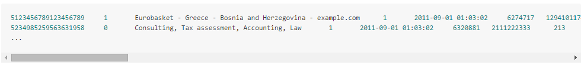
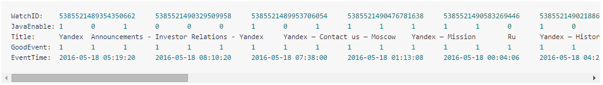
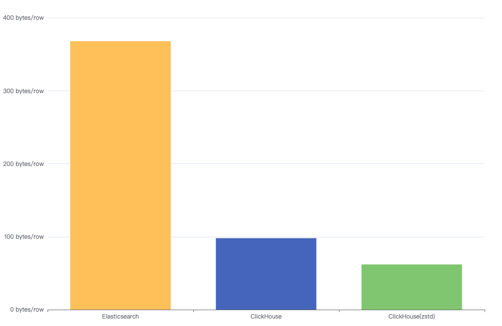

# 9.3.2 日志处理

处理日志本来是件稀松平常的事情，但在工程师们普遍爱写日志的影响下，日志处理质变为典型的大数据场景之一：高吞吐写入（GB/s）、低成本海量存储（PB 级别）、实时文本检索（1s 内）。

本节，我们从索引原理和成本分析的角度介绍 Elastic（全文索引）、Loki（仅索引元数据）和 ClickHouse（列式数据库）三类技术如何解决日志的存储/分析难题。

## 1. 传统解决方案 ELK

讨论实现一套完整的日志系统，工程师们或多或少都应该听说过这几个名词：ELK、ELKB 或者 Elastic Stack[^1]，这些其实说得都是同一套实现日志处理方案的开源组件。

图 9-10 展示了一套处理日志的 Elastic（为统一明确，本文统一称 Elastic）技术方案。这套方案中，Beats 部署到日志所在地收集原始数据，然后使用 MQ 做缓冲换取更好的吞吐，接着发给 logstash 做数据清洗，最后落地到 Elasticsearch 集群并进行索引，使用时通过 Kibana 来检索和分析，如果有必要挂上 Nginx 做各类访问控制。

:::center
   
  图 9-10 整合了消息队列和 Nginx 的 Elastic 日志系统
:::

Elastic 套件中最核心组件是 Elasticsearch，这是一个提供一种“准实时”搜索服务（生产环境中可以做到上报 10 秒后可搜，不惜成本万亿级日志秒级响应）的分布式搜索分析引擎。

:::tip 额外知识
说起 Elasticsearch 不得不提及背后的 Lucene。Lucene 的作者就是大名鼎鼎的 Doug Cutting，如果你不知道他是谁是？那你一定听过他儿子玩具的名字 —— Hadoop。

Lucene 是一个全文检索引擎，离直接使用还有部分集成工作，之后陆续有了 Solr、Nutch 等项目帮助发展，但依然不温不火。直到 2012 年，Elasticsearch 诞生后，通过优秀的 Restful API、分布式部署等扩展才把 Lucene 的使用推向新的高度。

:::

Elasticsearch 在**日志场景中的优势在于全文检索能力，快速从海量的数据中检索出关键词匹配的日志**，其底层核心技术就是 Lucene 中的反向索引（Inverted index）。

:::tip 什么是反向索引

反向索引（inverted index）常被翻译为倒排索引，但倒排极容易误解为倒序，不如翻译**反向索引**。

反向索引是信息检索领域常用的索引技术，原理将文本分割成一个个词，通过构建“<词->文档编号>”这样的索引，从而快速查找一个词在哪些文档出现。
:::

反向索引为 Elasticsearch 带来快速检索能力的同时，也付出了写入吞出率低和存储占用高的代价：
- **数据写入时需要进行分词、词典排序、构建排序表等 CPU/内存密集操作**，导致写入吞出率大幅下降；
- **Elasticsearch 会存储原始数据和反向索引，为了加速分析可能还需要存储一份列式数据（DocValue）**，3 份冗余数据在观测场景下导致极高的存储成本。

如果目的只是把日志集中起来，使用只是近期范围内查询和一些简单的条件（如匹配 host、service 等），那不妨看看下面介绍的 Loki。

## 2. 日志处理新贵 Loki 

Loki 是 Grafana Labs 公司推出的类似于 Prometheus 的日志系统，官方的项目介绍是“like Prometheus，but for logs”。

Loki 明显优势是非常经济，它不再根据日志原始内容建立大量的全文索引，而是借鉴了 Prometheus 核心的思想 **使用标签对日志进行特征标记，只索引与日志相关的元数据标签，日志内容不做任何索引，并压缩存储于对象存储中**。相较于 Elastic 全文索引系统，Loki 的最终存储成本可降低数十倍甚至更低。

Loki 另外一个特点是对以 Kubernetes 为基座的系统十分友好。如图 9-11 所示，日志收集组件 Promtail 以 DaemonSet 方式运行在每个节点中，负责收集日志并将其发送给 Loki。

因为日志数据使用和 Prometheus 一样的标签来作为索引，通过这些标签，既可以查询日志的内容，也可以查询到监控的内容，还能对接到 alertmanager。

:::center
   
  图 9-11 Loki 与 Kubernetes 密切集成
:::

作为 Grafana Labs 的自家产品，Loki 与 Grafana 密切集成，利用 Loki 的查询语法 LogQL 使用标签及运算符进行过滤，能展示出任何你想要的图表。

:::center
   
  图 9-12 在 Grafana 中通过 LogQL 查询展示不同的图表
:::

最后，Loki 和 Elastic 都是优秀的日志解决方案，如何选择取决于具体场景：
- Loki 相对轻量，具有较高的可扩展性和简化的存储架构，若是数据的处理不那么复杂，且有时序属性，如应用程序日志和基础设施指标，并且以 Kubernetes 为底座的 系统时，选择 Loki 更合适。
- Elastic 相对重量，需要复杂的存储架构和较高的硬件要求，部署和管理也比较复杂，适合更大的数据集和更复杂的数据处理需求。

## 3. 凶猛彪悍的 ClickHouse

一个流行的观点认为：“提升查询速度的最简单有效方法是减少数据扫描范围和数据传输量”。

普通数据库中的数据是按照如图 9-13 所示的结构进行组织的。换句话说，一行内的所有数据都彼此依次存储，像这样的行式数据库包括 MySQL、Postgres、MS SQL-Server 等。

:::center
   
  图 9-13 行式数据库存储结构
:::

与行式相对的是列式数据库，它们的数据是这样存储组织的，图 9-14 所示。

:::center
   
  图 9-14 列式存储的组织结构
:::

数据压缩的本质是通过一定的步长对数据进行匹配扫描，发现重复部分后进行编码转换。因此，数据中重复项越多，压缩率越高。在列式数据库中，由于同一列字段的数据具有相同的数据类型和语义，重复项的可能性自然更高。

近几年来，经常能在国内各个技术公众号看到关于列式数据库的实践分享，图 9-15 中的数据来源技术文章《B站基于Clickhouse的下一代日志体系建设实践》，文章中的数据表明 B 站使用 ClickHouse 降低了 60%+ 的存储成本[^2]

:::center
   
  图 9-15 同一份日志在 Elasticsearch、ClickHouse 和 ClickHouse(zstd) 中的容量对比
:::

上面提到的 ClickHouse，它是由 Yandex（一家俄罗斯搜索引擎公司）开源的用于 MPP (Massively Parallel Processing，大规模并行处理)架构的列式存储分析型数据库。

:::tip 来自官方的介绍
ClickHouse® is an open-source **column-oriented** database management system that allows generating analytical data reports in **real-time**.
:::

ClickHouse 另外一个特点是极致的向量化查询性能，从它的跑分结果来看（图 9-16），ClickHouse 比 Vertia（一款商业的 MPP 分析软件）快约 5 倍、比 Hive 快 279 倍、比 MySQL 快 801 倍。

:::center
   
  图 9-16 ClickHouse 性能测试 [图片来源](http://clickhouse.yandex/benchmark.html)
:::

ClickHouse 的查询速度当之无愧阐述“**real-time**”二字含义，正如 ClickHouse 的宣传所言，其他的开源系统太慢、商用太贵，只有 ClickHouse 在成本与性能之间做到了良好平衡，又快还开源。

[^1]: Elastic 的发展始于 Shay Banon 的个人兴趣，从开源、聚人、成立公司，到走向纽交所，再到股价一路狂飙（最新市值 $107 亿），几乎是最理想的工程师创业故事。
[^2]: 参见 https://mp.weixin.qq.com/s/dUs7WUKUDOf9lLG6tzdk0g