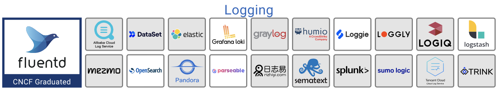

# 可观测性的三大支柱

在学术界，虽然“可观测性”这个名词是近几年才从控制理论中借用的舶来概念，不过其内容实际在计算机科学中已有多年的实践积累。

学术界一般会将可观测性分解为三个更具体方向进行研究，它们分别是**事件日志、链路追踪和聚合度量**，这三个方向各有侧重，又不是完全独立，它们天然就有重合或者可以结合之处，2017 年的分布式追踪峰会结束后，Peter Bourgon 撰写了总结文章《Metrics, Tracing, and Logging》[^1]系统地阐述了这三者的定义、特征以及它们之间的关系与差异，受到了业界的广泛认可。

	

## 日志

日志的职责是记录离散事件，通过这些记录事后分析出程序的行为，譬如曾经调用过什么方法，曾经操作过哪些数据等等。

打印日志被认为是程序中最简单的工作之一，调试问题时常有人会说“当初这里记得打点日志就好了”，可见这就是一项举手之劳的任务。输出日志的确很容易，但收集和分析日志却可能会很复杂，面对成千上万的集群节点，面对迅速滚动的事件信息，面对数以 TB 计算的文本，传输与归集都并不简单。对大多数程序员来说，分析日志也许就是最常遇见也最有实践可行性的“大数据系统”了。

在业界中，事件日志可观测产品也已经是一片红海。日志管理方案大都包含日志收集、日志聚合、日志存储与分析几个模块，具体过程是日志收集工具与应用程序容器一起运行，并直接从应用程序收集消息，然后将消息转发到中央日志存储以进行汇总和分析。

在这方面 Elastic Stack 日志解决方案独占鳌头，几乎覆盖了日志管理的全流程，其中一大变数是用于日志聚合、过滤等业务的 Logstash 效能较差，在未来可能会被 CNCF 孵化的 Fluentd 取代。

	

[^1]: 参见 https://peter.bourgon.org/blog/2017/02/21/metrics-tracing-and-logging.html