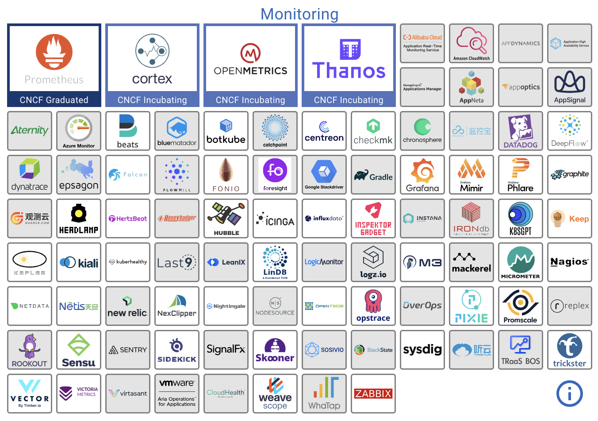

# 9.2.1 聚合度量

所有的度量系统总体上要解决的问题其实就三个：

- 监控指标用什么形式表示
- 怎么收集和存储指标
- 怎么利用指标生成报表

	

:::tip Prometheus 是什么

:::

如下图所示，Prometheus 的架构设计中，通过不同的子功能实现检测指标、收集指标、存储指标、查询指标、警报指标。再通过搭积木的方式，形成一个功能强大的监控告警系统。

	

## 数据模型

从存储上来讲所有的监控指标都是相同的，但是在不同的场景下这些指标又有一些细微的差异。以 Prometheus 为例，它支持四种不同的指标类型：

- Counter：只增不减的计数器，常用于服务的 HTTP 请求数量或使用的 CPU 时间之类的信息，例如 http_requests_total、node_cpu_seconds_total 都是 Counter 类型的监控指标。

- Gauge：可增可减的仪表盘，侧重于反应系统的当前状态，常见的监控指标 CPU 负载、活跃线程数、内存使用率、磁盘使用率，这些数它都是会随着时间进行波动的，它存储和展示的都是一个瞬时值。

- Summary：

## 收集指标

不同监控系统收集 Metrics 数据手段各有不同，但总结无非是通过 push 到中心 Collector 方式采集比如各种 Agent 采集器，Telegraf 等），又或者是中心 Collector 通过 pull 的方式主动获取（比如 Prometheus）。

如下图所示，Prometheus 主动地从数据源拉取数据 Exporter（Exporter 实例称 target ）暴露的 HTTP 服务地址（通常是/metrics）拉取监控样本数据。

	

:::tip Exporter
Exporter 一个相对开放的概念，可以是一个独立运行的程序独立于监控目标以外，也可以是直接内置在监控目标中，只要能够向 Prometheus 提供标准格式的监控样本数据即可。
:::

得益于 Prometheus 的良好社区生态，现在已经有大量各种用途的 Exporter，如表所示，涵盖了从基础设施、中间件以及网络等各个方面，让 Prometheus 的监控范围几乎能涵盖所有用户所关心的目标。

| 范围 | 常用 Exporter |
|:--|:--|
 | 数据库 |  MySQL Exporter、Redis Exporter、MongoDB Exporter、MSSQL Exporter 等 | 
 | 硬件 | Apcupsd Exporter、IoT Edison Exporter、IPMI Exporter、Node Exporter 等 | 
 | 消息队列 |  Beanstalkd Exporter、Kafka Exporter、NSQ Exporter、RabbitMQ Exporter 等 |
 | 存储 | Ceph Exporter、Gluster Exporter、HDFS Exporter、ScaleIO Exporter 等 | 
 | HTTP服务 | Apache Exporter、HAProxy Exporter、Nginx Exporter 等 |
 | API服务 | AWS ECS Exporter、Docker Cloud Exporter、Docker Hub Exporter、GitHub Exporter 等 | 
 | 日志 | Fluentd Exporter、Grok Exporter 等 | 
 | 监控系统 |  Collectd Exporter、Graphite Exporter、InfluxDB Exporter、Nagios Exporter、SNMP Exporter 等 |
 | 其它 | Blockbox Exporter、JIRA Exporter、Jenkins Exporter、Confluence Exporter 等|

## 存储指标

Prometheus 的作者及社区核心开发者都秉承一个理念：Prometheus 只聚焦核心的功能，扩展性的功能留给社区解决。Prometheus 自身携带 TSDB（时序数据库）的设计初衷是为可监控数据的查询，更多考虑的是高性能而非分布式。因此，一般只能把本地存储视为近期数据的短暂滑动窗口。

2017 年，Prometheus 扩展了远端存储扩展（Remote Read/Write API），自此之后社区涌现出大量长期存储的方案，如 Thanos、Grafana Cortex/Mimir、VictoriaMetrics、Wavefront、Splunk、Sysdig、SignalFx、InfluxDB、Graphite 等。

	
	
长期存储方案

基于多维度对上述介绍的 Prometheus 长期存储方案进行横向对比，数据持久化到硬盘的方案里，VictoriaMetrics 是更好的选择，如果是对象存储方案，Thanos 则更受欢迎。

## 生成报表

在仪表可视化领域，如果 Grafana Dashboard 称第二，应该没有敢窜出来称第一的。

Grafana Labs 公司成立之前，Grafana Dashboard 就已经在各个开源社区有不小的名气和用户积累。依靠社区的用户基础，Grafana Labs 也快速地将产品渗透至各个企业，各类大场面也时不时会见到 Grafana 的身影：
- 2016年，在猎鹰9号火箭首次发射期间，Grafana 出现在 SpaceX 控制中心的屏幕上；
- 几周后，微软发布一段宣传视频，展示了他们的水下数据中心，同样出现了 Grafana 的身影[^3]。

Grafana 的 slogan 是“Dashboard anything. Observe everything.” ，Prometheus 定义了功能强大的 promQL，可以满足各种复杂的查询场景。而 Grafana 提供了对 PromQL 的完整支持。两者结合的反应：只要你能想到的数据[^1]就能转成任何你想要的图表[^2]。

	

