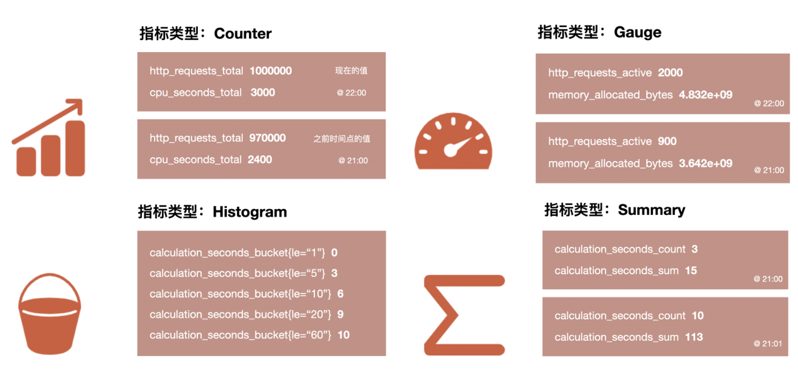

# 9.3.1 指标数据的处理

指标（Metrics）是监控系统的核心。提到监控系统，Prometheus 是绕不开的关键话题。本节将通过解析 Prometheus 系统，详细介绍指标的收集、存储和处理逻辑。

Prometheus 项目的灵感来自 Google 内部的 Borg 监控系统（Brogmon），由前 Google 工程师在 SoundCloud 公司发起并将其开源。2016 年 5 月，Prometheus 继 Kubernetes 之后，成为云原生计算基金会（CNCF）的第二个正式项目。经过多年的发展，Prometheus 已成为云原生系统中指标监控的事实标准。

如图 9-3 所示，Prometheus 是一个模块化系统，由多个独立组件组成，每个组件承担特定功能。其中，服务发现（Service Discovery）负责自动发现监控目标；Exporter 将监控目标的指标数据转换为 Prometheus 可理解的格式；Pushgateway 处理短期任务的监控数据；Prometheus 服务器负责数据的收集、存储和查询；而 Alertmanager 处理告警通知。

:::center
  <br/>
  图 9-3 Prometheus 处理指标流程图
:::

## 1. 定义指标的类型

为方便用户理解和使用不同类型的指标，Prometheus 定义了四种类型的指标：

- 计数器（Counter）：计数器是单调递增的，用于记录事件的累计次数。它只能递增或重置为 0，不能减少，适合记录不可逆的事件，如请求数、错误数等。常见的计数器指标包括 HTTP 请求次数、系统错误次数、数据包发送量等。
- 仪表盘（Gauge）：仪表盘表示可增可减的数值，适合那些随时间波动的数据，例如系统资源利用率。它的值可以上下波动，常用于内存使用量、CPU 使用率等场景。
- 直方图（Histogram）：直方图用于采样观测值，并将它们分配到预定义的区间（桶）中，适合统计分布情况，尤其适用于延迟、请求处理时间等场景。直方图不仅记录观测值的数量，还能够显示各个区间内的样本分布。常见应用包括 API 响应时间分布和任务处理延迟的测量。
- 摘要（Summary）：摘要同样用于采样观测值，但它直接计算分位数（如 50%、90% 等），更适合需要精确分位数的数据分析。摘要常用于追踪延迟和响应时间，特别是需要获取特定分位数（如 99th 百分位）的精确结果。

:::center
  <br/>
  图 9-4 Prometheus 定义的四种不同的指标类型
:::

## 2. 通过 Exporter 收集指标

定义完指标类型后，接下来的任务是从监控目标中收集这些指标。采集指标看似简单，但现实情况复杂得多，许多现有的服务、系统，甚至硬件设备，并不会直接暴露 Prometheus 格式的指标。例如：

- Linux 的许多指标信息以文件形式记录在 /proc 目录下，如 /proc/meminfo 提供内存信息，/proc/stat 提供 CPU 信息；
- Redis 的监控信息需要通过 INFO 命令获取；
- 路由器等硬件设备的监控数据通常通过 SNMP 协议获取。

为了解决这个问题，Prometheus 通过 Exporter 实现了数据收集与监控系统的解耦。Exporter 作为连接监控系统与被监控目标的桥梁，负责理解不同来源的监控数据，并将其转换为 Prometheus 支持的格式。并通过 HTTP（通常暴露在 /metrics 端点）将指标提供给 Prometheus 进行抓取。

如下所示，Prometheus 可以通过轮询的方式，从暴露指标的 /metrics 接口获取类型为 Counter 的 Exporter 实例。Prometheus 定期轮询这些监控目标，获取最新的指标数据，从而实现对系统状态的实时监控。

```bash
$ curl http://127.0.0.1:8080/metrics | grep http_request_total
# HELP http_request_total The total number of processed http requests
# TYPE http_request_total counter // 指标类型 类型为 Counter
http_request_total 5
```

只需使用相应的 Exporter 或编写自定义的 Exporter，Prometheus 可以监控几乎所有系统和应用。Prometheus 社区已经涌现出大量用于不同场景的 Exporter，涵盖了基础设施、中间件和网络等各个领域。如表 9-1 所示，这些 Exporter 扩展了 Prometheus 的监控能力，几乎覆盖了用户关心的所有监控目标。

:::center
表 9-1 Prometheus 中常用 Exporter
:::

| 范围 | 常用 Exporter |
|:--|:--|
 | 数据库 |  MySQL Exporter、Redis Exporter、MongoDB Exporter、MSSQL Exporter 等 | 
 | 硬件 | Apcupsd Exporter、IoT Edison Exporter、IPMI Exporter、Node Exporter 等 | 
 | 消息队列 |  Beanstalkd Exporter、Kafka Exporter、NSQ Exporter、RabbitMQ Exporter 等 |
 | 存储 | Ceph Exporter、Gluster Exporter、HDFS Exporter、ScaleIO Exporter 等 | 
 | HTTP服务 | Apache Exporter、HAProxy Exporter、Nginx Exporter 等 |
 | API服务 | AWS ECS Exporter、Docker Cloud Exporter、Docker Hub Exporter、GitHub Exporter 等 | 
 | 日志 | Fluentd Exporter、Grok Exporter 等 | 
 | 监控系统 |  Collectd Exporter、Graphite Exporter、InfluxDB Exporter、Nagios Exporter、SNMP Exporter 等 |
 | 其它 | Blockbox Exporter、JIRA Exporter、Jenkins Exporter、Confluence Exporter 等|


## 3. 存储指标

存储数据本来是一项常规操作，但当面对存储指标类型的场景来说，必须换一种思路来应对。

举例来说，假设你负责管理一个小型集群，该集群有 10 个节点，运行着 30 个微服务系统。每个节点需要采集 CPU、内存、磁盘和网络等资源使用情况，而每个服务则需要采集业务相关和中间件相关的指标。假设这些加起来一共有 20 个指标，且按每 5 秒采集一次。那么一天的数据规模将是：

```
10（节点）* 30（服务）* 20 (指标) * (86400/5) （秒） = 103,680,000（记录）
```

对于一个仅有 10 个节点的小规模业务来说，`7*24` 小时不间断生成的数据可能超过上亿条记录，占用 TB 级别的存储空间。虽然关系型数据库或 NoSQL 数据库也可以处理时序数据，但它们并未充分利用时序数据的特点。因此，使用这些数据库往往需要不断增加计算和存储资源，导致系统的运维成本急剧上升。

如何低成本存储这些海量的指标数据，是个关乎系统可用的重要课题。我们回顾指标数据有什么特征？

```json
  {
    "metric": "http_requests_total",  // 指标名称，表示 HTTP 请求的总数
    "labels": {                       // 标签，用于描述该指标的不同维度
      "method": "GET",                // HTTP 请求方法
      "handler": "/api/v1/users",     // 请求的处理端点
      "status": "200",                // HTTP 响应状态码
    },
    "value": 1458,                    // 该维度下的请求数量
  },
```

观察上述的数据结构，可以看出指标类型的数据是纯数字的、具有时间属性，目的揭示某些事件的趋势和规律。因此，它们肯定没有关系嵌套、不用考虑主键/外键、不用考虑事务处理。对于这种类型的数据，业界也发展出了专门优化的数据库类型 —— 时序数据库（Time-Series Database，简称 TSDB）。

时序数据库并不是一个新概念。最早的专用时序数据库之一是 1999 年问世的 RRDtool。自 2015 年以来，随着对实时数据监控、性能管理和预测分析需求的增加，时序数据库逐渐受到广泛关注，现已成为 DB-engines 排行网站上最受欢迎的数据库类型。

与常规数据库（如关系型数据库或 NoSQL 数据库）相比，时序数据库在设计和用途上存在显著区别。笔者介绍数据结构、数据保留策略方面的差异供你参考：

- 数据结构：时序数据库使用 LSM-Tree（Log-Structured Merge-Tree）来替代常规数据库中的 B+Tree。在时序数据库中，所有写入操作首先写入内存存储区（MemTable，通常为跳表或平衡树）。当 MemTable 满时，数据会被批量写入磁盘文件中。虽然磁盘写入延迟较高，但由于批量操作，时序数据库在写入吞吐量上通常优于传统关系数据库（使用 B+Tree）。
- 数据保留策略：时序数据通常有明确的生命周期，例如监控数据可能只需保留几天或几个月。时序数据库通常具有自动化的数据保留策略（data retention），以防止存储空间无限膨胀。例如，可以设置基于时间的保留策略，保留最近 30 天的数据，超过 30 天的数据将自动删除。

Prometheus 服务端内置了一个强大的时序数据库（该时序数据库与 Prometheus 同名）。Prometheus 时序数据库将数据按照时间范围进行“分片”存储，每两小时为一个时间窗口，数据被组织成时间块（chunk）。每个时间块包含该时间段内的所有样本数据、元数据文件以及索引文件。通过时间窗口以及分片的方式存储数据，使得 Prometheus 可以在海量数据规模的情况下，高效地根据特定时间段进行分析/查询指标。

:::tip 什么是分片(sharding)

“分片”（sharding）是数据库和数据存储系统中用来提高性能和可扩展性的一种技术。它将数据划分成更小的、独立的片段，每个片段称为一个“分片”。每个分片可以被单独管理和存储，这样可以减轻单个服务器的负担，提高系统的整体处理能力和可扩展性。

笔者稍后介绍的 Elastic Stack、ClickHouse 等技术皆是利用了分片技术实现水平可扩展以及并行计算能力。
:::

Prometheus 时序数据库内置了专用的数据查询语言 PromQL（Prometheus Query Language）。PromQL 是一种由 Prometheus 定制的查询 DSL，其语法类似于支持函数和运算的 CSS 选择器。

笔者举一个使用 PromQL 例子供你参考，假设我们有一个名为 http_requests_total 的指标，要计算过去 5 分钟内 host 标签为 server1 的请求速率，可以使用以下 PromQL 查询：

```PromQL
rate(http_requests_total{host="server1"}[5m])

// 返回查询结果
92.0
```

通过 PromQL，可以对时间序列数据进行丰富的查询、聚合和逻辑运算，已广泛应用于 Prometheus 的数据查询、可视化和告警处理等日常操作中。掌握 PromQL 语法已成为必备技能，笔者就不再详细介绍其语法细节了。

## 4. 展示分析/预警

采集/存储指标最终目的要用起来，也就是要“展示分析”以及“预警”。

在数据分析和可视化领域，Grafana Labs 公司开发的 Grafana 已成为事实上的标准。最初，Grafana 专注于时间序列数据的监控与分析，但随着项目的发展，它已经扩展到所有需要数据可视化和监控的场景，包括 IT 运维、应用性能监控以及物联网、金融、医疗等行业。图 9-17 展示了一个 Grafana 仪表板（Dashboard）。在这个仪表板中，有两个关键概念：


- 数据源（Data Source）：在 Grafana 中，数据源指的是为其提供数据的服务。Grafana 支持多种数据源，包括时序数据库（如 Prometheus、Graphite、InfluxDB）、日志数据库（如 Loki、Elasticsearch）、关系型数据库（如 MySQL、PostgreSQL），以及云监控平台（如 Google Cloud Monitoring、Amazon CloudWatch、Azure Monitor）。Grafana 插件库中提供了多达 165 种数据源。如果找不到某个特定的数据源，那通常意味着该数据源已经被市场淘汰。
- 面板（Panel）：面板是仪表板中的基本构建块，用于显示各种可视化图表。Grafana 提供了多种图表类型，如仪表盘、表格、折线图、柱状图、热力图、饼图和直方图等。每个面板可以单独配置，并具备交互选项。通过 Panel 的 Query Editor（查询编辑器），可以为每个面板设置不同的数据源。例如，如果以 Prometheus 作为数据源，那在 Query Editor 中，我们使用 PromQL 查询语言从 Prometheus 中查询出相应的数据，并且将其可视化。Grafana 支持多种数据源，每个面板可配置不同的数据源，这样就可以在一个统一的界面上（仪表板）整合和展示来自多种不同系统的数据。

Grafana 几乎涵盖了所有的数据源和图表类型。正如 Grafana 的宣传语所言“只要你能想到的数据，都能转化为你想要的图表”。

:::center
  <br/>
  图 9-5 Grafana 的仪表盘
:::

在预警方面，Prometheus 负责数据采集和预警信息的生成，而 Alertmanager 则专门处理这些预警信息。以下是一个具体的例子，展示如何使用 Prometheus 告警规则来监控某个 HTTP 接口的 QPS。

```yaml
groups:
  - name: example-alerts
    rules:
    - alert: HighQPS
      expr: sum(rate(http_requests_total[5m])) by (instance, job) > 1000
      for: 5m
      labels:
        severity: critical
      annotations:
        summary: "High QPS detected on instance {{ $labels.instance }}"
        description: "Instance {{ $labels.instance }} (job {{ $labels.job }}) has had a QPS greater than 1000 for more than 5 minutes."
```

这段规则会定期通过 PromQL 语法检测过去 5 分钟内某个被监控目标（instance）中的某个具体服务（job）的 QPS 是否大于 1000。如果条件满足，Prometheus 就会触发告警，并将其发送到 Alertmanager。Alertmanager 对告警进行进一步处理，例如：

- 分组（Grouping）：将具有相似标签的告警进行分组，以减少告警冗余。例如，若多个实例的故障告警属于同一服务，Alertmanager 可以将这些告警合并为一个群组发送，而不是发送多个独立的通知。
- 抑制（Inhibition）：定义规则来抑制某些告警的触发。当某个重要告警已触发时，可以避免其他相关但不那么重要的告警再次触发，从而防止告警风暴。例如，当整个服务宕机时，单个实例宕机的告警可以被抑制。
- 静默（Silencing）：在特定时间段内禁用某些告警通知。静默操作可以通过指定标签、持续时间和备注等条件设置，常用于维护期间的告警屏蔽。
- 路由（Routing）：根据告警标签或其他规则将告警路由到不同的接收端。Alertmanager 支持通过标签、优先级等条件进行灵活的路由设置。例如，将高优先级告警发送到短信和电话通知，而将低优先级告警仅通过邮件发送。
