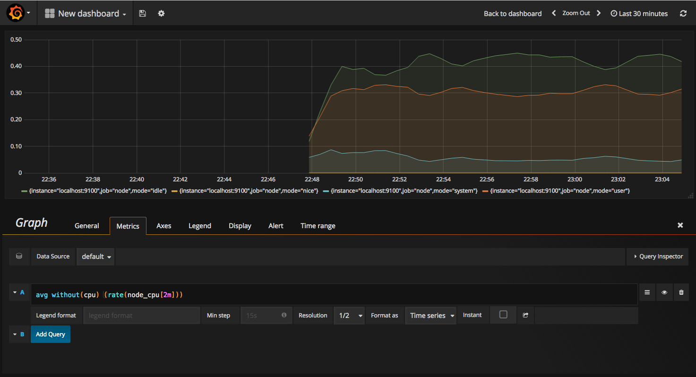

# 9.2.1 聚合度量

聚合度量（Metrics），传统监控和告警领域的代名词，一般是用来计算事件发生数量的数据集，例如服务 QPS、API 响应延迟、某个接口的失败数等。它们大部分以数字化指标出现，特征是可聚合性。在数据的处理上，Metrics 可以是实时的，也可能是区间范围的，是跟随着时间变化的时序数据，如此既能做常见的监控告警，也可以用来做趋势分析。

对于一个监控系统而言，核心要解决的问题其实就三个：

- 监控指标用什么形式表示
- 怎么收集和存储指标
- 怎么利用指标生成报表

为了实现这个功能，需要实现几个独立的子功能。检测指标、收集指标、存储指标、查询指标、警报指标。每个子功能独立实现，通过搭积木的方式，就可以形成一个功能强大的监控告警系统。

## 数据模型

- 计数（counter）：一个只能增加或重置的度量值（即该值只能比之前多）

## 收集和存储指标

由于目前并没有 Metrics 采集的标准 API，所以不同的监控系统在收集 Metrics 数据时采取的手段也可能不一样，但大部分无非都是通过 push 到中心 Collector 方式采集 Metrics（比如各种 Agent 采集器，Telegraf 等），又或者是中心 Collector 通过 pull 的方式去主动获取 Metrics（比如 Prometheus）。

Prometheus 的架构设计中，Prometheus Server 主要任务负责数据的收集，存储并且对外提供数据查询支持，并不直接服务监控特定的目标。因此为了能够能够监控到某些东西，如主机的CPU使用率，我们需要使用到 Exporter。

	

Prometheus 周期性的从 Exporter（Exporter 实例称 target ）暴露的 HTTP 服务地址（通常是/metrics）拉取监控样本数据。

	

从上面的描述中可以看出 Exporter 可以是一个相对开放的概念，其可以是一个独立运行的程序独立于监控目标以外，也可以是直接内置在监控目标中。只要能够向 Prometheus 提供标准格式的监控样本数据即可。

得益于 Prometheus 的良好社区生态，现在已经有大量各种用途的 Exporter，涵盖了从基础设施、中间件以及网络等各个方面，让 Prometheus 的监控范围几乎能涵盖所有用户所关心的目标。

| 范围 | 常用 Exporter |
|:--|:--|
 | 数据库 |  MySQL Exporter、Redis Exporter、MongoDB Exporter、MSSQL Exporter 等 | 
 | 硬件 | Apcupsd Exporter、IoT Edison Exporter、IPMI Exporter、Node Exporter 等 | 
 | 消息队列 |  Beanstalkd Exporter、Kafka Exporter、NSQ Exporter、RabbitMQ Exporter 等 |
 | 存储 | Ceph Exporter、Gluster Exporter、HDFS Exporter、ScaleIO Exporter 等 | 
 | HTTP服务 | Apache Exporter、HAProxy Exporter、Nginx Exporter 等 |
 | API服务 | AWS ECS Exporter、Docker Cloud Exporter、Docker Hub Exporter、GitHub Exporter 等 | 
 | 日志 | Fluentd Exporter、Grok Exporter 等 | 
 | 监控系统 |  Collectd Exporter、Graphite Exporter、InfluxDB Exporter、Nagios Exporter、SNMP Exporter 等 |
 | 其它 | Blockbox Exporter、JIRA Exporter、Jenkins Exporter、Confluence Exporter 等|

## 生成报表

Prometheus 的数据是典型的时序数据，Prometheus 本身会将。要注意的是，本地存储不可复制，无法构建集群，如果本地磁盘或节点出现故障，存储将无法扩展和建议。因此，一般只能把本地存储视为近期数据的短暂滑动窗口。

Prometheus 的作者及社区核心开发者都秉承一个理念：Prometheus 只聚焦核心的功能，扩展性的功能留给社区解决，所以 Prometheus 自诞生至今都是单实例不可扩展的。

尽管单实例的 Prometheus 已经足够强大，但还是存在部分需求是其无法满足的，如跨集群聚合、更长时间的存储等。为了扩展 Prometheus，社区给出了多种方案。

2017 年，Prometheus 加⼊ Remote Read/Write API，自此之后社区涌现出大量长期存储的方案，如 Thanos、Grafana Cortex/Mimir、VictoriaMetrics、Wavefront、Splunk、Sysdig、SignalFx、InfluxDB、Graphite 等。

## 存储

回到我们的主角 Prometheus， 它会将所有采集到的样本（sample）数据以时间序列（time-series）的方式保存在内存数据库中，并且定时保存到硬盘上。时间序列是按照时间戳和值的序列顺序存放的，每条time-series通过指标名称（metrics name）和一组标签集（labelset）命名。

主流的 TSDB 包括了 InfluxDB、Prometheus、Kdb、Graphite、TimescaleDB、Apache Druid 等等。
为了追求极致性能和极致成本，大家都在针对海量数据和使用场景，持续改进和优化数据的存储结构设计、各种高效索引机制、和查询效率。从单点技术或者关键技术上来讲，有趋同性和同质化的大趋势

prometheus-vs-victoriametrics[^1]

||Prometheus| VictoriaMetrics | 
|:--|:--|:--|
|数据采集	 |基于拉动	|基于拉式和推式|
|数据摄取	 |每秒高达 240,000 个样本|	每秒高达 360,000 个样本|
|数据查询 |	每秒高达 80,000 次查询	|每秒高达 100,000 次查询|
|内存使用情况	|高达 14GB RAM	|高达 4.3GB 的 RAM|
|数据压缩	 |使用LZF压缩	| 使用 Snappy 压缩|
|磁盘写入频率|	更频繁地将数据写入磁盘	|减少将数据写入磁盘的频率|
|磁盘空间使用情况	|需要更多磁盘空间	|需要更少的磁盘空间|
|查询语言	|PromQL	|MetricsQL（向后兼容 PromQL）|

时序数据库排名

https://db-engines.com/en/ranking/time+series+dbms

## 生成报表

Prometheus 定义了功能强大的 promQL，可以满足各种复杂的查询场景。

Grafana 提供了对 PromQL 的完整支持，如下所示，通过 Grafana 添加 Dashboard 并且为该 Dashboard 添加一个类型为 “Graph”的面板。 并在该面板的“Metrics”选项下通过PromQL查询需要可视化的数据：

	

[^1]: 参见 https://last9.io/blog/prometheus-vs-victoriametrics/