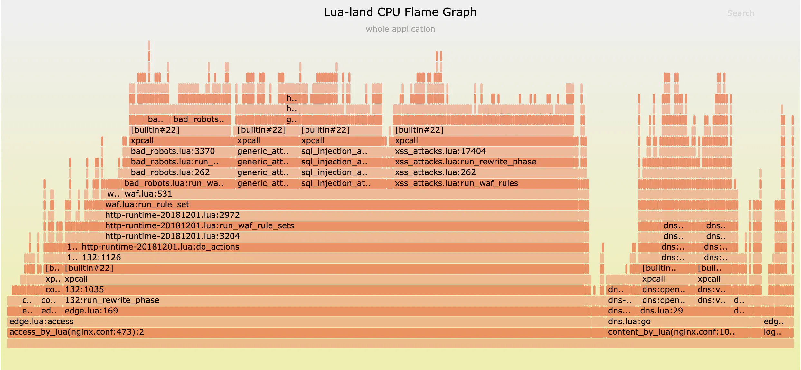

# 9.3.4 性能剖析 Profiling

熟悉 Golang 的工程师对 pprof 工具一定不陌生。借助 pprof 提供的 CPU 和内存分析功能，工程师能够深入了解 Golang 函数的执行时间、内存使用情况，从而分析、优化应用性能。

可观测性领域内的性能剖析（Profiling）和 Golang 中的 pprof 目标一致，两者皆是对运行中应用动态分析、生成详细的运行数据（Profiles），帮助工程师全面了解应用资源使用情况，确定代码和性能瓶颈之间的关联。

Profiles 数据通常以火焰图、堆栈图或内存分析图等形式呈现，是从“是什么”到“为什么”这一过程中重要的依据。例如，通过链路追踪识别出延迟（是什么）的位置，然后根据火焰图进一步定位到具体的代码行（为什么）。2021 年，国内某网站崩溃，工程师分析火焰图发现 Lua 代码存在异常，最终成功定位到问题源头[^1]。

:::center
   
  图 9-16 Lua 代码的 CPU 火焰图
:::

:::tip 火焰图分析说明

火焰图颜色没有特殊含义，因为火焰图表示的是 CPU 的繁忙程度，所以一般选择暖色调。

- 纵轴表示调用堆栈深度，越往上表示调用链越深，调用顺序依次向上。最底层的横向条形表示最开始的调用（通常是主函数或入口函数），每一层之上的条形表示被下层函数调用的函数。
- 横轴表示某个函数在采样期间占用的时间比例（宽度越大，表示消耗时间越长）。

分析火焰图的关键是观察横向条形的宽度，宽度越大表示该函数占用的时间越多。一旦出现“平顶”，则可能意味着该函数存在性能瓶颈。

:::

Profiles 数据包括多种类型，由不同的分析器（Profiler）生成，常见分析器如下：

- **CPU 分析器**：跟踪程序中每个函数或代码块的运行时间，记录函数调用的堆栈信息，生成调用图，显示函数之间的调用关系和时间分布。工程师利用调用图，可以找出 CPU 使用率最高的代码段，集中优化这些“热点”部分。
- **堆分析器（Heap Profiler）**：监控程序的内存使用情况，帮助定位内存泄漏或不必要的内存分配。例如，在 Java 应用中，使用 Heap Profiler 定位导致内存溢出的具体对象。
- **GPU 分析器**：分析 GPU 的使用情况，常见于游戏开发或其他图形密集型应用场景，用于优化渲染性能。
- **互斥锁分析器**：检测程序中互斥锁的竞争情况，帮助优化线程间的并发性能，减少因锁争用导致的性能瓶颈。
- **I/O 分析器**：评估 I/O 操作的性能，包括文件读写延迟和网络请求耗时，帮助识别数据传输瓶颈并提升效率。
- **特定编程语言的分析器**：例如 JVM Profiler，专门分析运行在 Java 虚拟机上的应用程序，挖掘与语言特性相关的性能问题。

过去，由于分析器资源消耗较高，工程师通常仅在紧急情况下临时启用它们。随着低开销分析技术的兴起，如编程语言层面的 Java Flight Recorder 和 Async Profiler 技术、操作系统层面的 systemTap 和 eBPF 技术，让生产环境中的“持续性能分析”（Continuous Profiling）逐渐成为现实，捕获“疑难杂症”的现场快照也变得更加容易。

[^1]: 参见《2021.07.13 我们是这样崩的》https://www.bilibili.com/read/cv17521097/

