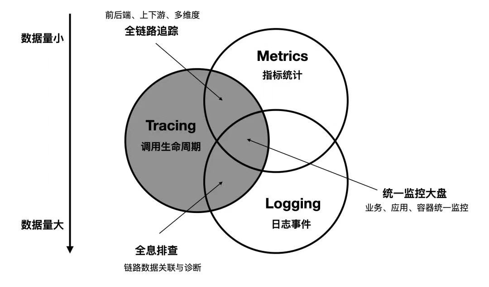

# 9.2 遥测数据分类

计算机领域一般会将可观测性的遥测数据分解为三个更具体方向进行研究：事件日志、链路追踪和聚合度量。这三个领域虽各有侧重，但也并非完全孤立，它们之间存在着天然的交集与互补。

2017 年的分布式追踪峰会结束后，Peter Bourgon 撰写的文章《Metrics, Tracing, and Logging》[^1]系统地阐述了这三者的定义、特征以及它们之间的关系与差异，受到了业界的广泛认可。三者之间的关系，如下韦恩图所示。

:::center
   
 Metrics, Tracing, and Logging
:::

- **Metrics（指标）**：系统事件发生数量的统计聚合。事件例如服务 QPS、API 响应延迟、某个接口的失败数等，聚合结果是呈具有时间属性的数字化指标，指标度量常作为发现问题的起点，一个典型例子是你收到一条告警”请求成功率跌到了 10%“，意识到不妙并立即开始处理，结合其他 Signals 找到 root cause，从而解决问题。
- **Logging（日志）**：日志描述一系列离散的事件，特别是非预期的行为。在缺乏有力的 APM 系统时，分析日志数据是工程师定位问题时最直接的手段。如果说 Metrics 告诉你应用程序出现问题，那么 Logging 就告诉你为什么出现问题。

- **Tracing（追踪）**：分布式系统中多个服务之间或多或少存在依赖，Tracing 通过有向无环图的方式记录分布式系统依赖中发生事件之间的因果关系，从而可以轻松分析出请求中异常点。

来自于 Cindy Sridharan 的著作《Distributed Systems Observability》进一步将这三个类型的数据称为可观测性的三大支柱（three pillars），不过将它们成为支柱容易让人产生误解，支柱就像一个房子的均匀受力支撑点，缺一不可。而事实上这三者都可以独立存在，系统中只存在 logging、tracing 也不是不行。

现在，CNCF 发布的最新可观测性白皮书中，将这些可观测的数据统一称为信号（Signals），主要的信号除了 metrics、logs、traces 之外又额外增加了 Profiles 和 Dumps。

[^1]: 参见 https://peter.bourgon.org/blog/2017/02/21/metrics-tracing-and-logging.html
