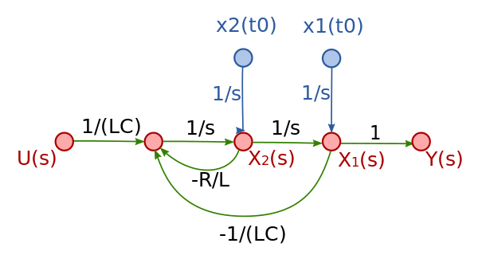

# 第九章：系统可观测性

可观测性（Observability）一词最早出现在控制论领域，有着几十年的历史。随着云原生时代的到来，2018 年，CNCF 率先将可观测性的概念引入 IT 领域，并称可观测性是云原生时代必须具备的能力（哎，又诞生一个得系统学习的领域）。从生产所需到概念发声，加之包括 Google 在内的众多大厂一拥而上。至此，”可观测性“逐渐取代”监控“，成为云原生技术领域最热门的话题之一。

:::tip 额外知识

控制理论中的可观察性（observability）是指系统可以由其外部输出推断其内部状态的程度。可观察性最早是匈牙利裔工程师鲁 Rudolf E. Kálmán 针对线性动态系统提出的概念，若以信号流图来看，若所有的内部状态都可以输出到输出信号，此系统即有可观察性。

	

:::