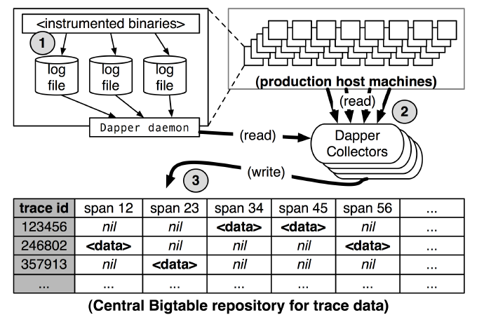

# 9.3.3 分布式链路追踪

Uber 是实施微服务架构的先驱，他们曾经撰写博客介绍过它们的打车系统，该系统约由 2,200 个相互依赖的微服务组成。引用资料中的配图，直观感受铺面而来的复杂性。
:::center
   
  图 9-10 Uber 使用 Jaeger 生成的追踪链路拓扑 [图片来源](https://www.uber.com/en-IN/blog/microservice-architecture/)
:::

上述微服务由不同团队使用不同编程语言开发，部署在数千台服务器上，横跨多个数据中心。这种规模使系统行为变得难以全面掌控，且故障排查路径异常复杂。因此，理解复杂系统的行为状态，并析性能问题的需求显得尤为迫切。

2010 年 4 月，Google 工程师发表了论文《Dapper, a Large-Scale Distributed Systems Tracing Infrastructure》[1]，论文总结了他们治理分布式系统的经验，并详细介绍了 Google 内部分布式链路追踪系统 Dapper 的架构设计和实现方法。

Dapper 论文的发布，让治理复杂分布式系统迎来了转机，链路追踪技术开始在业内备受推崇！

## 1. 链路追踪的基本原理

如今的链路追踪系统大多以 Dapper 为原型设计，因为它们也统一继承了 Dapper 的核心概念：

- **追踪（trace）**：Trace 表示一次完整的分布式请求生命周期，它是一个全局上下文，包含了整个调用链所有经过的服务节点和调用路径。例如，用户发起一个请求，从前端服务到后端数据库的多次跨服务调用构成一个 Trace。
- **跨度（Span）**：Span 是 Trace 中的一个基本单元，表示一次具体的操作或调用。一个 Trace 由多个 Span 组成，按时间和因果关系连接在一起。Span 内有描述操作的名称 span name、记录操作的开始时间和持续时间、Trace ID、当前 Span ID、父 Span ID（构建调用层级关系）等信息。

总结链路追踪系统的基本原理是，为每个操作或调用记录一个跨度，一个请求内的所有跨度共享一个 trace id。通过 trace id，便可重建分布式系统服务间调用的因果关系。换言之，链路追踪（Trace）是由若干具有顺序、层级关系的跨度组成一棵追踪树（Trace Tree），如图 9-1 所示。

:::center
   
  图 9-11 由不同跨度组成的追踪树
:::

从链路追踪系统的实现来看，核心是在服务调用过程中收集 trace 和 span 信息，并汇总生成追踪树结构。接下来，笔者将从与分析两个方面展开，解析主流链路追踪系统的设计原理。

## 2. 数据采集

目前，追踪系统的主流实现有三种，分别是基于日志的追踪（Log-Based Tracing）、基于服务的追踪（Service-Based Tracing）、基于边车代理的追踪（Sidecar-Based Tracing），具体如下：

- **基于日志的追踪**：直接将 Trace、Span 等信息输出到应用日志中，然后采集所有节点的日志汇聚到一起，再根据全局日志重建完整的调用链拓扑。这种方式的优点是没有网络开销、应用侵入性小、性能影响低；但其缺点是，业务调用与日志归集不是同时完成的，有可能业务调用已经结束，但日志归集不及时，导致追踪失真。

 根据图 9-13，总结 Dapper 基于日志实现的追踪如下：
  
  1. 将 Span 数据写入本地日志文件。
  2. Dapper 守护进程（Dapper Daemon）和采集器（Dapper Collectors）从主机节点读取日志。
  3. 将日志写入 Bigtable 仓库，每行代表一个 Trace，每列代表一个 Span。   
:::center
   
  图 9-13 基于日志实现的追踪
:::

- **基于服务的追踪**：通过某些手段给目标应用注入追踪探针（Probe），然后通过探针收集服务调用信息并发送给链路追踪系统。探针通常被视为一个嵌入目标服务的小型微服务系统，具备服务注册、心跳检测等功能，并使用专用的协议将监控到的调用信息通过独立的 HTTP 或 RPC 请求发送给追踪系统。

  以 SkyWalking 的 Java 追踪探针为例，它实现的原理是将需要注入的类文件（追踪逻辑代码）转换成字节码，然后通过拦截器注入到正在运行的应用程序中。比起基于日志实现的追踪，基于服务的追踪在资源消耗和侵入性（但对业务工程师基本无感知）上有所增加，但其精确性和稳定性更高。现在，基于服务的追踪是目前最为常见的实现方式，被 Zipkin、Pinpoint、SkyWalking 等主流链路追踪系统广泛采用。

- **基于边车代理的追踪**：这是服务网格中的专属方案，基于边车代理的模式无需修改业务代码，也没有额外的开销，是最理想的分布式追踪模型。总结它的特点如下：
    - **对应用完全透明**：有自己独立数据通道，追踪数据通过控制平面上报，不会有任何依赖或干扰；
    - **与编程语言无关**：无论应用采用什么编程语言，只要它通过网络（如 HTTP 或 gRPC）访问服务，就可以被追踪到。

  目前，市场占有率最高的边车代理 Envoy 就提供了链路追踪数据采集功能，但 Envoy 没有自己的界面端和存储端，需要配合专门的 UI 与存储系统来使用。不过，Zipkin、SkyWalking、Jaeger 和 LightStep Tracing 等等系统都能够接收来自 Envoy 的链路追踪数据，充当其界面和存储端。

## 3. 数据展示

追踪数据通常以两种形式呈现：调用链路图和调用拓扑图，具体如下：

- **调用链路图**：主要突出调用的深度、每一次调用的延迟。调用链路图通常用来定位故障。例如，当某次请求失败时，通过调用链路图可以追踪调用经过的各个环节，定位是哪一层调用失败。
:::center
   
  图 9-14 Skywalking 的调用链路图
:::

- **调用拓扑图**：主要突出系统内各个子服务的全局关系、调用依赖关系。作为全局视角图，它帮助工程师理解全局系统、并识别瓶颈。例如，若某服务压力过高，调用拓扑图的拓展区（右侧）会显示该服务详细情况（延迟、load、QPS 等）。
:::center
   
  图 9-15 Pinpoint 的调用拓扑图
:::

[^1]: 参见《Dapper, a Large-Scale Distributed Systems Tracing Infrastructure》https://research.google/pubs/dapper-a-large-scale-distributed-systems-tracing-infrastructure/
