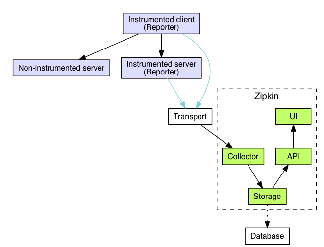

# 9.4 链路追踪

微服务架构中，每个完整的请求会跨越多个服务（数十个甚至数百个），并在期间产生多次网络、RPC、消息、数据库等调用。参阅 Uber 公开的技术文档信息，它们的架构大约有 2,200 个服务，这个级别的微服务相互依赖的链路关系引用 Uber 博客中的配图[^1]，供你直观感受。而分布式链路追踪所要做的事情就是通过请求粒度的轨迹追踪与数据透传，实现服务之间的确定性关联。

	
	
Uber 使用 Jaeger 生成的追踪链路拓扑

分布式链路追踪诞生的标志性事件就是 Google Dapper 论文的发表。2010年4月，Benjamin H. Sigelman 等人在 Google Technical Report 上发表了《Dapper, a Large-Scale Distributed Systems Tracing Infrastructure》[^2]。

Dapper 首先明确了分布式链路追踪的两个目标：任意部署和持续监控，进而给出了三个具体的设计准则：

- 低开销：额外数据采集的资源开销不能影响核心的业务系统
- 应用级透明：对应用开发透明，无需开发人员的协助，降低接入门槛
- 可扩展性：在未来相当长的一段时间内，随着业务的告诉发展，任然可以有效运转

Dapper 论文详细阐述了分布式链路追踪的设计理念，还提出了成为后续链路追踪系统设计的共识的两个概念：“追踪”（Trace）和“跨度”（Span）。一条 Trace 代表一次入口请求在 IT 系统内的完整调用轨迹及其关联数据集合。其中，全局唯一的链路标识 TraceId，是最具代表的一个属性。通过 TraceId 我们才能将同一个请求分散在不同节点的链路数据准确的关联起来，实现请求粒度的“确定性关联”价值。光有 TraceId 还不够，请求在每一跳的接口方法上执行了什么动作、耗时多久、执行状态是成功还是失败？承载这些信息的记录就是跨度（Span）。

每一次 Trace 实际上都是由若干个有顺序、有层级关系的 Span 所组成一颗“追踪树”（Trace Tree），如下图所示。通过 TraceId 将一次请求的所有链路日志进行组装，就能还原出该次请求的链路轨迹。

	
	
Trace 和 Spans

在没有形成大一统标准的早期，Dapper 的思想和协议影响了大量的开源项目。受到 Dapper 的启发，Twitter 开发了自己的分布式追踪系统 Zipkin，Zipkin 是第一个被广泛采用的开源的分布式链路追踪系统，提供了数据收集、存储和查询的功能以及友好的 UI 界面来展示追踪信息。

	
	
Zipkin 架构图

2017年 Uber 在基于 Zipkin 思想和经验的基础上开源了 Jaeger，增加了自适应采样、提供了更加强大和灵活的查询能力等，后来 Jaeger 成为 CNCF 的托管项目，并在 2019年 成为 graduated 级别。即使在今天，Zipkin 和 Jaeger 仍然是最流行的分布式追踪工具之一。

Zipkin 和 Jaeger 或多或少都对业务代码有侵入性，国内的工程师应该熟悉一款基于字节码注入具有无侵入性特点的 Skywaling ，这是一款本土开源的的调用链分析以及应用监控分析工具，特点是支持多种插件，UI 功能较强，接入端无代码侵入（Java Agent 技术）。

最后，无论是 Zipkin 还是 Jaeger 又或者 Skywaling，如何选择还是要参考采集的方式（无侵入、侵入）以及数据收集的开销。

随着分布式追踪技术的日益流行，有一个问题也日益突出，不同链路追踪系统和工具之间缺乏兼容性，如果使用了一个追踪系统，很难再切换到另一个。

CNCF 技术委员会发布了 OpenTracing 和 微软推出的 OpenCensus 两个竞品在 2019 年忽然宣布握手言和，共同发布了可观性的终极解决方案 OpenTelemetry。

[^1]: 参见 https://www.uber.com/en-IN/blog/microservice-architecture/
[^2]: 参见《Dapper, a Large-Scale Distributed Systems Tracing Infrastructure》https://research.google/pubs/dapper-a-large-scale-distributed-systems-tracing-infrastructure/

[^3]: 参见 https://logz.io/gap/devops-pulse-2022/