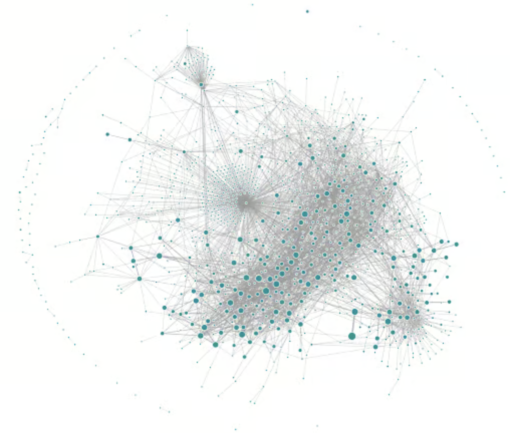
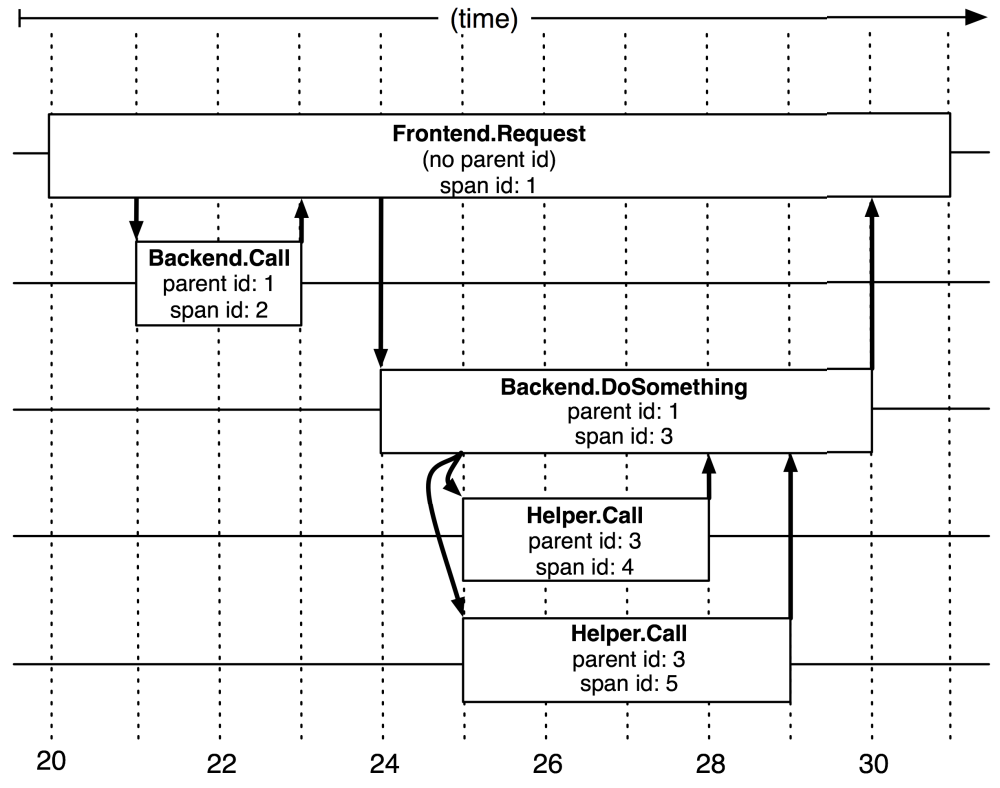
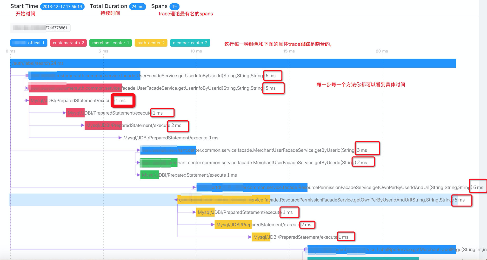

# 9.4 链路追踪

参阅 Uber 公开的技术文档信息，它们的微服务架构中大约有 2,200 个服务，这些服务相互依赖的链路关系引用 Uber 博客中的配图[^1]，供你直观感受。而分布式链路追踪所要做的事情就是通过请求粒度的轨迹追踪与数据透传，实现规模级服务之间的确定性关联。

	
	
Uber 使用 Jaeger 生成的追踪链路拓扑

分布式链路追踪诞生的标志性事件就是 Google Dapper 论文的发表。2010年4月，Benjamin H. Sigelman 等人在 Google Technical Report 上发表了《Dapper, a Large-Scale Distributed Systems Tracing Infrastructure》[^2]。Dapper 论文详细阐述了分布式链路追踪的设计理念，还提出了成为后续链路追踪系统设计的共识的两个概念：“追踪”（Trace）和“跨度”（Span）。

## Trace 和 Span

一条 Trace 代表一次入口请求在 IT 系统内的完整调用轨迹及其关联数据集合。其中，全局唯一的链路标识 TraceId 是代表性的一个属性，通过 TraceId 我们才能将同一个请求分散在不同节点的链路数据准确的关联起来，实现请求粒度的“确定性关联”。当前，光有 TraceId 还不够，请求在每一跳的接口方法上执行了什么动作、耗时多久、执行状态是成功还是失败？承载这些信息的记录就是跨度（Span）。每一次 Trace 实际上都是由若干个有顺序、有层级关系的 Span 所组成一颗“追踪树”（Trace Tree），如下图所示。

	
	
Trace 和 Spans

总结分布式链路追踪的原理就是在分布式应用的接口方法中设置一些观察点，在入口节点给每个请求分配一个全局唯一的标识 traceId，当请求流经这些观察点时就会记录一条对应的链路日志（Span），最后通过 TraceId 将一次请求的所有链路日志进行组装，就能还原出该次请求的链路轨迹。如图所示，根据拓扑图中 Span 记录的时间信息和响应结果，我们就可以定位到出错或者缓慢的服务。

	
	
Skywaling 链路分析

在没有形成大一统标准的早期，Dapper 的思想和协议影响了大量的开源项目。受到 Dapper 的启发，Twitter 开发了自己的分布式追踪系统 Zipkin，Zipkin 是第一个被广泛采用的开源的分布式链路追踪系统，提供了数据收集、存储和查询的功能以及友好的 UI 界面来展示追踪信息。

2017年 Uber 在基于 Zipkin 思想和经验的基础上开源了 Jaeger，增加了自适应采样、提供了更加强大和灵活的查询能力等，后来 Jaeger 成为 CNCF 的托管项目，并在 2019年 成为 graduated 级别。即使在今天，Zipkin 和 Jaeger 仍然是最流行的分布式追踪工具之一。

Zipkin 和 Jaeger 或多或少都对业务代码有侵入性，国内的工程师应该熟悉一款基于字节码注入具有无侵入性特点的 Skywaling ，这是一款本土开源的的调用链分析以及应用监控分析工具，特点是支持多种插件，UI 功能较强，接入端无代码侵入（Java Agent 技术）。

## Opentracing

一般来说 Tracing 开源项目他们只提供 Instrument 的接入方式，但是却不提供 Instrument 的具体实现，如果其他开源项目想接入 Tracing ，则是需要这些开源项目的开发者们自己去实现对应的 Instrument。即使一些 Tracing 开源项目的开发者们直接支持了一些开源组件的 Instrument（如 Pinpoint），也可能很快由于其他开源项目的架构升级，导致原来的 Instrument 实现不可用。

如果市场只有一个 Tracing 还好，但是百花齐放的 Tracing 开源实现会让开源组件的开发者们并不是很乐于去实现某个 Tracing 的 Instrument。而且开源组件的每次大版本升级，都有可能导致原先的 Instrument 无法工作。基于这个思考， 2016 年 Ben Sigelman 发表博客 《Towards Turnkey Distributed Tracing》[^4]，提出了 OpenTracing 这个概念。

和一般的规范标准不同，Opentracing 不是传输协议，消息格式层面上的规范标准，而是一种语言层面上的 API 标准。只要某链路追踪系统实现了 Opentracing 规定的接口（interface），符合Opentracing 定义的表现行为，那么就可以说该应用符合 Opentracing 标准。这意味着开发者只需修改少量的配置代码，就可以在符合 Opentracing 标准的链路追踪系统之间自由切换。

[^1]: 参见 https://www.uber.com/en-IN/blog/microservice-architecture/
[^2]: 参见《Dapper, a Large-Scale Distributed Systems Tracing Infrastructure》https://research.google/pubs/dapper-a-large-scale-distributed-systems-tracing-infrastructure/

[^3]: 参见 https://logz.io/gap/devops-pulse-2022/
[^4]: 参见 https://medium.com/opentracing/towards-turnkey-distributed-tracing-5f4297d1736