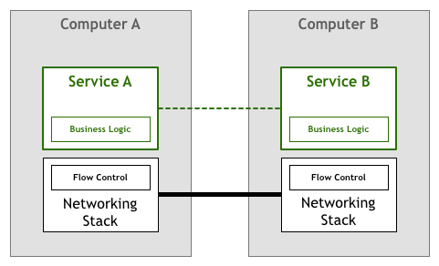

# 8.2 服务间通信的演化

TCP 协议之后分布式系统诞生，分布式系统催生出微服务，服务间的通信需求又催生出 ServiceMesh。理解服务间通信的本质之后，就会得到一个感性的结论 Service Mesh 是微服务时代的 TCP/IP 协议。

本节，笔者借用 Phil Calçado 的博客《Pattern: Service Mesh》的内容脉络，并加以我的理解，讨论 TCP 协议、分布式系统、服务间通信的因果关系，尝试说清楚 Service Mesh 诞生的必然性。本节内容图片来源于 Phil Calçado 的博客，在此统一注明，后面不再单独列出。

## 原始的通信时代

回到远古时代，大约在50年前，初代的开发人员需要在应用层代码里处理各类网络通信的细节问题，比如可靠连接、超时重传、拥塞控制等等。网络的通信逻辑实际上和业务逻辑没有任何关系，却不得不混杂在一起。

	

为了解决这个问题，TCP/IP 技术出现了，TCP/IP 把通信的流程控制从应用层剥离出来，网络通信变成了基础的、标准的、通用的功能。这个改动大幅降低了应用程序的复杂性，业务逻辑和底层网络通信细节解耦之后，应用程序开发人员才有更多的精力集中在业务逻辑处理上。

	

从 TCP 协议，我们看到基础的、通用的通信逻辑下移，成为一个基础设施层。逻辑解耦、两者透明，这样彻底解放上层应用生产力。

## 第一代微服务

TCP出现之后，机器之间的网络通信不再是一个难题，以 GFS/BigTable/MapReduce 为代表的分布式系统得以蓬勃发展。此时，分布式系统特有的通信语义又出现了，例如熔断策略、负载均衡、服务发现、认证和授权、quota限制、链路追踪和监控等等。

	

这个阶段，开发人员要实现业务逻辑之外，还需要根据业务需求来实现一部分所需的通信语义。随着服务规模的扩大，服务寻址逻辑也愈加变的复杂，哪怕是同一种开发语言的另外一个应用，上述的微服务基础能力也要再重新实现一遍。

笔者依稀记得，2011年使用 Python 编写 Zookeeper 调用库解决公司业务数据同步的问题，这期间耗费了大量的时间编写非业务逻辑，保持心跳、监听节点变化、实现负载均衡等。

此刻，你是否想到了计算机远古时代前辈们处理网络通信的情形。

## 第二代微服务

为了避免每个服务都需要自己实现一套分布式系统通信的语义功能，随着技术的发展，一些面向微服务架构的开发框架出现了，如 Twitter 的 Finagle、Facebook 的 Proxygen 以及 Spring Cloud 等等。

	

这些框架实现了分布式系统通信需要的各种通用语义功能：如负载均衡和服务发现等，因此一定程度上屏蔽了这些通信细节，使得开发人员使用较少的框架代码就能开发出健壮的分布式系统，而无需关注底层细节。

## 微服务的痛点显现

Spring Cloud、Dubbo 这类框架以类库的形式存在，但以运行的操作系统进程来看，类库还是渗透进了打包部署之后的业务程序之中，无论这些框架技术如何迭代，实现本质止步于“侵入性”的方式。

侵入性代表耦合，这一代的微服务框架无论如何迭代，都无法避免与生俱来的诸多痛点。

- **门槛高**：虽然框架本身屏蔽了分布式系统通信的一些通用功能实现细节，但开发者却要花更多精力去掌握和管理复杂的框架本身，在实际应用中，去追踪和解决框架出现的问题也绝非易事。

以 SpringCloud 和 Netflix OSS 为例说明：
| SpringCloud | Netflix OSS |
|:--|:--|
|||

问题来了，你准备花费多少时间让团队熟练使用这些技能？Netflix OSS 在 2019 开始逐步停止维护，问题又来了，你是否会选择切换到 Dubbo 这类框架，如果 Dubbo 也停止维护呢？付出巨大的精力学习，居然要处于这些软件在未来某一段时间取代、消亡的尴尬境地。

- **无法跨语言**：开发框架通常只支持一种或几种特定的语言，回过头来看文章最开始对微服务的定义，一个重要的特性就是语言无关，但那些没有框架支持的语言编写的服务，很难融入面向微服务的架构体系，想因地制宜的用多种语言实现架构体系中的不同模块也很难做到

- **升级困难**：框架以lib库的形式和服务联编，复杂项目依赖时的库版本兼容问题非常棘手，同时，框架库的升级也无法对服务透明，服务会因为和业务无关的lib库升级而被迫升级；

站在企业组织的角度思考：技术重要还是业务重要？每个人都是分布式专家固然好，但这种情况现实又不可能存在。当一个业务团队或者非技术驱动的企业，员工每天处理大量的非业务逻辑，时不时还解决粗心、技术理解不到位出现的各类非功能 Bug，第二天隔壁的部门又重新上演，这种情况是否合理？

## 理解服务间通信的本质

微服务架构中，一次请求往往经历多个服务节点，从这个角度看，服务间的通信是多个节点访问多个节点的关系。

在处理分布式微服务架构中“多个节点”的通信上，**那些需要解决的诸如：服务注册、服务发现、负载均衡、弹性等等，本质是解决请求的可靠传递**。在整个服务间通信的处理流程上，无论上述功能如何复杂，请求本身的业务语义与业务内容不会发生任何变化。分布式的技术挑战和业务应用，或者服务本身有关系么？没有任何关系。这些都属于服务通信的范畴，和应用本身的实现逻辑没有任何关系。

此外，以上还具有高度的普适性，只要是微服务架构，那这些问题适用于所有的语言框架、组织。

回顾开篇提到的 TCP 案例，你是否发现似曾相识？是否服务间的通信也能像TCP 协议栈那样，人们基于 HTTP 协议开发复杂的应用，无需关心底层 TCP 如何控制包。

借鉴当年 TCP/IP ，对于服务间通信，除了传统的侵入式框架，又有了一个新的思路：既然能把网络功能剥离并下沉到 TCP，那么服务间通信是否也能剥离，下沉到微服务基础层。如此，工程师不再浪费时间编写服务基础设施代码或者管理系统用到的软件库和框架，而是聚焦在业务逻辑处理上。

	

## Proxy 模式的探索

## 第一代 ServiceMesh 

因此以 Linkerd、Envoy、NginxMesh 为代表的代理模式（边车模式）应运而生，这就是第一代 Service Mesh，它将分布式服务的通信抽象为单独一层，在这一层中实现负载均衡、服务发现、认证授权、监控追踪、流量控制等分布式系统所需要的功能，作为一个和服务对等的代理服务，和服务部署在一起，接管服务的流量，通过代理之间的通信间接完成服务之间的通信请求，这样传统侵入式的三个问题也迎刃而解。

## 第二代 ServiceMesh

第一代Service Mesh由一系列独立运行的单机代理服务构成，为了提供统一的上层运维入口，演化出了集中式的控制面板，所有的单机代理组件通过和控制面板交互进行网络拓扑策略的更新和单机数据的汇报。这就是以Istio为代表的第二代 Service Mesh。

	

只看单机代理组件(数据面板)和控制面板的Service Mesh全局部署视图如下：

	

至此，见证了6个时代的变迁，大家一定清楚了 Service Mesh 技术到底是什么，以及是如何一步步演化到今天这样一个形态。

现在，我们回过头重新看 William Morgan 对 Service Mesh 的定义：

:::tip ServiceMesh

服务网格是一个**基础设施层**，用于处理服务间通信。云原生应用有着复杂的服务拓扑，服务网格保证**请求在这些拓扑中可靠地穿梭**。在实际应用当中，服务网格通常是由一系列轻量级的**网络代理**组成的，它们与应用程序部署在一起，但**对应用程序透明**。

:::

再来理解定义中的4个关键词：

- **基础设施层+请求在这些拓扑中可靠穿梭**：这两个词加起来描述了 Service Mesh 的定位和功能，是否似曾相识？没错，你一定想到了TCP。
- **网络代理**：描述了 Service Mesh 的实现形态。
- **对应用透明**：描述了 Service Mesh 的关键特点，正是由于这个特点，Service Mesh 能够解决以 Spring Cloud 为代表的第二代微服务框架所面临的三个本质问题。