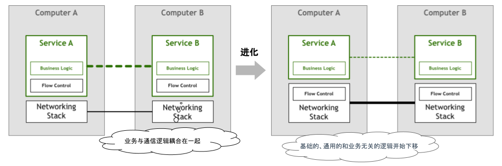
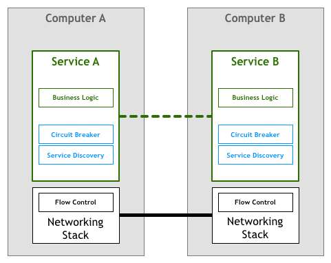
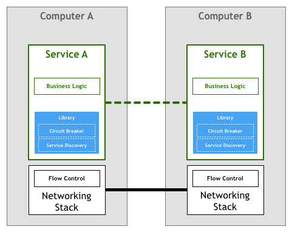
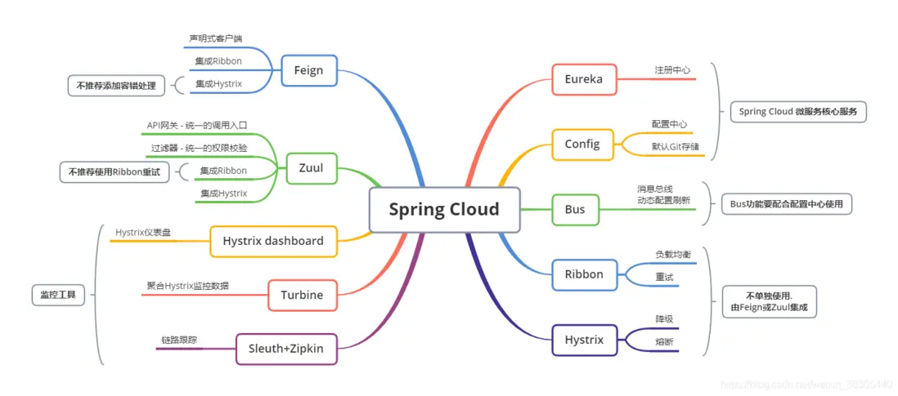
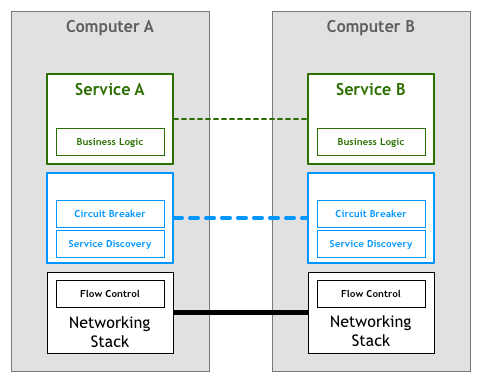
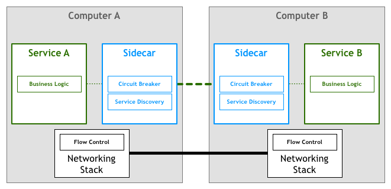
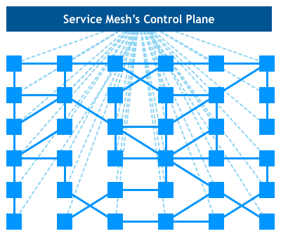

# 8.2 服务间通信的演化

服务间通信的治理是分布式系统中的核心问题。本节将分析各个历史阶段是如何处理通信中的非功能需求的，深入理解服务网格如何演变而来。

本节部分配图来源于 Phil Calçado 的博客，在此统一注明，后面不再单独列出。

## 8.2.1 原始的通信时代

让我们先回到计算机的远古时代。

大约 50 年前，初代的开发人员如果编写涉及网络的应用程序时，需要在业务代码里处理各类网络通信的逻辑。例如，实现可靠连接、超时重传以及拥塞控制等。此类通信逻辑和业务逻辑没有任何关系，但不得不和业务代码混在一起编写。

为了避免每个应用程序都需要自己实现一套相似的网络传输控制逻辑，TCP/IP 协议出现了。TCP/IP 协议将通用的通信控制逻辑从应用程序代码中剥离出来，并将这部分逻辑下沉，成为操作系统网络层的一部分。

:::center
   
  图 8-1 业务逻辑与通信逻辑解耦
:::

原始的通信时代 TCP/IP 协议的出现，让我们看到这样的变化：非业务逻辑从应用程序中剥离出来，剥离出来的通信逻辑下沉成为基础设施层。于是，工程师们的生产力被解放，各类网络应用开始遍地开花。

## 8.2.2 第一代微服务

TCP/IP 协议出现之后，机器之间的网络通信不再是一个难题，分布式系统开始蓬勃发展。

此时，分布式系统特有的通信语义又出现了。例如，熔断策略、负载均衡、服务发现、认证和授权、灰度发布以及蓝绿部署等等。

:::center
   
  图 8-2 微服务特有的通信语义又出现了
:::

这个阶段，工程师实施分布式系统时，除实现业务逻辑之外，还需要根据业务需求实现所需的分布式系统通信语义。随着分布式系统规模的扩大，就算最基础的服务发现逻辑也愈加变的复杂。其次，哪怕是同一种开发语言的另外一个应用，上述的分布式系统功能也要再重新实现一遍。

此刻，你是否想到了计算机远古时代前辈们处理网络通信的情形？

## 8.2.3 第二代微服务

为了避免每个应用程序都要自己实现一套分布式系统的通信语义，一些面向分布式系统的微服务开发框架出现了，如 Twitter 的 Finagle，Facebook 的 Proxygen，还有众多周知的 Spring Cloud。

:::center
   
  图 8-3 第二代微服务框架以 Lib 库的形式封装了分布式系统的通信语义
:::

此类微服务框架实现了负载均衡、服务发现、流量治理等各类分布式系统通用语义。开发人员无需关注分布式系统底层细节，付出较小的精力就能开发出健壮的分布式应用。

## 8.2.4 微服务框架的痛点

使用微服务框架解决分布式问题看似完美，但开发人员很快发现它也存在一些本质问题：

- **技术门槛高**：虽然微服务框架屏蔽了分布式系统通用功能的实现细节，但开发者却要花更多精力去掌握和管理复杂的框架本身。以 SpringCloud 为例，如图 8-5 所示，它的官网用了满满一页介绍各类通信功能的技术组件。实践过程中，工程师们追踪和解决框架出现的问题绝非易事。

:::center
   
  图 8-5 SpringCloud 全家桶
:::

- **框架无法跨语言**：微服务框架通常只支持一种或几种特定的语言，回过头来看文章最开始对微服务的定义：一个重要的特性就是和语言无关。如果你使用框架不支持的语言编写服务，则很难融入这类微服务的架构体系。因此，微服务架构所提倡的：“因地制宜用多种语言实现不同模块”，也就成了空谈。

- **框架升级困难**：微服务框架以 Lib 库的形式和服务联编，当项目非常复杂时，处理依赖库版本以及版本兼容问题将非常棘手。同时，微服务框架的升级也无法对服务透明，服务稳定的情况下，工程师们普遍不愿意升级微服务框架。大部分的情况是，微服务框架某个版本出现 Bug，应用才被迫升级。

站在企业组织的角度思考，技术重要还是业务重要？每个工程师都是分布式专家固然好，但又不现实。因此，当企业实施微服务架构后，你会看到业务团队每天处理大量的非业务逻辑，相似的技术问题总在不停上演，每一次技术问题的发生都刺激着老板的神经。

## 8.2.5 思考服务间通信的本质

实施微服务架构时，**需要解决问题（服务注册、服务发现、负载均衡、熔断、限流等）的本质是保证服务间请求的可靠传递**。

从业务层面来看，**无论上述逻辑设计的多么复杂，都不会影响业务请求本身的业务语义与业务内容发生任何变化**，实施微服务架构的技术挑战和业务逻辑也没有任何关系。

回顾前面提到的 TCP/IP 协议案例，我们思考是否服务间的通信是否也能像 TCP 协议栈那样：“人们基于 HTTP 协议开发复杂的应用，无需关心底层 TCP 协议如何控制数据包”。

如果能把服务间通信剥离并下沉到微服务基础层，工程师将不再浪费时间编写基础设施层的代码，而是将充沛的精力聚焦在业务逻辑处理上。

:::center
   
  图 8-6 将服务间通信逻辑剥离，并下沉成为微服务基础设施层
:::

## 8.2.6 代理模式的探索

最开始，探路者们尝试过使用代理（Proxy）的方案，如使用 Nginx 代理，通过配置上游、负载均衡的方式处理部分通信逻辑。

虽然这种方式和微服务关系不大，功能也简陋。但它们提供了一个新颖的思路：“**在服务器端和客户端之间插入一个中间层，避免两者直接通讯，所有的流量都必须经过中间层的代理，代理实现服务间通信的某些必须特性。**”。

受限于代理软件功能不足，在参考代理模式的基础上，市场上开始陆陆续续出现 Sidecar 模式的产品。如 Airbnb 的 Nerve & Synapse，Netflix 的 Prana。这些产品的思路在 Proxy 中对齐原侵入式框架在客户端实现的各类功能，实现上也大量重用了原客户端代码、类库。

:::center
   
  图 8-7 初代 Sidecar 模式的探索
:::

但是此类 Sidecar 模式存在局限性：它们往往被设计成与特定的基础设施组件配合使用。如 Airbnb 的 Nerve & Synapse 假设服务注册必须使用 Zookeeper，而对于 Prana，则限定使用 Netflix 自己的服务注册 Eureka。

因此，该阶段的 Sidecar 模式只能局限在某些特定架构体系中，不具备通用性。

## 8.2.7 第一代服务网格

2016 年 1 月，离开 twitter 的工程师 William Morgan 和 Oliver Gould 开启了他们的创业项目，在 Github 上发布了 Linkerd 0.0.7 版本。早期的 Linkerd 借鉴了 Twtter 开源的 Finagle 项目，并重用了大量的 Finagle 代码：

- 设计思路上：Linkerd 将分布式服务的通信逻辑抽象为单独一层，在这一层中实现负载均衡、服务发现、认证授权、监控追踪、流量控制等必要功能；
- 具体实现上：Linkerd 作为和服务对等的代理服务（Sidecar）和服务部署在一起，接管服务的流量。

Linkerd 开创先河的不绑定任何基础架构或某类技术体系，实现了通用性，成为业界第一个服务网格项目。同期的服务网格代表产品还有 Lyft（和 Uber 类似的打车软件）公司的 Envoy（Envoy 是 CNCF 内继 Kubernetes、Prometheus 第三个孵化成熟的项目）。

:::center
   
  图 8-8 第一代服务网格产品 Linkerd 和 Envoy
:::

## 8.2.8 第二代服务网格

第一代服务网格由一系列独立运行的代理服务（Sidecar）构成，但并没有思考如何系统化管理这些代理服务。为了提供统一的运维入口，服务网格继续演化出了集中式的控制面板（Control Plane）。

典型的第二代服务网格以 Google、IBM 和 Lyft 联合开发的 Istio 为代表。根据这类服务网格的总体架构来看（图 8-8），第二代服务网格包括两大块内容：由一系列与微服务共同部署的边车代理，以及控制这些代理的管理器构成。代理与代理之间需要通信，用以转发程序间通信的数据包，代理与管理器之间也需要通信，用于传递路由管理、服务发现、数据遥测等控制信息。

:::center
   
  图 8-8 增加了控制平面（Control Plane）的第二代服务网格
:::

只看代理组件（下发浅蓝色的方块）和控制面板（头部深蓝色的方块），它们之间的关系形成如图 8-9 所示的网格形象状，这也是服务网格命名的由来。

:::center
   
  图 8-9 服务网格的控制平面通信与数据平面之间的通信
:::

至此，见证了 5 个时代的变迁，大家一定清楚了服务网格技术到底是什么，以及是如何一步步演化到今天这样一个形态。

现在，我们回过头重新看 William Morgan 对服务网格的定义。

:::tip 服务网格的定义

服务网格是一个**基础设施层**，用于处理服务间通信。云原生应用有着复杂的服务拓扑，服务网格保证**请求在这些拓扑中可靠地穿梭**。在实际应用当中，服务网格通常是由一系列轻量级的**网络代理**组成的，它们与应用程序部署在一起，但**对应用程序透明**。

:::

再来理解定义中的 4 个关键词：

- **基础设施层+请求在这些拓扑中可靠穿梭**：这两个词加起来描述了服务网格的定位和功能，是否似曾相识？没错，你一定想到了 TCP 协议。
- **网络代理**：描述了服务网格的实现形态。
- **对应用透明**：描述了服务网格的关键特点，正是由于这个特点，服务网格能够解决以 Spring Cloud 为代表的第二代微服务框架所面临的三个本质问题。
