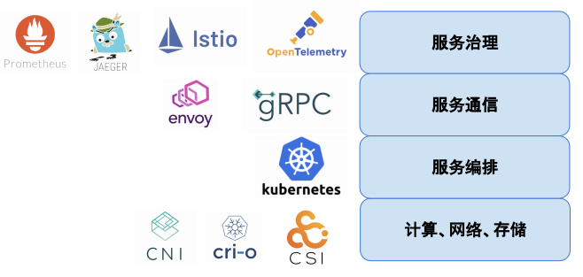

# 8.4 服务网格与 Kubernetes

Kubernetes 让大型的分布式系统彻底的虚拟化，为它管理的工作负载提供了韧性和弹性，也为 Pod 维护了互相联通的虚拟网络。但对于分布式系统通信而言，服务之间的路由、容错、加密、跟踪都是无可回避的，Kubernetes 提供的“通与不通”入门级网络环境，仅仅是服务间可靠通信必要的但非充分的条件。

以 Kubernetes 为基础构建起的云原生世界里，Sidecar 模式无疑是最经典的设计。当需要为应用提供与自身逻辑无关的辅助功能时，在应用 Pod 内注入对应功能的 Sidecar 显然弥补了容器编排系统对服务间通信管控能力不足的缺憾。

如 8-15 图所示，服务网格（Istio）最大化地利用基础设施 Kubernetes，两者叠加形成从底层工作负载部署、运维、扩缩容，到上层服务综合治理的一套完整分布式系统解决方案。

:::center
   
  图 8-15 服务网格（Istio）叠加 Kubernetes，形成一套完整的基础设施解决方案
:::

从 Google 与 IBM 联合推出 Istio 开始，我们也看到了 Google 的技术影响力和企业战略布局，如图 8-17 所示，从最底层的计算、网络、存储开始，一步步靠近应用。可以预见对于云原生应用而言，采用 Kubernetes 进行服务部署和集群管理，采用 Istio 处理服务通讯和治理，将成为微服务应用的标准配置。

:::center
  
 图 8-17 以 Kubernetes 为核心的微服务生态系统
:::

