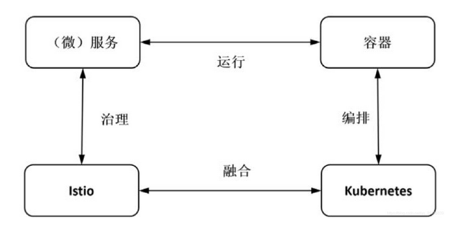

# 8.4 服务网格与 Kubernetes

现在，承载应用 Workload 的形式已经从”物理机“过渡到”容器“。容器意味着创建（包括初始化）和销毁高度自动化，且具备极强弹性。此时，基础设施的功能（服务发现、负载均衡、熔断限流、路由等）与业务代码的集成需要在低成本前提下保证相同的生命周期。

物理机时代，基础设施功能添加到业务代码的方式只能选择 SDK，而容器时代，基础设施的功能添加到业务代码的最佳方式变成了 Sidecar。Kubernetes 通过管理基础设施（Pod）为微服务提供了可扩展、高弹性的部署粗粒度服务。而 ServiceMesh 通过 Pod 内的 Sidecar Proxy 实现透明代理，通过更接近微服务应用层的抽象，实现服务间的流量、安全性和可观察性细粒度管理。

	
	

如下图所示，Kubernetes 与 Servicemesh 天生契合，Istio 最大化地利用了 Kubernetes 这个基础设施，与之叠加在一起形成一套从底层的负载部署运行到上层服务运行和治理的基础设施。

	
	
图片来源于《云原生服务网格Istio》

由下图可见，Istio 补充了 Kubernetes 生态圈的重要一环，是 Google 的微服务版图里一个里程碑式的扩张

	
	
图片来源于 zhaohuabing.com

可以预见不久的将来，对于云原生应用而言，采用 kubernetes 进行服务部署和集群管理，采用 Istio 处理服务通讯和治理，将成为微服务应用的标准配置。