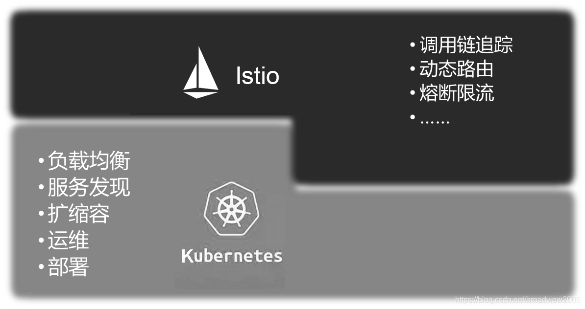

# 8.4 服务网格与 Kubernetes

现在，承载应用 Workload 的形式已经从”物理机“过渡到”容器“。容器意味着创建（包括初始化）和销毁高度自动化，且具备极强弹性。此时，基础设施的功能（服务发现、负载均衡、熔断限流、路由等）与业务代码的集成需要在低成本前提下保证相同的生命周期。物理机时代，基础设施功能添加到业务代码的方式只能选择 SDK，而容器时代，基础设施的功能添加到业务代码的最佳方式变成了 Sidecar。

Kubernetes 通过管理基础设施（Pod）为微服务提供了可扩展、高弹性的部署粗粒度服务。而 ServiceMesh 通过 Pod 内的 Sidecar Proxy 实现透明代理，通过更接近微服务应用层的抽象，实现服务间的流量、安全性和可观察性细粒度管理。

如下图所示，Kubernetes 与 Servicemesh 结合，提供一套从底层的负载部署运行到上层的服务访问治理端到端的解决方案。

	
	
图片来源于《云原生服务网格Istio》

比较传统的SDK与 Istio ，可以看出 Istio 最大化地利用了Kubernetes这个基础设施，与之叠加在一起形成了一个更强大的用于进行服务运行和治理的基础设施，并提供了更透明的用户体验。

|比较观点| Istio 部署在 Kubernetes | SDK 开发的服务部署在 Kubernetes |
|:--|:--|:--|
|架构设计| 基于 Kubernetes 能力设计 | 和 Kubernetes 无关|
| 服务发现| 使用和 Kubernetes 一致的服务发现 | 得搭建单独的服务发现，两套服务发现存在不一致的问题，Kubernetes 的 Pod 迁移会引起重新服务注册。|
| 使用体验| 完全的 Kubernetes 使用体验。 Sidecar 自动注入，业务无感知| 和 Kubernetes 无结合，Kubernetes 只是提供了运行环境|
| 控制面 | 无需额外的 APIServer 和 规则策略的定义，基于 CRD 扩展| 需安装单独的控制面来维护管理规则 |

